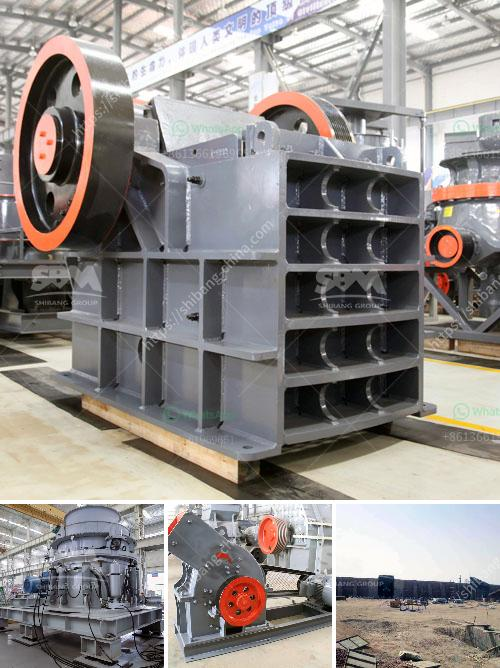

<h3>china quarry plant manufacturers</h3>
China has become a leading player in the global mining machinery industry. The country's rapid economic growth and increasing investment in infrastructure have fueled the demand for minerals, resulting in a boom in the mining sector. As a result, the need for quarry plants has surged, leading to the emergence of numerous manufacturers in China specializing in designing, manufacturing, and supplying quarry plant equipment.

One of the key reasons behind China's prominence in the quarry plant manufacturing sector is its abundant and diverse mineral resources. The country has vast reserves of minerals such as coal, iron ore, copper, gold, and rare earth elements. Therefore, mining companies from all over the world flock to China to establish strategic partnerships and procure mining equipment, including quarry plants.

Chinese quarry plant manufacturers have gained a reputation for producing high-quality and cost-effective equipment. They employ advanced technology and modern manufacturing processes to ensure that their products meet the highest international standards. Furthermore, their emphasis on research and development enables them to continuously innovate and introduce new products that cater to the specific needs of their clients.

China's quarry plant manufacturers offer a wide range of products, including crushers, screens, feeders, conveyors, and other auxiliary equipment. These machines are designed to extract, crush, and process various types of minerals efficiently. They are also equipped with advanced automation features, ensuring maximum productivity and operational safety.

Moreover, Chinese manufacturers prioritize environmental sustainability in their production processes. They are committed to developing eco-friendly solutions that minimize energy consumption and reduce emissions. This aligns with China's broader national goals of achieving low-carbon and green development in the mining sector.

Chinese quarry plant manufacturers have earned the trust and confidence of customers worldwide due to their reliable after-sales services. They provide comprehensive support, including installation, maintenance, spare parts supply, and technical training. This ensures that their equipment functions optimally and minimizes downtime for mining operations.

The competitive pricing offered by Chinese manufacturers has played a crucial role in their global success. By leveraging economies of scale, streamlined production processes, and competitive labor costs, they can offer cost-effective quarry plant equipment without compromising on quality. This has made Chinese equipment highly competitive in the international market.

In recent years, Chinese manufacturers have expanded their presence beyond the domestic market. They have established partnerships and opened subsidiary offices in countries that are major mineral producers, such as Australia, Brazil, Canada, and South Africa. This has allowed them to tap into local markets, gain a better understanding of customer requirements, and forge long-term partnerships.

In conclusion, China's quarry plant manufacturers have emerged as leaders in the global mining machinery industry. Their commitment to quality, technological innovation, environmental sustainability, and customer service has paved the way for their success. With the country's abundant mineral resources and the continuous growth in global demand, Chinese quarry plant manufacturers are well-positioned to maintain their dominance in the industry and contribute to the sustainable development of the mining sector worldwide.
<h3>Contact us</h3><ul><li><strong>Whatsapp:&nbsp;<a href="https://wa.me/8613661969651">+8613661969651</a></strong></li><li><a href="https://swt.shibang-china.com/?git&amp;zhl&amp;china quarry plant manufacturers"><strong>Online Service(chat now)</strong></a></li></ul><h3>Related</h3><ul><li><a href='vibrating screen price philippines.md'>vibrating screen price philippines</a></li><li><a href='cheapest crusher machines for sale in kenya.md'>cheapest crusher machines for sale in kenya</a></li><li><a href='high energy ball milling process.md'>high energy ball milling process</a></li><li><a href='prices of stone crushers from nigeria.md'>prices of stone crushers from nigeria</a></li><li><a href='vibrating screens australia.md'>vibrating screens australia</a></li></ul>