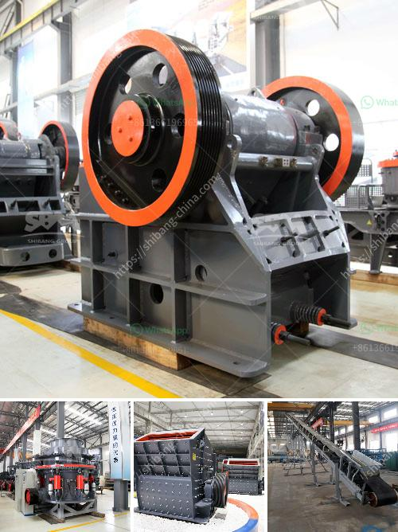

<h3>china roller grinding mill</h3>
In recent years, the Chinese machinery industry has achieved rapid growth. With the acceleration of industrialization and the development of the construction industry, mill equipment has become a hot-selling product in the Chinese market. Among them, the China Roller Grinding Mill is a well-known machine favored by many customers due to its high efficiency, energy saving, and environmental protection.

The roller grinding mill is used for the production of fine powders. Its working principle is to use the grinding roller crushes materials, and the ground materials are brought into the powder selection stage by airflow. The finished powder is collected by the dust collector, and the whole process is completely sealed, which effectively reduces pollution and dust emissions.

One of the advantages of the China Roller Grinding Mill is its energy-saving feature. Compared with traditional mills, this equipment can save up to 30% of energy. It adopts a high-pressure spring system, which greatly reduces the power consumption of the mill. In addition, the grinding roller and grinding ring are made of special materials, which greatly extend their service life and reduce maintenance costs.

Moreover, the China Roller Grinding Mill has a stable performance, and its production capacity is also remarkable. The advanced milling structure design ensures the uniformity of the ground powder, and the particle size can be adjusted freely in the range of 80-800 mesh. This mill is suitable for a wide range of materials, such as limestone, dolomite, calcite, talc, kaolin, barite, fluorite, and more.

Environmental protection is always a key consideration in the modern industry. The China Roller Grinding Mill adheres to the principle of green production and has passed the environmental evaluation and certification. The dust collector is equipped with an advanced filtration system, which effectively purifies the exhaust gas and meets the national environmental protection standards. This feature not only protects the environment but also helps companies comply with the increasingly stringent environmental regulations.

The China Roller Grinding Mill has been exported to many countries and regions, and its popularity in the international market is also rising. In addition to the excellent performance and competitive price, the after-sales service provided by Chinese manufacturers is also outstanding. From the installation and commissioning to regular maintenance, they provide comprehensive technical support and guidance, which greatly ensures the smooth operation of the equipment.

In conclusion, the China Roller Grinding Mill stands out in the global machinery market due to its high efficiency, energy-saving, stable performance, and environmental protection. As a leader in the industry, it has won the favor of customers at home and abroad. With the continuous improvement of technology and the expansion of market demand, the China Roller Grinding Mill will surely embrace a brighter future.
<h3>Contact us</h3><ul><li><strong>Whatsapp:&nbsp;<a href="https://wa.me/8613661969651">+8613661969651</a></strong></li><li><a href="https://swt.shibang-china.com/?git&amp;zhl&amp;china roller grinding mill"><strong>Online Service(chat now)</strong></a></li></ul><h3>Related</h3><ul><li><a href='jaw crusher machine price.md'>jaw crusher machine price</a></li><li><a href='30t hr 50t hr range stone crusher plant china.md'>30t hr 50t hr range stone crusher plant china</a></li><li><a href='jaw crusher sale.md'>jaw crusher sale</a></li><li><a href='machine de fabrication de sable de platre.md'>machine de fabrication de sable de platre</a></li><li><a href='stone crusher equipment manufacturer made in canada.md'>stone crusher equipment manufacturer made in canada</a></li></ul>