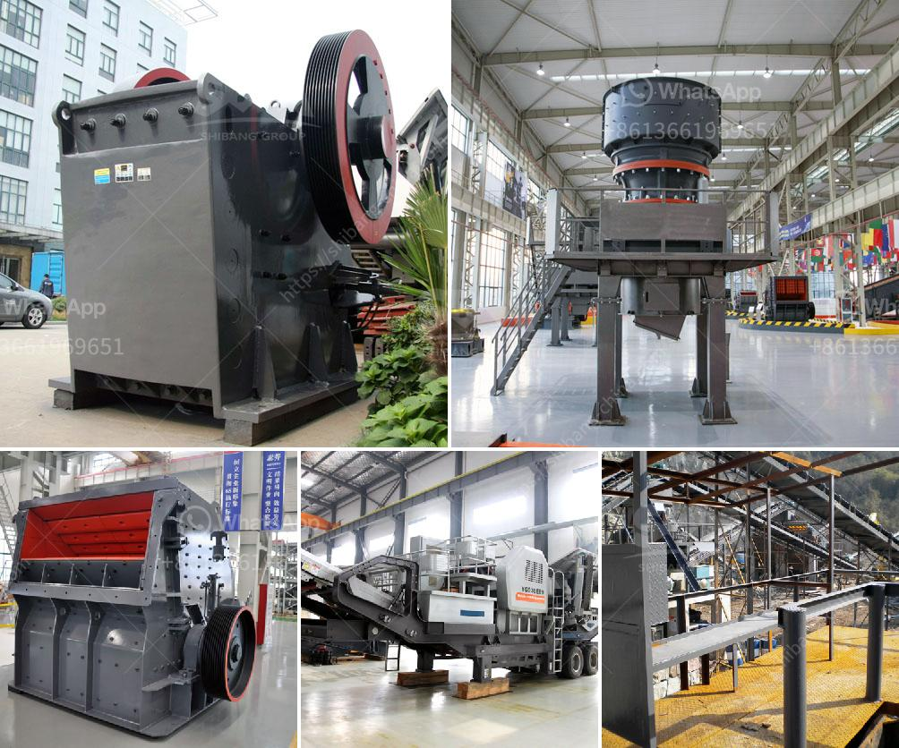

<h3>china stone crusher closed circuit</h3>
Stone crushing is a daunting task for even the most experienced of personnel. It requires painstaking efforts and meticulous care to ensure that each rock is reduced to its desired size. The complexity of the task increases manifold when a plethora of rocks need to be crushed in a limited amount of time. To make this process easier and more efficient, China stone crushers have come to the forefront.

A stone crusher is a machine used to crush rocks into smaller pieces, usually for gravel or some other road or building application. Most stone crushers have a hopper at the top, a container which holds the rock above the crusher and uses gravity to feed it in. Alternately, stone crushers can use a belt drive to continuously transport the rock into the crusher.

In China, stone crushers can be classified into coarse crushers, medium crushers, and fine crushers based on their capabilities. However, whatever the classification, each crusher compresses the material until it breaks, thereby creating smaller pieces that can easily be transported or further processed.

One popular variation of the stone crusher is the closed circuit crushing system. This configuration allows the material to be continuously circulated throughout the crusher until it is of the desired size. The closed circuit system is particularly useful when an even finer product is desired or to control the size of the final product.

The closed circuit stone crusher already mentioned provides a true one-stop crushing solution to its users. It combines all the important features of a complete stone crusher into a compact design. This allows users to operate the crusher with minimal effort and achieve the desired results in no time.

In conclusion, China stone crushers have become an essential part of the construction industry, providing efficient and reliable crushing solutions. The closed circuit systems in particular have gained popularity due to their ability to produce precisely sized products. Whether it is for road construction, building projects or landscaping purposes, stone crushers have become an invaluable tool for contractors worldwide.
<h3>Contact us</h3><ul><li><strong>Whatsapp:&nbsp;<a href="https://wa.me/8613661969651">+8613661969651</a></strong></li><li><a href="https://swt.shibang-china.com/?git&amp;zhl&amp;china stone crusher closed circuit"><strong>Online Service(chat now)</strong></a></li></ul><h3>Related</h3><ul><li><a href='stone crusher used for sale spain.md'>stone crusher used for sale spain</a></li><li><a href='dolomite beneficiation.md'>dolomite beneficiation</a></li><li><a href='4 rolar raymond mill productions.md'>4 rolar raymond mill productions</a></li><li><a href='jaw crusher for graphite.md'>jaw crusher for graphite</a></li><li><a href='fortius roller mill.md'>fortius roller mill</a></li></ul>