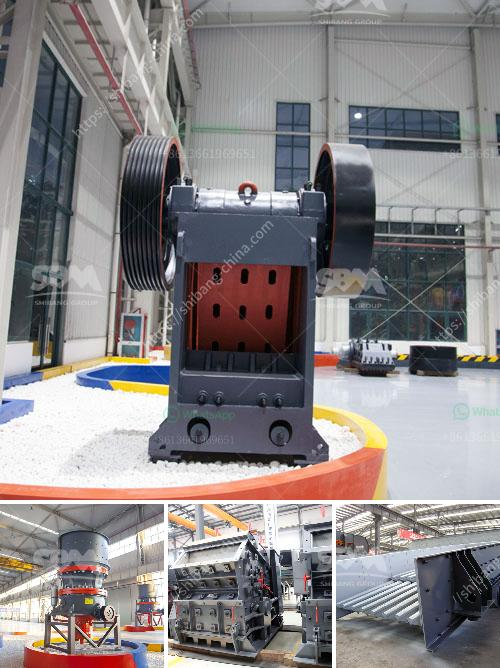

<h3>china stone crusher pe 400 specs</h3>
The stone crusher is an essential equipment in mining machinery. It is widely used in various stages such as coarse crushing, medium crushing, fine crushing, and sand making. It is used as a primary, secondary, or tertiary crusher depending on the types of material being crushed.

One of the most popular stone crushers in the market is the PE 400 model. This crusher is designed and developed by a famous manufacturer in China. It has a maximum feeding size of 340 mm and a production capacity range of 10-40 tons per hour.

The PE 400 model is suitable for crushing stone materials with compressive strength below 320MPa. It can crush various materials, such as granite, limestone, concrete, and pebble, into finished stones with different sizes. The discharging size of the crusher can be adjusted between 40-100 mm, which makes it suitable for different applications.

In terms of features, the PE 400 stone crusher has several notable specifications. It has a simple structure, which makes it easy to operate and maintain. The crusher is equipped with deep crushing chamber and no dead zone, which improves the feeding capacity and output.

The eccentric shaft is made of high-quality steel, ensuring its stability and strength. The toggle plate, also made of high-quality steel, enhances the crushing effect and protects the machine from overload. The flywheel plays a crucial role in the crusher's operation, reducing energy consumption and increasing the crushing efficiency.

The PE 400 stone crusher is driven by an electric motor or diesel engine, which makes it flexible and convenient to use. It can be powered by either electricity or diesel, depending on the specific requirements of the user. With an energy-saving design, it consumes less power and produces less noise during operation.

As for the working principle, the PE 400 stone crusher uses a motor as the power source. The motor drives the belt and pulley to make the movable jaw move back and forth, up and down through the eccentric shaft. The raw materials are continuously crushed and discharged from the crushing chamber, forming a continuous production process.

In conclusion, the PE 400 stone crusher is a versatile and efficient machine suitable for various crushing applications. With its robust construction, high crushing capacity, and adjustable discharging size, it can meet the needs of different users. Whether used in mining, construction, or other industries, this crusher is guaranteed to deliver exceptional performance and create value for its users.
<h3>Contact us</h3><ul><li><strong>Whatsapp:&nbsp;<a href="https://wa.me/8613661969651">+8613661969651</a></strong></li><li><a href="https://swt.shibang-china.com/?git&amp;zhl&amp;china stone crusher pe 400 specs"><strong>Online Service(chat now)</strong></a></li></ul><h3>Related</h3><ul><li><a href='companies selling mining equipment in south africa.md'>companies selling mining equipment in south africa</a></li><li><a href='german technical semi mobile crusher.md'>german technical semi mobile crusher</a></li><li><a href='vibrating screen price philippines.md'>vibrating screen price philippines</a></li><li><a href='cement project cost in pakistan.md'>cement project cost in pakistan</a></li><li><a href='buy used crushing coal screen plant.md'>buy used crushing coal screen plant</a></li></ul>