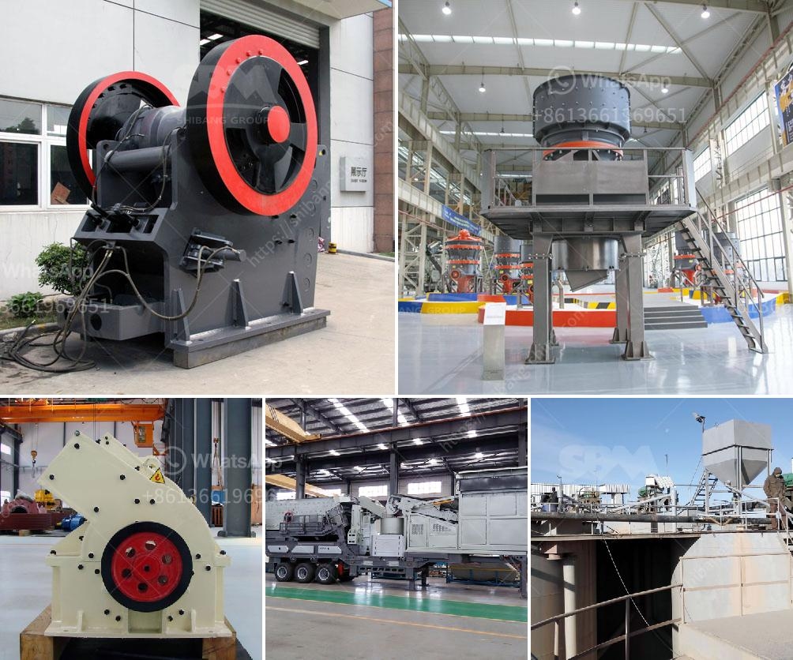

<h3>china stone grinding mill</h3>
Stone grinding mill, also known as raymond mill, is a widely utilized milling machine that is mainly used for grinding various rocks or ores into powder for further processing. The stone grinding mill is used in industries such as metallurgy, building materials, chemical engineering, mining, and many others. It is usually used to process non-explosive and non-flammable materials, such as quartz, feldspar, calcite, limestone, etc.

One of the key advantages of stone grinding mill is its ability to produce uniform particle size distribution. With the advanced technology and strict quality control system, the stone grinding mill manufactured in China can ensure precise fineness and excellent particle morphology. This is essential for industries that require consistent and high-quality products.

Another noteworthy feature of China stone grinding mill is its high energy efficiency. The grinding process is conducted in a closed system, which minimizes energy consumption and ensures that the product is ground to the desired fineness. Additionally, the stone grinding mill has a low noise level, making it suitable for use in noise-sensitive environments.

In terms of design and manufacturing, China stone grinding mill has always been at the forefront of the industry. Chinese manufacturers continuously invest in research and development to improve the performance and optimize the design of stone grinding mills. As a result, China stone grinding mills are equipped with advanced technology and innovative features to meet the diverse needs of customers worldwide.

In conclusion, the stone grinding mill manufactured in China is a reliable grinding solution, which can be used for grinding various rocks and ores into powder. With its high energy efficiency, precise fineness control, and noise reduction features, the China stone grinding mill is a cost-effective and environmentally friendly option for many industries. Whether it is used in mining, building materials, or chemical engineering, the China stone grinding mill is known for its excellent performance and quality.
<h3>Contact us</h3><ul><li><strong>Whatsapp:&nbsp;<a href="https://wa.me/8613661969651">+8613661969651</a></strong></li><li><a href="https://swt.shibang-china.com/?git&amp;zhl&amp;china stone grinding mill"><strong>Online Service(chat now)</strong></a></li></ul><h3>Related</h3><ul><li><a href='crushing machine in quarry.md'>crushing machine in quarry</a></li><li><a href='crusher machine manufacturers in pakistan.md'>crusher machine manufacturers in pakistan</a></li><li><a href='talc grinding mills usa.md'>talc grinding mills usa</a></li><li><a href='plant grinder mill price.md'>plant grinder mill price</a></li><li><a href='coal screen plant for hire in south africa.md'>coal screen plant for hire in south africa</a></li></ul>