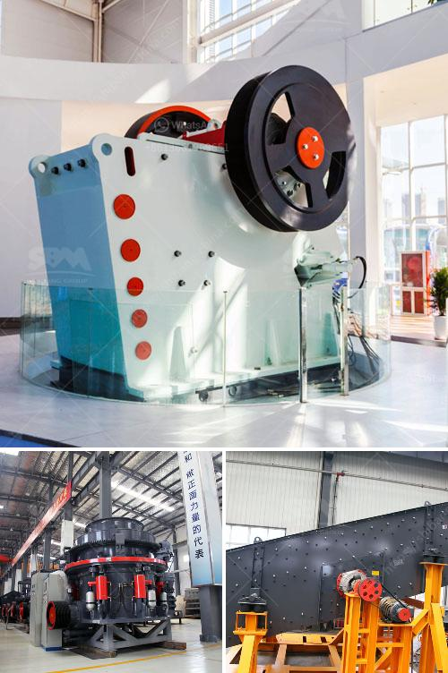

<h3>china vertical roller mill</h3>
China is known for its manufacturing prowess and technological advancements, especially in the realm of heavy machinery and equipment. One prime example of China's engineering excellence is the vertical roller mill (VRM).

What is a vertical roller mill, you may ask? A vertical roller mill is a type of industrial equipment used to crush or grind materials into small particles. These machines consist of a large, heavy-duty steel drum that relies on mechanical force to pulverize the material into a fine powder.

China's vertical roller mill has gained an increasing popularity worldwide over the years. Its unique features and capabilities have made it an essential tool in various industries such as cement, power generation, mining, chemical, and metallurgy.

First and foremost, the vertical roller mill offers exceptional grinding efficiency. With its advanced grinding technology, the machine can produce high-quality finished products with a narrow particle size distribution. This attribute is particularly important for industries like cement manufacturing, where specific particle sizes are required to achieve the desired cement properties.

Moreover, the vertical roller mill is equipped with multiple grinding rollers that can be adjusted independently. This design enables different materials to be ground simultaneously, resulting in increased productivity and cost savings.

Additionally, the vertical roller mill is highly flexible and adaptable. It can accommodate various types of materials, including both hard and soft ones. This versatility allows industries to process different materials with a single machine, eliminating the need for multiple types of equipment.

The vertical roller mill boasts a compact design, saving valuable floor space in manufacturing plants. Despite its small footprint, the machine can handle large volumes of materials, making it suitable for both small and large-scale production.

Furthermore, China's vertical roller mill is equipped with advanced control systems, ensuring precise and consistent operation. The automation features allow operators to monitor and adjust the machine's parameters in real-time, optimizing performance and enhancing operational efficiency.

In terms of maintenance, the vertical roller mill is fairly easy to operate and maintain. It requires minimal manual intervention and can be equipped with automatic lubrication systems, reducing the risk of equipment failure and increasing its service life.

From an environmental perspective, the vertical roller mill offers significant energy savings compared to traditional grinding mills. Its efficient design and use of advanced components result in reduced energy consumption, leading to lower greenhouse gas emissions.

China's vertical roller mills are not only technologically advanced but also cost-effective. They provide excellent value for money, with durable construction and low maintenance requirements. The machines' long lifespan and high reliability contribute to a lower total cost of ownership, making them a smart investment for industries looking to streamline their operations and increase profitability.

In conclusion, China's vertical roller mill is a testament to the country's engineering prowess. Its advanced grinding technology, flexibility, efficiency, and cost-effectiveness make it a valuable tool in various industries. With continuous improvements and technological advancements, China's vertical roller mills are set to revolutionize the way materials are processed, creating a brighter future for manufacturing worldwide.
<h3>Contact us</h3><ul><li><strong>Whatsapp:&nbsp;<a href="https://wa.me/8613661969651">+8613661969651</a></strong></li><li><a href="https://swt.shibang-china.com/?git&amp;zhl&amp;china vertical roller mill"><strong>Online Service(chat now)</strong></a></li></ul><h3>Related</h3><ul><li><a href='how to start quarry business.md'>how to start quarry business</a></li><li><a href='portable hard rock mining.md'>portable hard rock mining</a></li><li><a href='hammer mill h 300 tph.md'>hammer mill h 300 tph</a></li><li><a href='marble grinding machine dealers.md'>marble grinding machine dealers</a></li><li><a href='balance calculations in vertical roller mill.md'>balance calculations in vertical roller mill</a></li></ul>