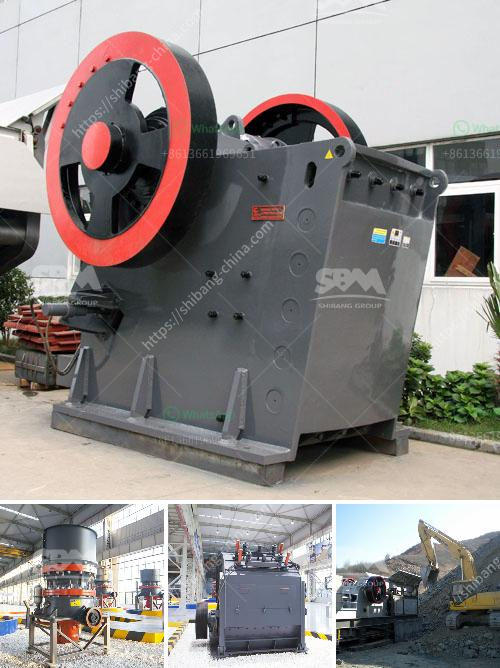

<h3>chrome beneficiation plant china</h3>
Chrome ore beneficiation plant in China is the most commonly used Mineral processing method, which is basic on the industrial requirements and mainly composed of four parts: crushing activities, grinding activities, grading activities and gravity concentration activities. There are three types of crushing activities that can be selected: the first crushing process uses a jaw crusher, and the ore is selectively crushed; the second crushing process uses a cone crusher, and the ore is screened and crushed; the third crushing process uses a roller crusher, and the ore is crushed in a roller press.

After the ore is crushed, it needs to be ground in a grinding mill. The grinding process mainly includes ball mill, rod mill, self-grinding mill, and semi-self-grinding mill. After the primary grinding, the qualified ore enters the grading operation. The main grading equipment is the spiral classifier, and the spiral classifier can grade the minerals and send them into the next grinding operation.

The gravity concentration process is an important part of the chrome beneficiation plant in China. The principle of gravity concentration is based on the difference in the specific gravity of the ore minerals and the gangue minerals. The commonly used equipment for gravity concentration includes shaking table, jig, and spiral chute. These gravity concentration equipment can effectively recover the coarse grain of chrome ore and solve the problem of excessive loss of chrome ore fines in the process of beneficiation.

At present, the chrome beneficiation plant in China has been developed and put into use, and the number of beneficiation plants is also increasing. This article mainly introduces the chrome beneficiation plant in China. It mainly includes the following aspects:

The chrome ore is a hard metal with a bright metallic luster, which is obtained by mining chrome ore and then smelting it. The chrome ore is usually obtained by the method of gravity separation. If the chrome ore contains a lot of iron, the gravity separation process is not suitable. Therefore, the common chrome ore beneficiation plants in the world mainly include the following types:

The spiral chute concentrator is the earliest mining and beneficiation equipment, which can effectively recover a variety of minerals including chromite and has been widely used in the treatment of iron ore, tungsten, tin ore, niobium tantalum ore, coastal and riverside placer and gold ore.

The jigging machine models for iron ore will depend on the iron ore itself. For coarse iron ore inlay, any kind of jiggers can help to gain great beneficiation efficiency while for fine iron inlay separation, saw tooth wave jigger will be adopted to beneficiate the ore with high recovery and great beneficiation efficiency.

Spiral concentrator is also a popular chrome ore beneficiation machine. Besides the function of recovery, gravity spiral concentrator can also have the function of producting qualified chrome concentrate for final application.

In conclusion, the chrome beneficiation plant in China has been developed and put into use, and the number of chrome beneficiation plants is also increasing. This article mainly introduces the chrome beneficiation plant in China, including the introduction of chrome ore, the main equipment of chrome beneficiation plant, and the chrome ore beneficiation process.
<h3>Contact us</h3><ul><li><strong>Whatsapp:&nbsp;<a href="https://wa.me/8613661969651">+8613661969651</a></strong></li><li><a href="https://swt.shibang-china.com/?git&amp;zhl&amp;chrome beneficiation plant china"><strong>Online Service(chat now)</strong></a></li></ul><h3>Related</h3><ul><li><a href='jual mesin limestone crusher.md'>jual mesin limestone crusher</a></li><li><a href='designs of hammer mills.md'>designs of hammer mills</a></li><li><a href='stone ball mill up mesh.md'>stone ball mill up mesh</a></li><li><a href='stone stone crusher machine malaysia.md'>stone stone crusher machine malaysia</a></li><li><a href='ball mills mfg in kenya.md'>ball mills mfg in kenya</a></li></ul>