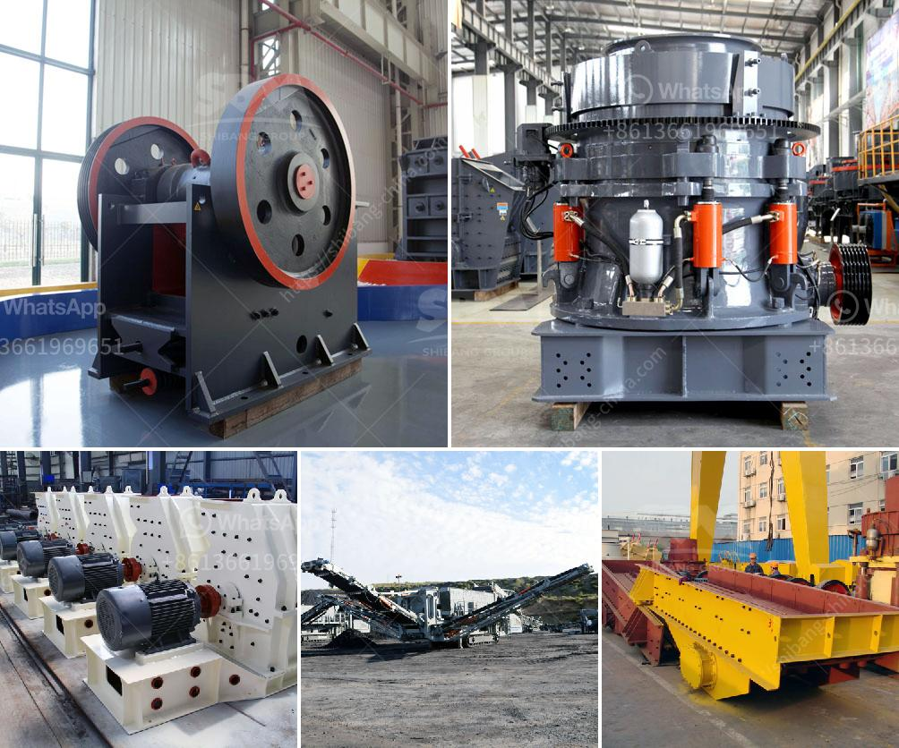

<h3>chrome washing machine plant eluvial mill gold</h3>
Chrome washing machine plant eluvial mill gold is a state-of-the-art technology that offers an alternative to traditional mining methods. This innovative process uses a washing machine-style plant to extract gold from eluvial deposits in a cost-effective and efficient manner.

Eluvial gold refers to gold deposits that have been weathered and eroded from the original source rock and are found in gravel and sand deposits near the surface. These deposits are often overlooked by traditional mining methods, as they are not generally located in large, concentrated lodes.

The chrome washing machine plant eluvial mill gold process involves a series of steps. First, the eluvial material is excavated from the ground and transported to the washing plant. At the plant, the material is washed and screened to remove any larger rocks or debris. This step helps to ensure that only the finest material is processed.

Next, the washed material is fed into the mill, where it is ground into a fine powder using various crushing and grinding techniques. This powdered material is then mixed with water to create a slurry, which is further processed in the chrome washing machine.

The chrome washing machine uses a combination of gravity and centrifugal forces to separate the gold from the slurry. The machine is equipped with rotating plates that create a fluidized bed, allowing the heavier gold particles to settle to the bottom, while the lighter material is washed away. This process is repeated multiple times to ensure maximum gold recovery.

The chrome washing machine plant eluvial mill gold process offers several advantages over traditional mining methods. Firstly, it is a more environmentally friendly option, as it eliminates the need for extensive excavation and the use of harmful chemicals such as mercury or cyanide. Additionally, the chrome washing machine is highly efficient, with the ability to recover up to 95% of the gold from the eluvial material.

In conclusion, the chrome washing machine plant eluvial mill gold process is a state-of-the-art technology that offers a cost-effective and efficient method of recovering gold from eluvial deposits. With its environmentally friendly approach and high recovery rates, it is a promising alternative for the mining industry.
<h3>Contact us</h3><ul><li><strong>Whatsapp:&nbsp;<a href="https://wa.me/8613661969651">+8613661969651</a></strong></li><li><a href="https://swt.shibang-china.com/?git&amp;zhl&amp;chrome washing machine plant eluvial mill gold"><strong>Online Service(chat now)</strong></a></li></ul><h3>Related</h3><ul><li><a href='gypsum mines in pakistan.md'>gypsum mines in pakistan</a></li><li><a href='calculation of cement ball mill capacity.md'>calculation of cement ball mill capacity</a></li><li><a href='silica sand washing steps.md'>silica sand washing steps</a></li><li><a href='gravel crushers manufacturers.md'>gravel crushers manufacturers</a></li><li><a href='mica processing technology and flow chart.md'>mica processing technology and flow chart</a></li></ul>