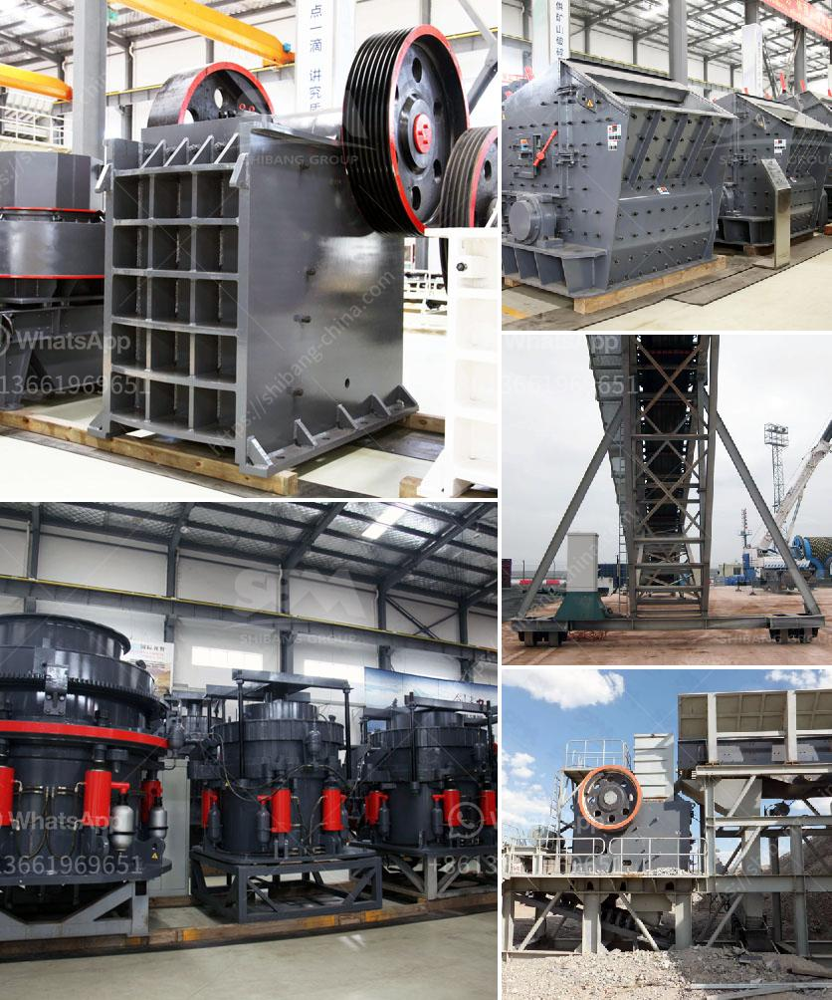

<h3>chrome washing machine plant eluvial</h3>
Chrome ore is a valuable mineral, extensively used in various industries for its exceptional properties. The demand for chrome has been rapidly increasing, leading to the exploration of more efficient extraction methods. One such groundbreaking solution is the Chrome Washing Machine Plant Eluvial, which has revolutionized chrome ore extraction.

The Chrome Washing Machine Plant Eluvial is a state-of-the-art facility designed to extract chrome ore from eluvial deposits. Eluvial deposits refer to the weathering of minerals on the surface, resulting in the accumulation of rich ore deposits. This innovative plant effectively harnesses these deposits, streamlining the extraction process.

One of the key advantages of the Chrome Washing Machine Plant Eluvial is its efficiency. Traditional chrome ore extraction methods involve complex and time-consuming processes, including extensive digging and chemical treatment. This often results in wastage of resources and increased production costs. However, the Chrome Washing Machine Plant Eluvial offers a faster and more efficient alternative.

The plant utilizes advanced washing technology to separate the chrome ore from unwanted impurities. The eluvial deposits are initially crushed and screened to remove any large particles. The remaining ore is then fed into the washing machine, where it undergoes a series of sieving and washing processes. These processes effectively separate the chrome ore from the surrounding soil and other impurities, yielding high-quality chrome concentrate.

Another significant advantage of the Chrome Washing Machine Plant Eluvial is its environmental friendliness. Traditional chrome ore extraction methods often result in significant disturbance to the natural habitat due to extensive digging and chemical usage. On the other hand, the plant minimizes environmental impact by utilizing eluvial deposits. This prevents unnecessary excavation and reduces the carbon footprint.

Not only does the Chrome Washing Machine Plant Eluvial offer superior efficiency and environmental benefits, but it also brings economic advantages. By streamlining the extraction process, the plant reduces production costs, allowing for more cost-effective extraction of chrome ore. This, in turn, contributes to increased profitability for companies involved in the chrome industry.

The Chrome Washing Machine Plant Eluvial is a game-changer in the chrome ore extraction industry. Its efficient and environmentally friendly approach, combined with economic advantages, make it a preferred solution for chrome extraction. As the demand for chrome continues to rise, this innovative plant provides an excellent opportunity to meet the market requirements while minimizing environmental impact and maximizing profitability.
<h3>Contact us</h3><ul><li><strong>Whatsapp:&nbsp;<a href="https://wa.me/8613661969651">+8613661969651</a></strong></li><li><a href="https://swt.shibang-china.com/?git&amp;zhl&amp;chrome washing machine plant eluvial"><strong>Online Service(chat now)</strong></a></li></ul><h3>Related</h3><ul><li><a href='chrome washing machine plant eluvial mill gold.md'>chrome washing machine plant eluvial mill gold</a></li><li><a href='clay grinder machine kerala.md'>clay grinder machine kerala</a></li><li><a href='crusher manufactures in europe.md'>crusher manufactures in europe</a></li><li><a href='used stone crushers for sale kenya.md'>used stone crushers for sale kenya</a></li><li><a href='barite grinding plants.md'>barite grinding plants</a></li></ul>