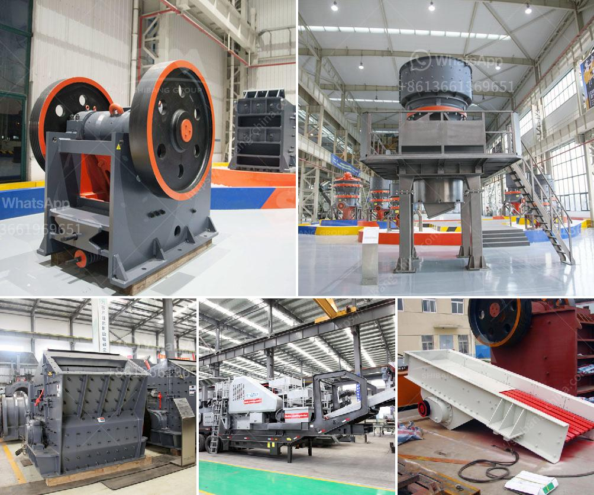

<h3>chrome washing plant new technology</h3>
The mining industry has always been at the forefront of technological advancements. With the relentless pursuit of more efficient and sustainable operations, mining companies are constantly exploring new ways to improve their processes. In recent years, one technology that has caught the attention of the mining community is the chrome washing plant.

Chrome, a vital metal used in various industries including stainless steel production, is primarily extracted from chromite ore deposits. Traditionally, the process of extracting chrome involved large-scale mining operations, which often resulted in significant environmental impacts. However, with the introduction of chrome washing plants, the mining industry has witnessed a revolution in its operations.

A chrome washing plant is a facility designed to concentrate chromite ore and remove impurities such as silica, alumina, and other minerals. This process enables mining companies to obtain high-quality chrome concentrate, which is vital for the production of stainless steel. The utilization of chrome washing plants offers several advantages over traditional mining methods.

First and foremost, chrome washing plants ensure a more environmentally friendly approach to chrome extraction. By removing impurities at an early stage, mining companies can significantly reduce the amount of waste generated during the mining process. This not only helps protect the surrounding ecosystems but also minimizes the environmental footprint of the overall operation.

Moreover, chrome washing plants facilitate a more efficient and cost-effective mining process. By concentrating the chrome ore into a high-grade concentrate, mining companies can maximize the economic value of their operation. With the help of advanced technology and equipment, chrome washing plants enable higher recovery rates, ensuring that no valuable chrome is wasted during extraction.

Additionally, chrome washing plants offer enhanced safety for mine workers. With traditional mining methods, workers are exposed to various hazards, including collapses and accidents. However, by utilizing automated processes and machinery within a controlled environment, chrome washing plants reduce the risk of accidents and injuries to workers.

In terms of technological advancements, chrome washing plants have come a long way. The latest chrome washing plants utilize state-of-the-art equipment, such as vibrating screens, spirals, and magnetic separators, to achieve optimal results. These modern plants not only provide higher recovery rates and superior product quality but also minimize water and energy consumption, making them more sustainable.

The implementation of chrome washing plants has already made a significant impact on the mining industry. Mining companies that have adopted this technology have reported increased production levels, improved product quality, and reduced environmental impacts. As a result, chrome washing plants are becoming increasingly popular and sought after in the mining industry.

In conclusion, the introduction of chrome washing plants has revolutionized the mining industry. This new technology offers a more efficient, environmentally friendly, and cost-effective approach to chrome extraction. With its ability to concentrate chromite ore and remove impurities, chrome washing plants have become an indispensable asset for mining companies. As advancements in technology continue to enhance the capabilities of these plants, the future of chrome extraction looks promising, with increased sustainability and improved productivity.
<h3>Contact us</h3><ul><li><strong>Whatsapp:&nbsp;<a href="https://wa.me/8613661969651">+8613661969651</a></strong></li><li><a href="https://swt.shibang-china.com/?git&amp;zhl&amp;chrome washing plant new technology"><strong>Online Service(chat now)</strong></a></li></ul><h3>Related</h3><ul><li><a href='buy fine grinding machine.md'>buy fine grinding machine</a></li><li><a href='cement mill liner manufacturers in india.md'>cement mill liner manufacturers in india</a></li><li><a href='impact crushers for rent.md'>impact crushers for rent</a></li><li><a href='price of stone crusher machine in pakistan.md'>price of stone crusher machine in pakistan</a></li><li><a href='mobile crushing unit.md'>mobile crushing unit</a></li></ul>