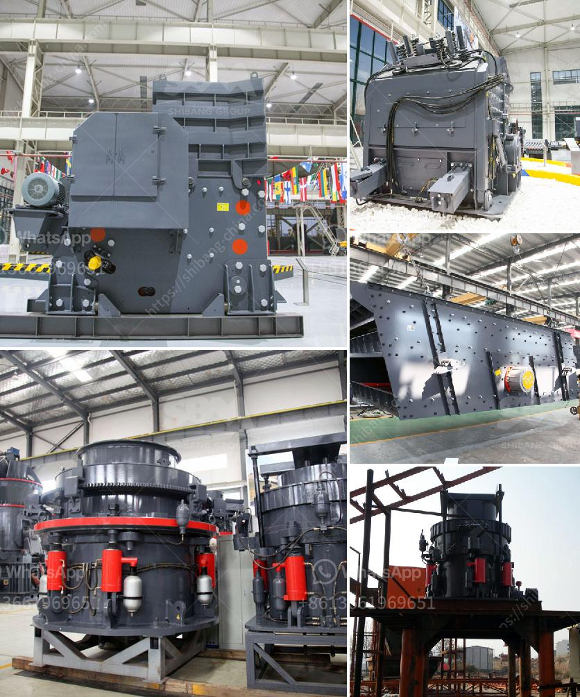

<h3>clay beneficiation process</h3>
Clay beneficiation is a process that involves separating the impurities from clay to improve its quality. Clay beneficiation relies on the different physical and chemical properties of the clay minerals and their association with impurities. The process removes unwanted materials such as sand, mica, iron oxide, and carbonates, resulting in a more refined clay product.

The beneficiation process typically includes sieving, attrition, scrubbing, gravity separation, and magnetic separation techniques. These processes can be classified into two main categories: physical beneficiation and chemical beneficiation.

Physical beneficiation involves the use of mechanical methods to separate impurities from clay. Sieving is often the first step, where the clay is passed through a series of screens to remove large particles. This is followed by attrition and scrubbing, which involve agitation of the clay to remove surface impurities. Gravity separation is then used to separate heavier impurities such as sand and iron oxide from the lighter clay particles. Magnetic separation can also be employed to remove magnetic impurities from the clay.

Chemical beneficiation, on the other hand, utilizes chemical reactions to remove impurities from clay. Acid leaching is a commonly used method, where the clay is treated with acids to dissolve the impurities. This process is effective in removing carbonates and other minerals that are not soluble in water but readily dissolve in acid. In some cases, the clay may need to be calcined, heated to high temperatures, to enhance the effectiveness of chemical beneficiation.

The beneficiation process is crucial in producing clay with specific desired properties. Beneficiated clay has enhanced plasticity, which is important for molding and shaping applications. It also has improved strength, making it suitable for construction materials. Moreover, beneficiated clay has a higher purity level, ensuring it meets the required specifications for different end uses.

The beneficiation process can vary depending on the type of clay being processed. Kaolin, for instance, is one of the most important and widely used clays. The beneficiation of kaolin commonly consists of two processes: mechanical carrier flotation and selective flocculation. Carrier flotation involves the addition of a flotation agent to selectively separate the hydrophobic constituents from the kaolin clay. Selective flocculation, on the other hand, utilizes polymer flocculants to selectively aggregate and settle the impurities, which can then be removed through sedimentation.

Clay beneficiation is an essential step in the value chain of clay products, as it improves the properties of clay for various applications. The process helps to eliminate impurities, enhance plasticity and strength, and ensure the desired quality of the final product. By employing physical and chemical beneficiation techniques, clay processors can produce high-quality clay that meets the specifications of different industries.
<h3>Contact us</h3><ul><li><strong>Whatsapp:&nbsp;<a href="https://wa.me/8613661969651">+8613661969651</a></strong></li><li><a href="https://swt.shibang-china.com/?git&amp;zhl&amp;clay beneficiation process"><strong>Online Service(chat now)</strong></a></li></ul><h3>Related</h3><ul><li><a href='mobile crusher plants.md'>mobile crusher plants</a></li><li><a href='grinding tools dealers in nigeria.md'>grinding tools dealers in nigeria</a></li><li><a href='impact crusher equipment.md'>impact crusher equipment</a></li><li><a href='second hand quarry equipment price philippines.md'>second hand quarry equipment price philippines</a></li><li><a href='mtw grinding mill.md'>mtw grinding mill</a></li></ul>