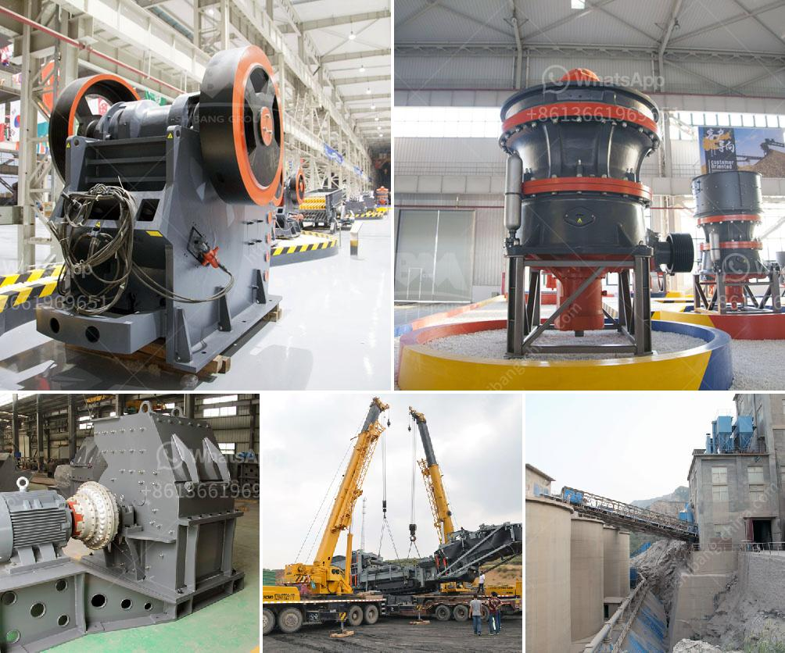

<h3>clay crusher machine</h3>
Clay, an abundant and versatile natural resource, has been used for centuries as a building material. However, clay production has its challenges, particularly when it comes to crushing materials such as clay, limestone, and other minerals into powder form or slurry. An indispensable machine in the construction industry, the clay crusher machine helps convert clay into usable construction materials.

As the construction industry continues to evolve, the demand for manufactured sand (M-sand) is increasing. This is where the clay crusher machine comes into play. This machine is an essential piece of equipment in any construction site, and it effectively reduces clay lumps and solids into smaller particles with its powerful motor-driven blades.

One of the key advantages of the clay crusher machine is that it guarantees consistent and uniform reduction in clay lumps or chunks into fine particles. This ensures that the clay material is processed evenly and efficiently, resulting in high-quality M-sand. The consistent sizing also helps reduce wasted material, improving cost efficiency and productivity on construction sites.

Another vital feature of the clay crusher machine is its ability to control the moisture content of the crushed clay. Excessive moisture in clay can be detrimental to the quality of the M-sand produced. The clay crusher machine allows operators to control the moisture content of the material through adjustable settings. With precise control over moisture levels, construction professionals can ensure optimal M-sand production.

Furthermore, the clay crusher machine is highly advanced in terms of maintenance and operating costs. It is designed to be low maintenance and easy to operate, with minimal need for manual intervention. This machine helps streamline the crushing process, reducing downtime and providing operators with more time to focus on other crucial tasks on the job site.

The versatility of the clay crusher machine is also worth mentioning. It can handle various types of clay, including sticky, plastic clay, shale clay, and mixed clay. This adaptability makes it suitable for a wide range of construction applications, from road construction to building foundations.

Despite its advantages, the clay crusher machine does have some limitations. For instance, it may experience issues with larger, harder clay rocks that are difficult to crush. However, these challenges can be overcome by employing complementary equipment, such as a jaw crusher or impact crusher, to break down larger clay boulders before they enter the clay crusher machine.

In conclusion, the clay crusher machine is an essential piece of equipment for construction sites that produce or use clay as a building material. It ensures consistent particle sizing, controls moisture levels, and improves overall productivity. Additionally, its low maintenance and operating costs make it a cost-effective solution for the construction industry. With its versatility and adaptability, this machine is changing the landscape of clay processing in construction tasks.
<h3>Contact us</h3><ul><li><strong>Whatsapp:&nbsp;<a href="https://wa.me/8613661969651">+8613661969651</a></strong></li><li><a href="https://swt.shibang-china.com/?git&amp;zhl&amp;clay crusher machine"><strong>Online Service(chat now)</strong></a></li></ul><h3>Related</h3><ul><li><a href='used stone crusher in uganda.md'>used stone crusher in uganda</a></li><li><a href='second hand gold mining equipments in uk.md'>second hand gold mining equipments in uk</a></li><li><a href='specifications of a tonnes hour jaw crusher.md'>specifications of a tonnes hour jaw crusher</a></li><li><a href='cement production equipment in germany.md'>cement production equipment in germany</a></li><li><a href='marble quarry mining in sudan.md'>marble quarry mining in sudan</a></li></ul>