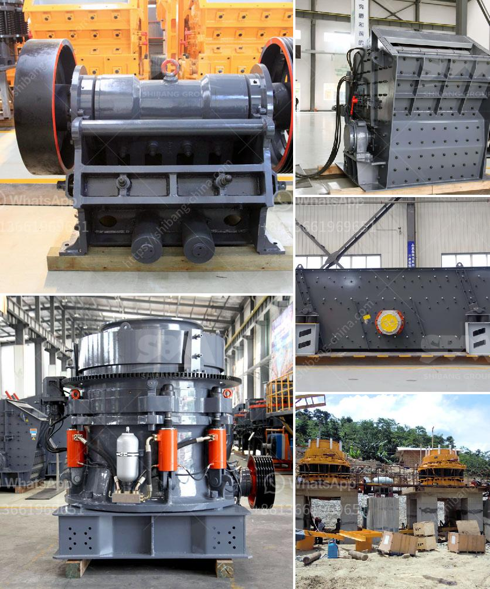

<h3>clay crushers for clay crushing process</h3>
Clay Crushes - Consisting of clay minerals, clay crushers are designed to break up and pulverize clay into various uses from clay pottery to industrial clay. These crushers are often called "clay busters" as they are engineered to process clay and other sedimentary materials.

Clay is a naturally occurring fine-grained soil composed mainly of clay minerals. When moistened, it becomes pliable and can be shaped into various forms. Clay has a wide range of applications, from art and pottery to construction and agriculture. However, before it can be utilized, it must first be processed and broken down into a more manageable form.

This is where clay crushers come into play. Clay crushers are essential machines in the clay crushing process. With various modes of operation, these machines can help achieve the desired end product for any clay-related application.

The primary crusher reduces the size of large clay lumps in preparation for subsequent processing. Secondary crushers further break down the clay into particles less than 2 inches in size. These crushers perform both primary and secondary crushing tasks, working in tandem to process clay into the desired size.

One of the main components of clay crushers are the hammers. These hammers deliver powerful blows to the clay material, resulting in its breakdown. The hammer design and configuration can vary depending on the specific application, with some crushers having multiple rows of hammers to ensure efficient clay crushing.

Another important element of clay crushers is the screen. The screen allows for the separation of clay particles of different sizes. The finer particles can then be used for pottery or other applications, while larger particles can be further processed or discarded. Screens come in various sizes and configurations to accommodate different clay crushing needs.

In addition to hammers and screens, clay crushers also feature heavy-duty motors and drive belts to power the crushing process. The motors provide the necessary torque to operate the machine, while the drive belts ensure smooth and consistent power transmission.

Depending on the clay crushing requirements, clay crushers can be stationary or mobile. Stationary crushers are often found in clay pits where the clay is mined and processed on-site. Mobile crushers, on the other hand, can be transported to various locations to process clay at different sites. This flexibility allows for clay to be processed more efficiently and conveniently.

The clay crushing process is crucial in achieving the desired clay particle size and quality. Clay crushers play a key role in the whole clay crushing process and are responsible for breaking and grinding the clay into smaller sizes suitable for further processing.

As detailed above, crushers are versatile machines designed to serve different purposes. Whether it is for pottery, construction, or industrial applications, clay crushers efficiently and effectively handle the crushing and processing of clay materials. Their robust construction and innovative features ensure maximum productivity and reliable operation.

In conclusion, clay crushers are integral to the clay crushing process. They are specifically designed to break down clay into smaller particles, allowing for its various applications. From pottery to construction, clay crushers provide the necessary crushing power to transform clay into a usable product. With their hammers, screens, motors, and drive belts, these machines are essential in the clay crushing process.
<h3>Contact us</h3><ul><li><strong>Whatsapp:&nbsp;<a href="https://wa.me/8613661969651">+8613661969651</a></strong></li><li><a href="https://swt.shibang-china.com/?git&amp;zhl&amp;clay crushers for clay crushing process"><strong>Online Service(chat now)</strong></a></li></ul><h3>Related</h3><ul><li><a href='gold ore mill for sale in canada.md'>gold ore mill for sale in canada</a></li><li><a href='rock crushing machine price in india.md'>rock crushing machine price in india</a></li><li><a href='crushing machine in quarry.md'>crushing machine in quarry</a></li><li><a href='mobile gold processing plant in germany.md'>mobile gold processing plant in germany</a></li><li><a href='mining machine and equipments for limestone.md'>mining machine and equipments for limestone</a></li></ul>