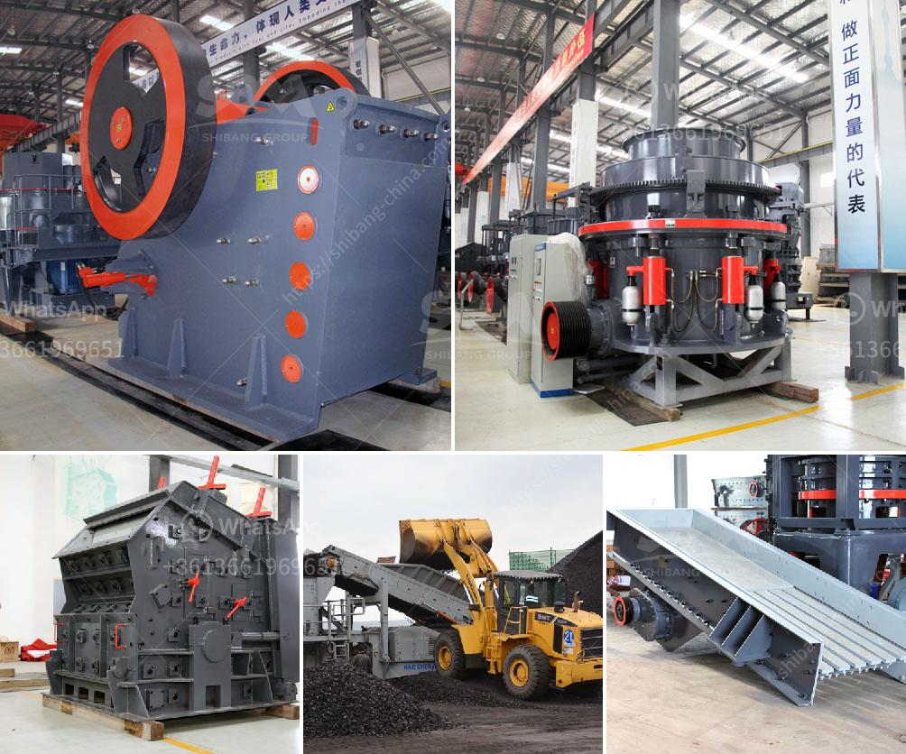

<h3>clay grinder machine kerala</h3>
In the southern state of Kerala in India, an ancient craft of pottery making has been revived thanks to the introduction of a clay grinder machine. This innovative device has led to a transformation in the way clay is processed and has brought a new lease of life to the potters of Kerala.

For centuries, pottery making has been an intrinsic part of Kerala's culture and heritage. Skilled artisans have been crafting clay into beautiful and functional objects, ranging from pots and pitchers to decorative items and sculptures. The traditional method of preparing clay involved manual grinding and pounding, which was a labor-intensive and time-consuming process. However, with the advent of modern technology, the pottery industry in the state underwent a significant change.

The introduction of the clay grinder machine has revolutionized the pottery-making process in Kerala. This machine, also known as a clay pulverizer, grinds and mixes clay material, water, and other additives to produce a smooth and malleable clay paste. The device consists of a sturdy grinder that efficiently crushes the clay into fine particles, enhancing its workability and plasticity.

One of the key advantages of the clay grinder machine is its ability to save time and effort for potters. Previously, artisans had to spend hours manually grinding the clay using wooden or stone tools, exerting considerable physical labor. The advent of the clay grinder machine has considerably reduced the time required to process clay, allowing potters to focus on the creative aspects of their work.

Additionally, the machine ensures better consistency and quality in the clay paste. Through its efficient grinding process, the clay particles are evenly distributed, and any impurities or debris are removed. This results in a smoother and more homogenous clay paste, providing artisans with a superior material to work with.

Furthermore, the clay grinder machine has facilitated the use of different types of clay and additives, expanding the possibilities for creativity in pottery making. Potters can now experiment with various clay compositions, such as adding sand or crushed shells for texture or introducing colored pigments for unique visual effects. This has sparked innovation and led to the creation of contemporary designs that blend traditional techniques with modern aesthetics.

The clay grinder machine has also had a positive impact on the livelihoods of potters in Kerala. By automating the clay grinding process, the machine has increased the production capacity of artisans significantly. Potters can now create more pottery in less time, leading to increased sales and better financial prospects for themselves and their families.

The introduction of the clay grinder machine not only modernized the pottery industry in Kerala but also preserved and promoted an age-old craft. The machine has provided a new lease of life to the traditional art of pottery making, attracting younger generations to take up the craft and ensuring its survival for years to come.

In conclusion, the clay grinder machine has transformed the way clay is processed in Kerala's pottery industry. It has saved time and effort for artisans, enhanced the quality of clay paste, enabled creative experimentation, and improved the livelihoods of potters. This innovative device has not only modernized the craft but also preserved the rich cultural heritage of Kerala.
<h3>Contact us</h3><ul><li><strong>Whatsapp:&nbsp;<a href="https://wa.me/8613661969651">+8613661969651</a></strong></li><li><a href="https://swt.shibang-china.com/?git&amp;zhl&amp;clay grinder machine kerala"><strong>Online Service(chat now)</strong></a></li></ul><h3>Related</h3><ul><li><a href='mobile crusher machine price.md'>mobile crusher machine price</a></li><li><a href='used granite machines for sale cone crusher stone crusher.md'>used granite machines for sale cone crusher stone crusher</a></li><li><a href='barite bulking process.md'>barite bulking process</a></li><li><a href='clay beneficiation process.md'>clay beneficiation process</a></li><li><a href='black granite land for sale in tamilnadu.md'>black granite land for sale in tamilnadu</a></li></ul>