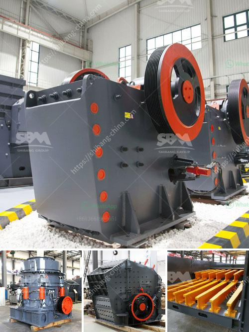

<h3>clay mill roller balancing</h3>
A clay mill roller plays a crucial role in the clay processing industry. It is responsible for grinding, mixing, and shaping clay into various forms for use in ceramics, pottery, and other manufacturing processes. A well-balanced clay mill roller is essential for achieving high efficiency and quality output. In this article, we will explore the importance of roller balancing and the methods used to ensure optimal performance.

The main purpose of balancing clay mill rollers is to minimize vibration and prevent excessive wear and tear. Vibrations not only affect the lifespan of the roller but also the overall performance of the mill. Unbalanced rollers tend to create uneven grinding and an unstable milling process, resulting in inconsistent clay quality and reduced productivity.

One common method used to balance clay mill rollers is dynamic balancing. This technique involves measuring the roller’s mass distribution and determining the points of imbalance. Dynamic balancing machines are commonly used for this purpose. These machines are equipped with sensors that detect the roller's vibration caused by imbalances. The collected data is then analyzed to identify the necessary corrections needed to achieve a balanced state.

Dynamic balancing involves the addition or removal of weights to specific areas of the roller. These weights are strategically placed to counteract the imbalances. The process is repeated until the roller reaches the desired balanced condition. It is important to note that dynamic balancing should be carried out regularly as the weight distribution of the roller may change over time due to normal wear and tear.

Another method used for roller balancing is called static balancing. This is a simpler technique compared to dynamic balancing and is often used for smaller rollers or when access to dynamic balancing machines is limited. Static balancing involves manually adding weights to the roller to achieve balance. The roller is placed on a balancing stand, and weights are adjusted until it remains stable in a specific position. While static balancing may not be as accurate as dynamic balancing, it is still effective in reducing vibrations and ensuring smoother operation.

In addition to balancing, regular maintenance and inspection of clay mill rollers are essential to prolong their lifespan and optimize performance. Proper lubrication, checking for signs of wear, and timely replacements of worn-out parts contribute to the overall efficiency and longevity of these rollers. Regular maintenance should also include checking the alignment of the rollers to ensure consistent grinding and minimize unnecessary stress on the machine.

Balancing clay mill rollers is critical for achieving efficient clay processing and maintaining high-quality output. The investment in dynamic balancing machines or utilizing static balancing techniques is well worth it in the long run, as it ensures longer roller lifespan, reduced vibrations, and improved overall performance. Combined with regular maintenance, roller balancing allows manufacturers in the clay processing industry to deliver consistent and superior clay products to their customers.

In conclusion, balancing clay mill rollers is a crucial step in optimizing efficiency and quality output in the clay processing industry. Whether through dynamic or static balancing methods, achieving a balanced state ensures reduced vibrations, smoother operation, and prolonged roller lifespan. Regular maintenance and inspections further contribute to the overall performance and reliability of these important machines. Manufacturers who prioritize roller balancing and maintenance are better equipped to deliver superior clay products and enhance their competitive edge in the market.
<h3>Contact us</h3><ul><li><strong>Whatsapp:&nbsp;<a href="https://wa.me/8613661969651">+8613661969651</a></strong></li><li><a href="https://swt.shibang-china.com/?git&amp;zhl&amp;clay mill roller balancing"><strong>Online Service(chat now)</strong></a></li></ul><h3>Related</h3><ul><li><a href='how to set up a crushing plant.md'>how to set up a crushing plant</a></li><li><a href='sand screen with vibrator.md'>sand screen with vibrator</a></li><li><a href='diatomite grinding mill in indonesia.md'>diatomite grinding mill in indonesia</a></li><li><a href='calcium carbonate manufacturing process.md'>calcium carbonate manufacturing process</a></li><li><a href='ballast making machine for sale.md'>ballast making machine for sale</a></li></ul>