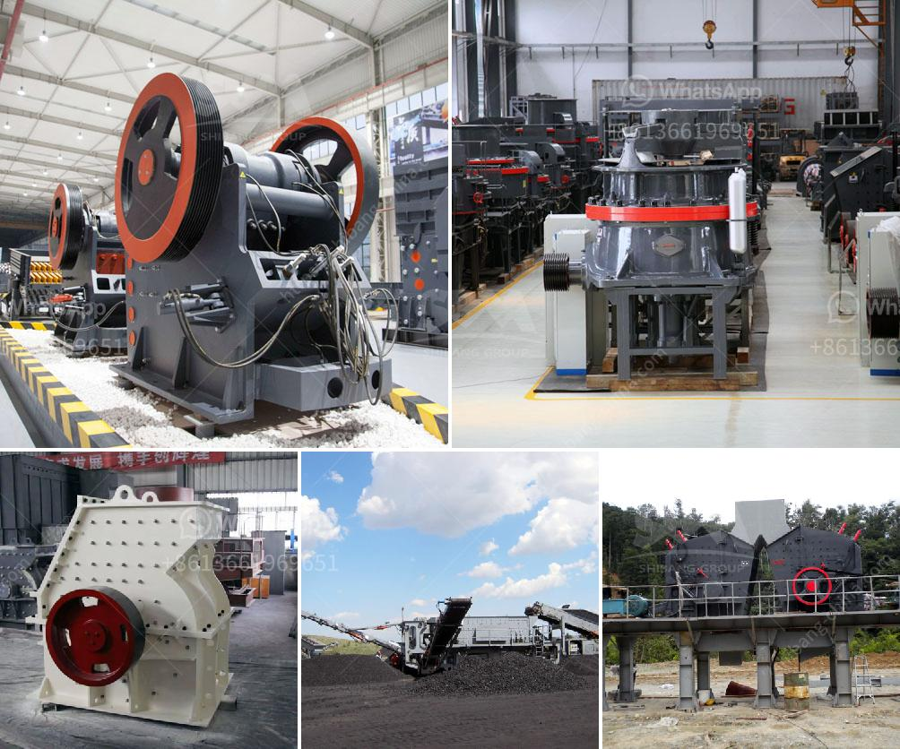

<h3>clinker grinding mill machine germany</h3>
Clinker grinding mill machine Germany is a mine machinery equipment, mainly used in metallurgy, building materials, chemical industry, mining and other mineral materials. Crushing materials are cement, clinker, limestone, etc. The material breaking method is usually used in keyless connection which is more flexible, convenient and reliable operation. The machine is mainly composed of feeding device, pre-discharge device, rotating device, transmission device (reducer, small driving gear, electric motor, electric control cabinet) and other components.

Germany Clinker Grinder machine is a kind of high-efficiency and energy-saving grinding machine, which is widely used in industries, such as cement, silicate, new building materials, refractory materials, fertilizers, black and non-ferrous metal beneficiation, and glass ceramics. It can not only bond with other grinding machines, but also form a single-stage grinding system to achieve simple operation, high-yield, and low consumption.

The Germany Clinker Grinder machine has made great contributions to the economic development of Germany. It not only solves the problem of electricity consumption in cement production, and reduces the pollution caused by mineral grinding, but also has a wider range of applications. With the continuous development of Germany's mineral processing technology and equipment, the market demand for cement clinker grinding mill machines in Germany is increasing.

The advantages of Germany clinker grinding mill machines are simple process flow, small investment, low energy consumption, and simple operation. The technology is mature and stable, and the equipment has a long service life. The output material has uniform particle size, good particle shape, and meets the standards of hydraulic and construction industries.

In conclusion, the Germany clinker grinding mill machines are widely used in cement, mining, building materials, chemical, and other fields. However, due to the inconsistency of the material source and the diversity of materials, the clinker grinding mill machine in Germany has a complex structure and a high degree of automation. Therefore, continuous improvement and development are still needed in its future operation and maintenance.
<h3>Contact us</h3><ul><li><strong>Whatsapp:&nbsp;<a href="https://wa.me/8613661969651">+8613661969651</a></strong></li><li><a href="https://swt.shibang-china.com/?git&amp;zhl&amp;clinker grinding mill machine germany"><strong>Online Service(chat now)</strong></a></li></ul><h3>Related</h3><ul><li><a href='ball mill machine in pakistan.md'>ball mill machine in pakistan</a></li><li><a href='xzm ultrafine grinding mill.md'>xzm ultrafine grinding mill</a></li><li><a href='project cost of 100 tpd opc cement plant.md'>project cost of 100 tpd opc cement plant</a></li><li><a href='construction of roller mill.md'>construction of roller mill</a></li><li><a href='crusher machine for sale south africa.md'>crusher machine for sale south africa</a></li></ul>