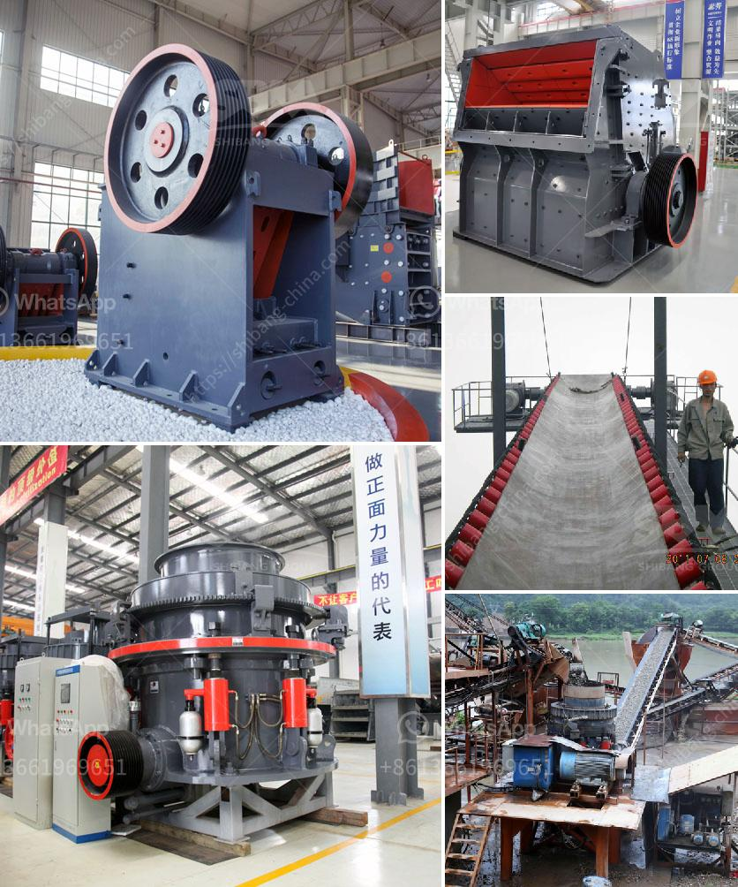

<h3>clinker grinding unit</h3>
Cement is an essential building material used in various construction projects. It is made from a mixture of limestone, clay, gypsum, and other additives. Many companies tend to specialize in the production of clinker, a component used for the development of cement. These specialized units, known as clinker grinding units, play a crucial role in the production process.

A clinker grinding unit is a stand-alone operation that manufacturers cement from clinker obtained from limestone and clay mines. The clinker is ground into a fine powder using specific grinding aids, such as fly ash, slag, or limestone, to control the setting time of cement and ensure optimal compression strength.

The clinker grinding process involves several stages. Firstly, large clinker pieces are crushed into smaller particles by various crushing equipment, such as jaw crushers, cone crushers, hammer crushers, or impact crushers. These machines reduce the clinker size to a more manageable level.

The next step is to transport the crushed clinker to the grinding unit using conveyors or trucks. Once at the grinding unit, the clinker undergoes further size reduction in rotating ball mills or vertical roller mills. The finely ground clinker is then mixed with gypsum and other additives to create cement.

The grinding process is energy-intensive, requiring substantial electrical power to rotate the mills. Moreover, grinding aids are often used to improve grindability and reduce power consumption. These additives, when combined with clinker and other materials, help to produce a high-quality cement product.

Additionally, clinker grinding units often have integrated storage facilities for clinker and cement, allowing for proper storage and distribution. These storage facilities play a crucial role in maintaining the consistency and quality of the cement produced.

Clinker grinding units are typically located near a cement plant, as they require a continuous supply of clinker to meet the production demands. Obtaining clinker from other sources may not be economically feasible due to transportation costs and potential quality variations.

Apart from grinding clinker, some clinker grinding units also produce blend cement by grinding different materials, such as blast furnace slag, fly ash, or limestone, with clinker. This allows cement manufacturers to produce specialized cement products with desired characteristics.

In conclusion, clinker grinding units are a vital component in the cement production process. They specialize in finely grinding clinker obtained from limestone and clay mines to produce cement powder. These units employ various crushing and grinding equipment to achieve optimal grindability and compression strength. The use of additives further enhances cement quality, while integrated storage facilities ensure consistent supply and distribution. Overall, clinker grinding units play a critical role in meeting the growing demand for cement in construction projects worldwide.
<h3>Contact us</h3><ul><li><strong>Whatsapp:&nbsp;<a href="https://wa.me/8613661969651">+8613661969651</a></strong></li><li><a href="https://swt.shibang-china.com/?git&amp;zhl&amp;clinker grinding unit"><strong>Online Service(chat now)</strong></a></li></ul><h3>Related</h3><ul><li><a href='quartz ball mill.md'>quartz ball mill</a></li><li><a href='cameroon quarry crusher.md'>cameroon quarry crusher</a></li><li><a href='looking for limestone crushing contractor.md'>looking for limestone crushing contractor</a></li><li><a href='harga stone crusher mini bekas.md'>harga stone crusher mini bekas</a></li><li><a href='raymond mill manufactrer in udaipur.md'>raymond mill manufactrer in udaipur</a></li></ul>