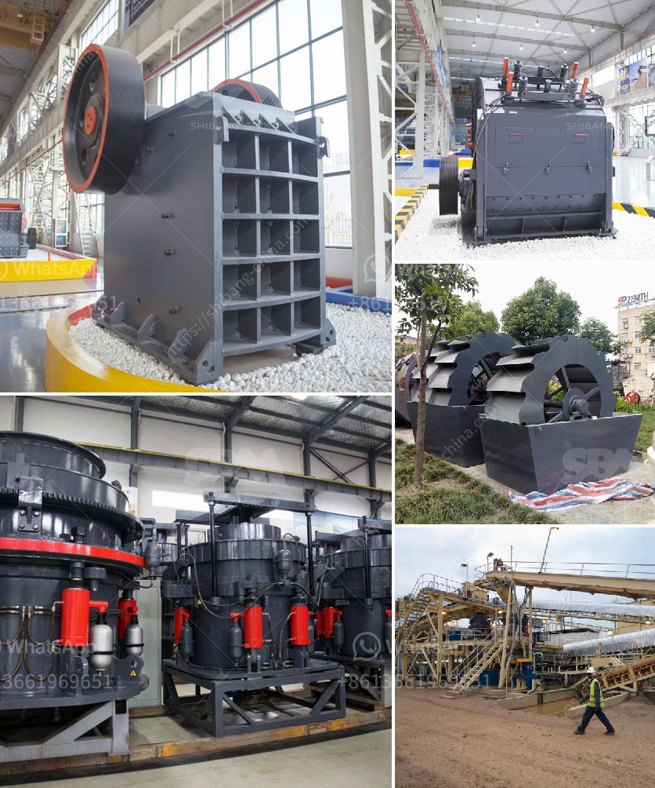

<h3>clinker plant cost</h3>
The cost of establishing and operating a clinker plant can be significant, and it is important for investors and stakeholders to have a clear understanding of the expenses involved. Clinker plants are integral to the production of cement, which is a key building material used in various construction projects.

The primary cost associated with a clinker plant is the initial investment required to set up the facility. This includes the acquisition of land, construction of the plant, and the purchase of machinery and equipment. The size and capacity of the plant can vary depending on the anticipated demand for cement in the region. A larger plant will require a higher investment but also has the potential to generate higher returns.

The land required for a clinker plant can vary depending on its size and the availability of suitable locations. It is important to choose a site that is easily accessible to raw material sources and has a strategic proximity to potential customers. The cost of land can vary significantly depending on the location and local real estate market conditions.

The construction of the plant involves various expenses, such as the cost of building structures, installing utilities, and setting up the required infrastructure. This can include the construction of warehouses, administrative buildings, and production facilities. The complexity and size of the plant will influence the construction cost, which can be a substantial part of the overall investment.

The machinery and equipment required for a clinker plant can also contribute to the cost. This includes crushers, kilns, and ball mills, which are essential for processing raw materials and producing clinker. Advanced technologies and systems designed to improve efficiency and reduce emissions may also incur additional expenses.

Furthermore, operational costs need to be considered in evaluating the viability of a clinker plant. These costs include labor, maintenance, utilities, and raw material expenses. The labor cost will depend on the size of the workforce required to operate the plant, while maintenance costs are necessary to ensure the smooth running and longevity of the machinery and equipment. Utilities, such as electricity and water, are essential for the production process and need to be factored into operational expenses.

Raw material expenses are a critical component of the overall operational cost. The primary raw materials used in clinker production are limestone, clay, and iron ore. The availability and cost of these materials can vary depending on factors such as location, transportation, and the presence of local mining operations.

In conclusion, establishing and operating a clinker plant involves substantial costs. These costs include the initial investment required for land acquisition, plant construction, and machinery and equipment purchase. Additionally, operational expenses such as labor, maintenance, utilities, and raw materials need to be considered. A thorough cost analysis is essential for investors and stakeholders to make informed decisions and assess the financial feasibility of a clinker plant project.
<h3>Contact us</h3><ul><li><strong>Whatsapp:&nbsp;<a href="https://wa.me/8613661969651">+8613661969651</a></strong></li><li><a href="https://swt.shibang-china.com/?git&amp;zhl&amp;clinker plant cost"><strong>Online Service(chat now)</strong></a></li></ul><h3>Related</h3><ul><li><a href='suoer fine mill grinder.md'>suoer fine mill grinder</a></li><li><a href='mining equipment seller in asia.md'>mining equipment seller in asia</a></li><li><a href='jaw crusher prices saudi.md'>jaw crusher prices saudi</a></li><li><a href='ore crushers benoni.md'>ore crushers benoni</a></li><li><a href='stone quarrying machines in dubai.md'>stone quarrying machines in dubai</a></li></ul>