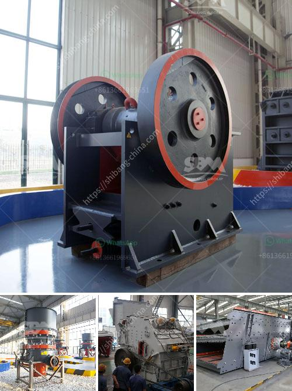

<h3>clinker powder machine</h3>
Clinker powder is an essential component in the manufacturing of cement. It is produced by heating limestone and clay to a high temperature in a kiln and then grinding the resulting clinker into a fine powder. This powder is then mixed with gypsum to create cement, which is used in various construction applications.

The process of manufacturing clinker powder involves a clinker powder machine, also known as a cement mill. This machine grinds the clinker into a fine powder, allowing it to be mixed with other materials to create cement. The grinding process is crucial in determining the quality of the final product, as it affects the particle size and the fineness of the powder.

A clinker powder machine typically consists of a rotating drum, lined with steel balls or other grinding media. The clinker is fed into the drum through a central chute and is progressively crushed and ground by the falling steel balls. The rotation of the drum ensures that the clinker is evenly distributed, allowing for efficient grinding.

There are several factors that determine the efficiency and productivity of a clinker powder machine. One important factor is the speed of rotation of the drum. A higher rotational speed leads to a higher grinding efficiency, as the clinker is subjected to more impacts and actions from the grinding media. However, a very high rotational speed may lead to excessive wear and tear of the machine.

Another important factor is the size and composition of the grinding media. Different types of media, such as steel balls or ceramic beads, have different grinding characteristics. The size of the media also affects the particle size of the final powder. A machine with smaller media size can achieve a finer powder, but it may require more energy and time to achieve the desired fineness.

The clinker powder machine also needs to have a reliable and efficient motor system. The motor should be capable of providing sufficient power for the grinding process and should have a smooth and consistent operation. A faulty motor can lead to decreased productivity and increased energy consumption.

Maintenance and proper care of the clinker powder machine are essential to ensure its long-term performance and productivity. Regular inspections, lubrication, and cleaning are necessary to prevent the buildup of dust and debris that can affect the grinding efficiency. Additionally, worn-out or damaged parts should be promptly replaced to avoid any disruption in the production process.

In conclusion, the clinker powder machine plays a crucial role in the manufacturing of cement. Its efficient operation and maintenance are vital for the production of high-quality clinker powder. By understanding the grinding process, optimizing the machine's speed and media size, and ensuring proper maintenance, manufacturers can achieve the desired fineness and productivity in their cement production.
<h3>Contact us</h3><ul><li><strong>Whatsapp:&nbsp;<a href="https://wa.me/8613661969651">+8613661969651</a></strong></li><li><a href="https://swt.shibang-china.com/?git&amp;zhl&amp;clinker powder machine"><strong>Online Service(chat now)</strong></a></li></ul><h3>Related</h3><ul><li><a href='buy fine grinding machine.md'>buy fine grinding machine</a></li><li><a href='crushing plant suppliers in pakistan.md'>crushing plant suppliers in pakistan</a></li><li><a href='non magnetic vibrating screen.md'>non magnetic vibrating screen</a></li><li><a href='calcium carbonate micronized plants.md'>calcium carbonate micronized plants</a></li><li><a href='rock crusher for crushing balsalt stone.md'>rock crusher for crushing balsalt stone</a></li></ul>