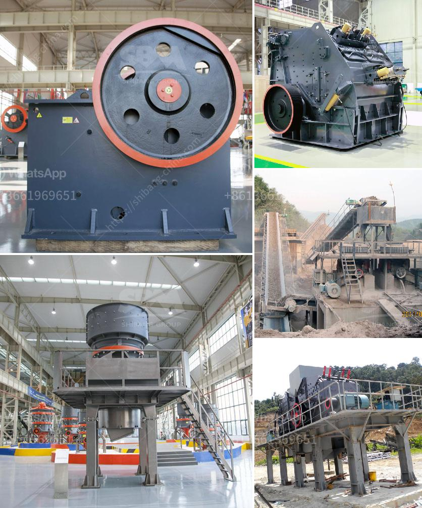

<h3>coal beneficiation</h3>
Coal beneficiation, also known as coal preparation, is a process that removes impurities from raw coal before it is utilized for various purposes. The goal of coal beneficiation is to eliminate these impurities, thereby improving the quality and purity of the coal. This process plays a crucial role in ensuring that the coal used for energy generation and other applications meets the required standards.

One of the main reasons for coal beneficiation is the reduction of harmful emissions during combustion. Raw coal often contains impurities such as sulfur, nitrogen, and ash. When coal is burned, these impurities are released into the atmosphere as pollutants, contributing to air pollution and the formation of smog. By removing these impurities through beneficiation, the resulting coal has a lower sulfur content, which leads to reduced sulfur dioxide (SO2) emissions.

Another benefit of coal beneficiation is the improvement of coal's energy content. Raw coal typically has a lower energy content due to impurities and moisture. By removing these impurities, the resulting coal has a higher calorific value, which means it will release more energy when burned. This makes the coal more efficient for energy production, reducing the overall coal consumption and the associated environmental impact.

Coal beneficiation also has economic benefits. The removal of impurities increases the market value of coal, making it a more desirable commodity. Moreover, higher-quality coal can be used for a variety of applications, including electricity generation, steel production, and chemical manufacturing. By improving the quality of coal through beneficiation, its versatility and value are enhanced, leading to increased profitability for coal producers.

There are various methods employed for coal beneficiation, depending on the characteristics of the raw coal and the desired end product. These methods include crushing, screening, washing, and flotation. Crushing and screening are used to reduce the size of the coal and remove any oversize or undersize particles. Washing involves the separation of coal from impurities using water or other media. Meanwhile, flotation relies on the differences in hydrophobicity between coal and impurities to separate them.

In conclusion, coal beneficiation is a critical process that addresses the environmental, economic, and quality aspects of coal utilization. By removing impurities, coal becomes cleaner and more efficient for energy generation, minimizing emissions of pollutants. This process also enhances the value and versatility of coal, making it a valuable resource for various industries. As the world continues to focus on reducing carbon emissions and transitioning towards cleaner energy sources, coal beneficiation plays a crucial role in ensuring the sustainable use of this abundant fossil fuel.
<h3>Contact us</h3><ul><li><strong>Whatsapp:&nbsp;<a href="https://wa.me/8613661969651">+8613661969651</a></strong></li><li><a href="https://swt.shibang-china.com/?git&amp;zhl&amp;coal beneficiation"><strong>Online Service(chat now)</strong></a></li></ul><h3>Related</h3><ul><li><a href='mica minerals powder grinding unit in kenya.md'>mica minerals powder grinding unit in kenya</a></li><li><a href='how to set up a crushing plant.md'>how to set up a crushing plant</a></li><li><a href='used stone crushers for sale from uae.md'>used stone crushers for sale from uae</a></li><li><a href='second hand jaw crusher for sale in malaysia.md'>second hand jaw crusher for sale in malaysia</a></li><li><a href='calculation of torque of hammer mill.md'>calculation of torque of hammer mill</a></li></ul>