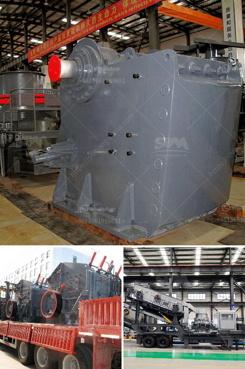

<h3>coal crusher design calculation</h3>
Coal crusher design calculation is important to ensure its operation efficiency and performance. The gyratory crusher is a typical mining compression crusher, which is widely used in the coarse crushing of abrasive or high compressive strength rocks. Coal processing involves crushing, screening, and beneficiation. Raw coal is fed into the crusher, and then crushed to a smaller size, suitable for transportation or further processing.

To design a coal crusher properly, engineers take into consideration the target particle size, the capacity of the crusher, and the properties of the coal, such as its hardness and moisture content. These factors greatly influence the selection of crushers and the design of crushing systems.

The target particle size of the coal dictates the type of crusher to be used. Cone crushers or impact crushers may be considered for large feed sizes, while gyratory crushers are generally used for smaller feed sizes. The specific capacity of the crusher, which is the throughput per unit time, should also be considered to meet production requirements.

The properties of coal, such as hardness and moisture content, affect the crushing process and equipment selection. Harder coals require more crushing force to break them down, while wet coal may cause operational issues. Therefore, crusher design should take these factors into account to ensure optimal performance.

Crusher design calculations involve parameters such as crushing capacity, product size distribution, power consumption, and wear pattern analysis. These factors affect the selection of the correct design and operational parameters to ensure desired performance.

In conclusion, designing a coal crusher involves various factors such as the target particle size, coal properties, and crusher capacity. Proper design and selection of crushing equipment play a crucial role in the efficiency and performance of the coal processing plant. By considering these factors, engineers can optimize the design and ensure that the crushing process operates with maximum efficiency.
<h3>Contact us</h3><ul><li><strong>Whatsapp:&nbsp;<a href="https://wa.me/8613661969651">+8613661969651</a></strong></li><li><a href="https://swt.shibang-china.com/?git&amp;zhl&amp;coal crusher design calculation"><strong>Online Service(chat now)</strong></a></li></ul><h3>Related</h3><ul><li><a href='used stone crusher in germany.md'>used stone crusher in germany</a></li><li><a href='series capacitor for crushing plant.md'>series capacitor for crushing plant</a></li><li><a href='graphite powder processing equipment.md'>graphite powder processing equipment</a></li><li><a href='cement plant business plan.md'>cement plant business plan</a></li><li><a href='artificial stone production line floor.md'>artificial stone production line floor</a></li></ul>