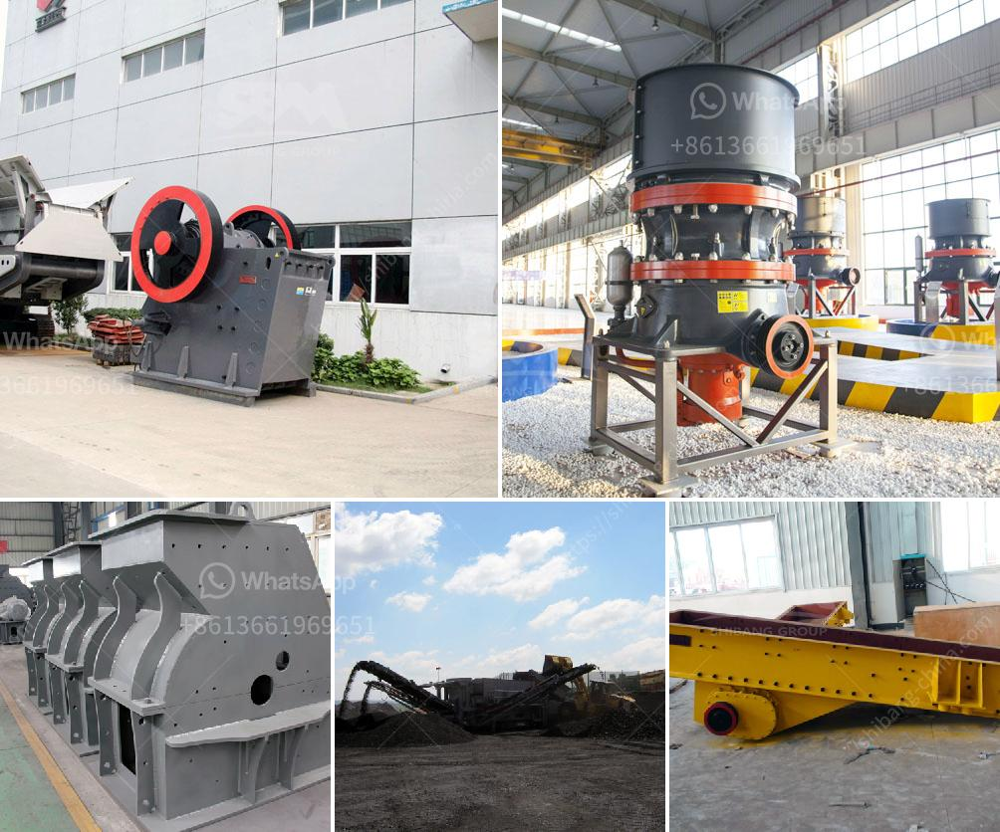

<h3>coal crusher machine in zhengzhou henan china</h3>
Coal is a combustible black or brownish-black sedimentary rock formed from fossilized plant materials, with a high carbon content. Coal is used primarily as a solid fuel to produce electricity and heat through combustion. Coal is the largest source of energy for the generation of electricity worldwide, and it is also the largest worldwide source of carbon dioxide emissions. A crucial step in the coal mining process is the crushing and processing of the coal.

Coal crusher machine plays an important role in the coal mining process. Different types of coal crusher machines are available in the market, including jaw crusher, impact crusher, cone crusher, gyratory crusher, hammer crusher, and roller crusher. Coal crusher machine is a machine crushing coal which is unprocessed after being extracted from the ground.

Coal crusher machine is utilized to pulverize coal for combustion in the steam-generating furnaces of coal-fired power plants. In coal crushing process, coal crusher equipment is the main machine to crush coal. Coal mill,coal crusher machine coal crushing plant, many types of coal crusher, coal crusher for sale (Henan Fote Heavy Machinery Co., Ltd.)In the coal crushing plant, coal crushing can resize the coal stone in order that it could be easily managed and processed.

Coal crusher is acknowledged in coal processing industry for a long time. has many years manufacturing experience in coal crushing plant (coal crushing process, washing plant and belt conveyor). is actually a great coal crushing plant manufacturer and supplier, it supplies different coal mining equipment utilized in coal crushing plant. Learn More +

Coal crushing PE jaw crusher is widely used crushing equipment. It means that PE jaw crusher is the first stage crushing equipment, in the coal crushing production line instead of impact crusher, and if the raw coal size is small, they can be crushed by PE jaw crusher directly. And due to its simple structure and reliable work, the PE jaw crusher has been popular among the customers.

When the coal crusher machine is working, the motor drives the rotor to rotate at a high speed through the belt, and on the rotor, there are series of hammers. When the materials get into the working area of hammers, the rotating hammers with high rotation speed will crush them, and the products which are crushed to meet the required size will be discharged through the discharging opening.

As a professional coal crusher machine manufacturer, Zhengzhou, Henan in China, aims to provide high-quality coal crusher machine with reasonable price. Besides, Fote Machinery can also design suitable coal crushing production line for customers according to their specific requirements. With rich mining industry experience, Fote Machinery has created many successful coal crushing production lines all over the world.

In conclusion, coal crusher machine is a type of equipment that is used to crush minerals consisting of coal into tiny, particle sizes. This machine is available in a wide range of sizes and configurations, each designed for efficient and smooth operation. Customers looking to purchase coal crusher machine in Zhengzhou, Henan, China can rely on the top-notch quality and fair prices offered by Fote Machinery.
<h3>Contact us</h3><ul><li><strong>Whatsapp:&nbsp;<a href="https://wa.me/8613661969651">+8613661969651</a></strong></li><li><a href="https://swt.shibang-china.com/?git&amp;zhl&amp;coal crusher machine in zhengzhou henan china"><strong>Online Service(chat now)</strong></a></li></ul><h3>Related</h3><ul><li><a href='hammer mill crusher drawings.md'>hammer mill crusher drawings</a></li><li><a href='clinker grinding mill machine germany.md'>clinker grinding mill machine germany</a></li><li><a href='stone crusher plant in ghana.md'>stone crusher plant in ghana</a></li><li><a href='tonne ball mill.md'>tonne ball mill</a></li><li><a href='stone crusher price in india.md'>stone crusher price in india</a></li></ul>