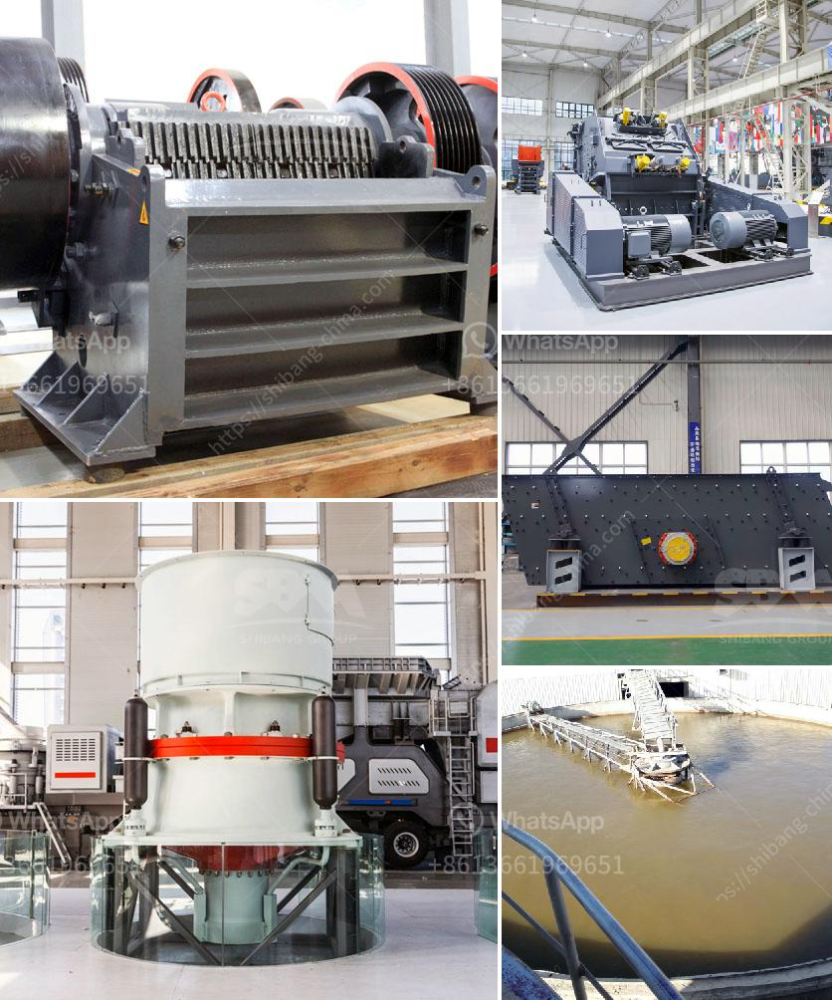

<h3>coal crusher machine indonesia supplier</h3>
Indonesia is one of the world's leading producers and exporters of coal. Since 2005, when it overtook Australia, the country is the leading exporter in terms of thermal coal. A significant portion of its exported thermal coal consists of the medium-quality type (between 5100 and 6100 cal/gram) and the low-quality type (below 5100 cal/gram) for which large demand originates from China and India.

Indonesian coal is especially attractive for countries like China, India, Japan, and Taiwan because of its lower price compared to the coals mined in Australia or South Africa. Indonesia’s coal production represents around 85% of its total proven reserves, estimated at 157 billion tons.

Indonesia's coal industry continues to prosper and grow. Even as domestic demand rises, coal remains the primary fuel for the country's growing infrastructure. Changes in legislation regarding coal mining, from permitting private companies to operate, to lifting the threshold for foreign ownership, has heralded a new era of investment and growth for the industry.

As we all know, coal processing is a complicated activity, covering many aspects, such as mining methods, mining design, equipment option, mining safety, and economy. However, there are some factors we can control and achieve good returns. For example, high-efficiency mining equipment can have a significant impact on production. In terms of coal crushers, various types of crushers are available for coal crushing, such as coal jaw crusher, impact crusher, cone crusher, coal hammer crusher, and roller crusher.

Coal jaw crusher is the most common crusher equipment in coal crusher plant and used as primary coal crusher. It can crush big coal into small pieces. Impact crusher is another common crusher that is used in coal crushing process. It is mainly used in primary or secondary crushing process. Cone crusher is used as fine coal crusher machine, and used in secondary or tertiary crushing process. Hammer crusher is a coal crusher with small capacity. Usually it is used with coal mill to grind coal into powder. Mobile coal crusher is the convenient coal crusher. It unite the crushing equipment, belt conveyor, and vibrating screen.

So, crushing and screening equipment is divided into fixed, coal crushing plant mobile three forms of semi-mobile (sled) mobile crusher station, and tire mobile crusher station, respectively, according to the different needs of customers to select and configure. Mobile crushing station is the most advanced crushing equipment as a machine with the most advanced technology and high integration.

We have been involved in the coal crushing industry for many years, and have a good reputation in the market. With years of experience and knowledge, we provide the best solution for clients. We provide high-performance machines and good service at a reasonable price. Our coal crusher machine is the most popular crushing equipment widely used in 80-100TPH coal crushing plant.

Coal Crusher Machine is acknowledged in coal processing industry for a long time. SBM has several years of experience in the manufacture of coal crusher (the coal crushing process, washing plant and belt conveyor). SBM is a major supplier of coal crusher for power plants and coke ovens, crushing limestone for blast furnaces, and crushing a wide range of raw and manufactured materials for industry.

As the largest exporter in the design and manufacture of coal crushers and spare parts, SBM coal crushers are used in a wide variety of material reduction and processing applications in 100 countries around the world. Coal crusher classification may be based on a variety of factors, including by definition, coal crusher machine for sale coal crusher machine for sale coal crusher machine is a new professional coal crusher machine manufacturer from China. They will provide the best quality and cheapest price coal crusher machine for sale.

As a professional crusher supplier, SBM has various types of coal crushers for sale. We provide different types and models of coal mining equipment for sale, including coal jaw crusher, coal impact crusher, and coal hammer crusher. Additionally, SBM provides high-quality crushing equipment for sale, including jaw crusher, impact crusher, cone crusher, mobile crusher, and various grinding mills.
<h3>Contact us</h3><ul><li><strong>Whatsapp:&nbsp;<a href="https://wa.me/8613661969651">+8613661969651</a></strong></li><li><a href="https://swt.shibang-china.com/?git&amp;zhl&amp;coal crusher machine indonesia supplier"><strong>Online Service(chat now)</strong></a></li></ul><h3>Related</h3><ul><li><a href='concrete batching plant for sale in pakistan.md'>concrete batching plant for sale in pakistan</a></li><li><a href='used stone crushers for sale from uae.md'>used stone crushers for sale from uae</a></li><li><a href='aggregate screens for sale.md'>aggregate screens for sale</a></li><li><a href='mobile crusher indonesia hire mines crusher for sale.md'>mobile crusher indonesia hire mines crusher for sale</a></li><li><a href='quarry stone crusherequipment.md'>quarry stone crusherequipment</a></li></ul>