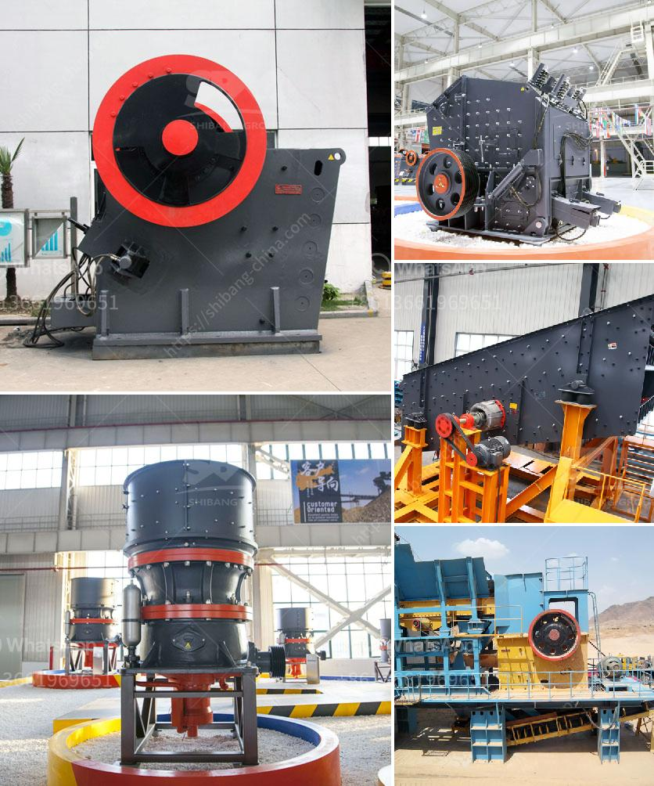

<h3>coal crusherton per hours</h3>
Coal is one of the primary sources of energy worldwide, and it plays a crucial role in powering industries and providing electricity to countless homes. As the demand for coal continues to rise, it becomes vital to understand the capacity of coal crushers for efficient processing. In this article, we will explore the coal crusher ton per hour concept and its significance.

Coal crushers are machines that are used to reduce the size of coal by systematically breaking it into smaller fragments. The crushed coal can then be used as fuel or as a raw material in various industries. The efficiency of a coal crusher depends on several parameters, including the size of the feed, the capacity, and the particle size distribution of the product. In general, a higher capacity coal crusher delivers a more consistent product size and requires less maintenance.

The coal crusher ton per hour refers to the amount of coal that can be crushed in an hour by the coal crusher. The specific model and capacity depend on the application and purpose. Typically, a 1000-ton-per-hour crusher can handle bigger-sized coals compared to smaller crushers accessible in the market. However, the process also involves evaluating the classifications and specifications of coal to determine the suitable crusher model.

When it comes to coal crushing operations, time is of the essence. Industries rely on crushers to efficiently process coal and produce accurate-sized coal particles required for combustion or further processing. A crusher capable of crushing a large tonnage of coal per hour ensures minimal downtime, high productivity, and reduced energy consumption. Moreover, it results in cost savings, as efficient crushers require less maintenance and produce less waste.

Coal crushers can be categorized based on their rotor speed, feed size, and granularity. High-speed crushers are suited for coals with smaller particle sizes and are typically used in power plants. On the other hand, low-speed crushers are effective for coals with larger particle sizes and are often employed in coal mines.

Professionals highly recommend considering the coal crusher ton per hour capacity during the crusher selection process. It is crucial to match the crusher's capacity with the expected coal production rate to ensure optimal functioning. Operating a crusher with overload constantly not only decreases the productivity but also increases the wear and tear on the equipment. On the other hand, using a higher-capacity crusher can result in unnecessary energy consumption and higher operational costs.

In conclusion, the coal crusher ton per hour concept is essential for understanding the capacity and efficiency of coal crushers. Selecting the appropriate crusher capacity is a crucial aspect, as it directly impacts the productivity and performance of coal processing operations. By choosing the right crusher, industries can maximize their coal processing efficiency, reduce downtime, and save costs in the long run. It is essential to consult with experts and evaluate the specific requirements of the task at hand to ensure the reliable and effective utilization of coal crushers.
<h3>Contact us</h3><ul><li><strong>Whatsapp:&nbsp;<a href="https://wa.me/8613661969651">+8613661969651</a></strong></li><li><a href="https://swt.shibang-china.com/?git&amp;zhl&amp;coal crusherton per hours"><strong>Online Service(chat now)</strong></a></li></ul><h3>Related</h3><ul><li><a href='stone crusher equipment supplier.md'>stone crusher equipment supplier</a></li><li><a href='small scale aggregate crushing machine.md'>small scale aggregate crushing machine</a></li><li><a href='portable stone crusher.md'>portable stone crusher</a></li><li><a href='ball mill grinding.md'>ball mill grinding</a></li><li><a href='list of crusher industry in nepal.md'>list of crusher industry in nepal</a></li></ul>