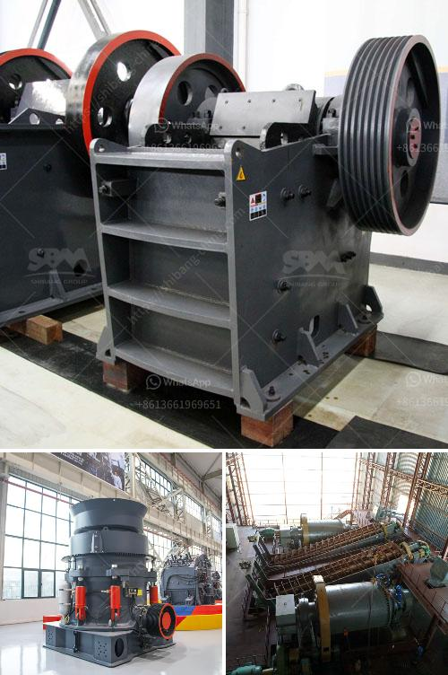

<h3>coal crushing plant price</h3>
In recent years, the coal industry has been under widespread criticism due to its adverse environmental effects. However, with the emergence of clean energy alternatives, coal remains a significant contributor to global energy production. As a result, the demand for efficient coal crushing plants is increasing, and manufacturers are adapting their machinery to cater to this growing market. This article aims to shed light on the coal crushing plant price, factors affecting its price range, and available options that purchasers can consider.

The primary factor influencing the price of a coal crushing plant is the raw coal material. It plays a vital role in selecting the appropriate crusher equipment. Different types of crushers are designed for handling different qualities of coal. Some crushers excel at crushing high moisture and sticky coal, while others are particularly effective for crushing hard and abrasive materials. The price of the coal crushing plant heavily depends on the type of crusher selected, as well as the specific model and capacity.

The second major consideration is the specification and configuration of the plant. Many companies offer customizable options to meet the diverse needs of their customers. These options may include different storage capacities, feeding systems, and screening equipment. Purchasers must carefully assess their requirements, such as production capacity and coal quality, and choose the appropriate specifications. Higher-end specifications and configurations tend to carry a higher price tag due to the advanced technology and enhanced features they offer.

In addition to the above factors, the brand reputation and supplier competence also influence the coal crushing plant price. Well-established manufacturers with years of experience in producing quality crushing plants often charge a premium for their products. These brands have a track record of delivering reliable and efficient equipment, which increases their market value. While opting for lesser-known or new suppliers might fetch a relatively lower price, it is essential to assess their expertise and quality standards to avoid compromising on functionality and durability.

Lastly, external factors such as market demand and economic conditions can influence the coal crushing plant price. Market demand directly impacts supply, and fluctuations in demand can lead to price variations. Similarly, economic conditions, including inflation, production costs, and currency exchange rates, influence the cost of manufacturing and sourcing equipment. Keeping an eye on these factors can help purchasers make informed decisions and identify opportune moments to invest.

In conclusion, the coal crushing plant price is determined by various factors, including the type of crusher, specifications and configuration, brand reputation, and external market considerations. Buyers should assess their needs and budget carefully before making a purchase decision. It is essential to balance the price and quality, ensuring that the chosen coal crushing plant meets the specific requirements of the coal mining operation while contributing to environmental sustainability.
<h3>Contact us</h3><ul><li><strong>Whatsapp:&nbsp;<a href="https://wa.me/8613661969651">+8613661969651</a></strong></li><li><a href="https://swt.shibang-china.com/?git&amp;zhl&amp;coal crushing plant price"><strong>Online Service(chat now)</strong></a></li></ul><h3>Related</h3><ul><li><a href='crushed aggregates supplier in negros.md'>crushed aggregates supplier in negros</a></li><li><a href='green rock quarry in sariaya.md'>green rock quarry in sariaya</a></li><li><a href='companies selling mining equipment in south africa.md'>companies selling mining equipment in south africa</a></li><li><a href='indonesia crushers of how much price.md'>indonesia crushers of how much price</a></li><li><a href='coal beneficiation.md'>coal beneficiation</a></li></ul>