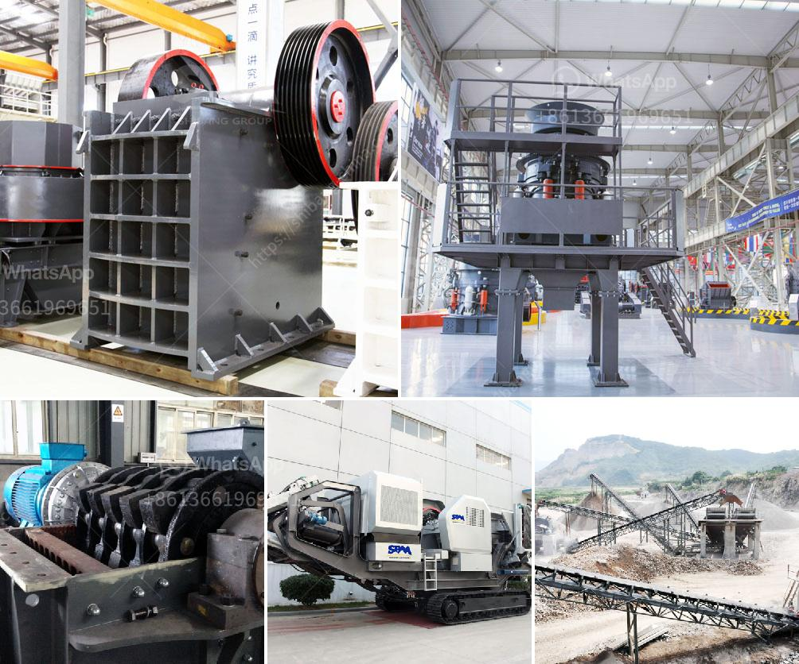

<h3>coal making process</h3>
Coal, a black sedimentary rock formed from organic matter, has been used for centuries as a source of heat and energy. Its formation is a complex process that takes place over millions of years.

The first step in the coal-making process is the accumulation of plant material in swamps and marshes. These plant remains, including leaves, stems, and roots, get buried under layers of sediment. Over time, as more sediment is deposited, the organic material becomes compressed and compacted.

As the layers of sediment continue to build up, heat and pressure also increase. This heat and pressure initiate a process called carbonization, where the organic material undergoes chemical changes. Oxygen and hydrogen atoms are gradually expelled, leaving behind mostly carbon-rich compounds, known as peat.

Peat is the initial stage of coal formation. It is a brownish material with a high moisture content. While it can be used as a low-quality fuel, the true energy potential of coal is unlocked through further transformation.

Through continued heat and pressure, peat slowly transforms into lignite – a softer, darker form of coal. Lignite retains some water content and has a lower carbon content compared to other coal types. It is considered a low-quality coal and often used in power plants for electricity generation.

As the process continues, lignite further matures into sub-bituminous coal, followed by bituminous coal – the most widely used type of coal. Bituminous coal has a higher carbon content and a lower moisture content than lignite. It is commonly used for heating and industrial purposes, providing a significant source of energy worldwide.

The final stage of coal formation is anthracite, also known as hard coal. With the highest carbon content and the lowest moisture content, anthracite is the most valuable and energy-dense form of coal. It is primarily used for residential heating and industrial applications where high heat and extended burning periods are required.

In conclusion, the formation of coal is a gradual and intricate process that begins with the accumulation of plant material and ends with the creation of various coal types. This fossil fuel, despite its environmental impacts, continues to be a significant source of energy for electricity generation, heating, and various industrial applications.
<h3>Contact us</h3><ul><li><strong>Whatsapp:&nbsp;<a href="https://wa.me/8613661969651">+8613661969651</a></strong></li><li><a href="https://swt.shibang-china.com/?git&amp;zhl&amp;coal making process"><strong>Online Service(chat now)</strong></a></li></ul><h3>Related</h3><ul><li><a href='how to start mining business in india.md'>how to start mining business in india</a></li><li><a href='rubber conveyor belt pdf.md'>rubber conveyor belt pdf</a></li><li><a href='iron ore beneficiation plant consultants in india.md'>iron ore beneficiation plant consultants in india</a></li><li><a href='gypsum calcination processing plant equipments.md'>gypsum calcination processing plant equipments</a></li><li><a href='distributor stone crusher machine indonesia.md'>distributor stone crusher machine indonesia</a></li></ul>