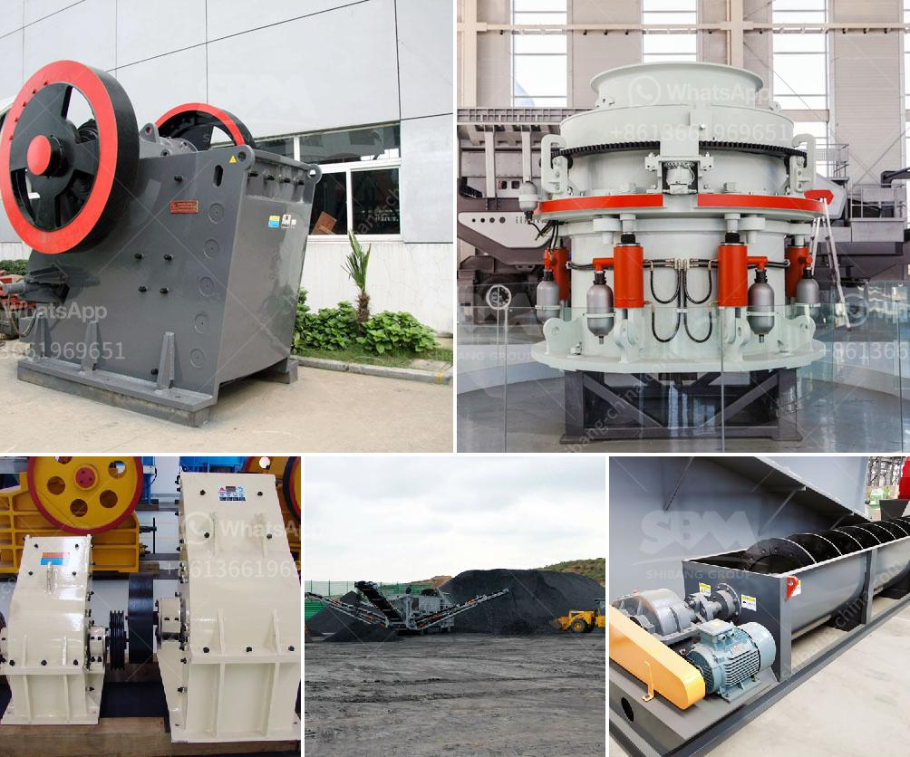

<h3>coal mining machine undercuter</h3>
Coal mining has been a crucial part of the global energy sector for centuries. The extraction of coal from the earth continues to be a challenging process, often characterized by hazardous working conditions and heavy machinery. However, advancements in technology have paved the way for innovations that not only ensure miners' safety but also significantly increase productivity. Among these groundbreaking inventions is the coal mining machine undercuter, an impressive piece of equipment that has revolutionized the coal mining industry.

The coal mining machine undercuter, also known as a longwall cutter, is a massive machine designed specifically for underground coal mining. Its primary function is to undercut coal seams, removing the rock between the coal seam and the floor. This innovative machine plays a pivotal role in large-scale mining operations, allowing for faster and more efficient extraction of coal resources.

One of the key advantages of the undercuter is its cutting mechanism, which enables it to extract coal continuously. Equipped with a spinning cutter head, the machine can literally chew through coal seams, reducing the need for manual labor. This not only increases productivity but also eliminates the exposure of miners to hazardous conditions, such as roof falls and toxic gases.

Furthermore, the advanced automation features of the machine undercuter are truly remarkable. It utilizes state-of-the-art sensors, cameras, and computerized controls to navigate and operate in the underground environment. These sensors enable real-time monitoring of various parameters such as temperature, gas concentration, and roof stability, ensuring the safety of both the machine and the workers. The sophisticated camera systems provide operators with a clear view of the mining area, minimizing the risk of accidents.

In addition to its safety and productivity benefits, the coal mining machine undercuter also offers significant economic advantages. Its ability to extract coal continuously and efficiently translates into a higher volume of coal production, leading to increased profitability for mining companies. The machine's accuracy in cutting coal walls also reduces waste, maximizing resource utilization. This, in turn, contributes to sustainability in the coal mining industry by minimizing environmental impact.

Furthermore, the introduction of this cutting-edge machine has opened up new possibilities for underground mining. Previously inaccessible coal seams can now be mined due to the undercuter's low profile design and its ability to operate in narrow spaces. Moreover, the machine has significantly reduced the time required for coal extraction, allowing miners to explore deeper and previously untouched deposits. As a result, the undercuter has not only increased the lifespan of existing coal mines but has also opened up new opportunities for exploration and long-term sustainability.

In conclusion, the coal mining machine undercuter has undoubtedly revolutionized the coal mining industry. Its technological advancements have led to safer working conditions, increased productivity, and improved efficiency in coal extraction. With its advanced cutting mechanism, automation features, and economic benefits, this machine has become an indispensable tool for large-scale mining operations worldwide. As technology continues to evolve, it is exciting to envision further innovations that will drive the coal mining industry forward, ensuring a sustainable and efficient future.
<h3>Contact us</h3><ul><li><strong>Whatsapp:&nbsp;<a href="https://wa.me/8613661969651">+8613661969651</a></strong></li><li><a href="https://swt.shibang-china.com/?git&amp;zhl&amp;coal mining machine undercuter"><strong>Online Service(chat now)</strong></a></li></ul><h3>Related</h3><ul><li><a href='used washing plant sale south africa.md'>used washing plant sale south africa</a></li><li><a href='small rock crusher machine.md'>small rock crusher machine</a></li><li><a href='how much crusher machine.md'>how much crusher machine</a></li><li><a href='mobile crusher machine price.md'>mobile crusher machine price</a></li><li><a href='quotation for crusher.md'>quotation for crusher</a></li></ul>