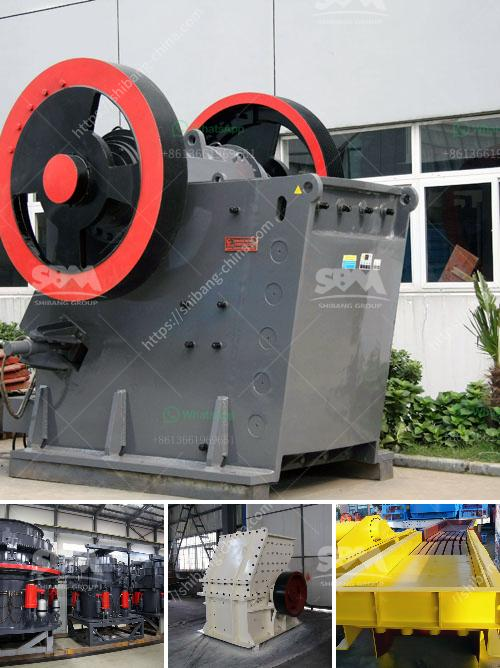

<h3>coal processing plants for sale</h3>
The global demand for energy is ever-increasing, and coal has remained a crucial energy source for many countries. Coal is an abundant and affordable source of energy, making it an attractive option for power generation. With the growing need for electricity and industrial processes, coal processing plants have become vital in the energy industry.

Coal processing plants are facilities designed to remove impurities from coal before it is used for various applications. These plants typically consist of several stages, including crushing, screening, and washing processes. The objective is to produce a cleaner, higher-quality coal that meets the specific requirements of end-users.

Recently, the sale of coal processing plants has seen a significant surge in demand. One of the main reasons for this is the rising awareness of environmental concerns associated with coal-fired power plants. To meet environmental regulations and reduce emissions, coal processing plants are essential. By removing impurities and reducing the ash and sulfur content of coal, these plants can significantly lower the environmental impact of burning coal for energy.

Moreover, technological advancements have made coal processing plants more efficient and cost-effective. The latest equipment and machinery used in these plants ensure higher yields, better quality control, and improved productivity. As a result, investors and energy providers are increasingly interested in acquiring coal processing plants to optimize their operations and increase their profit margins.

Another factor driving the sale of coal processing plants is the growing demand for clean coal technologies. These technologies aim to reduce greenhouse gas emissions by capturing and storing carbon dioxide produced during coal combustion. Coal processing plants play a vital role in enabling these technologies, making them an attractive investment for companies focused on sustainable and eco-friendly practices.

In conclusion, the increasing demand for energy, coupled with the need for cleaner and more sustainable solutions, has intensified the sale of coal processing plants. These plants offer a range of benefits, including improved environmental performance, higher coal quality, and increased operational efficiency. With advanced technologies and stricter environmental regulations, coal processing plants have become a booming industry for those looking to contribute to the energy sector while meeting sustainability goals.
<h3>Contact us</h3><ul><li><strong>Whatsapp:&nbsp;<a href="https://wa.me/8613661969651">+8613661969651</a></strong></li><li><a href="https://swt.shibang-china.com/?git&amp;zhl&amp;coal processing plants for sale"><strong>Online Service(chat now)</strong></a></li></ul><h3>Related</h3><ul><li><a href='stone mining in meghalaya.md'>stone mining in meghalaya</a></li><li><a href='crusher and wash plant for sale in china.md'>crusher and wash plant for sale in china</a></li><li><a href='crusher price peru stone.md'>crusher price peru stone</a></li><li><a href='30t hr 50t hr range stone crusher plant china.md'>30t hr 50t hr range stone crusher plant china</a></li><li><a href='how much is limestone per ton.md'>how much is limestone per ton</a></li></ul>