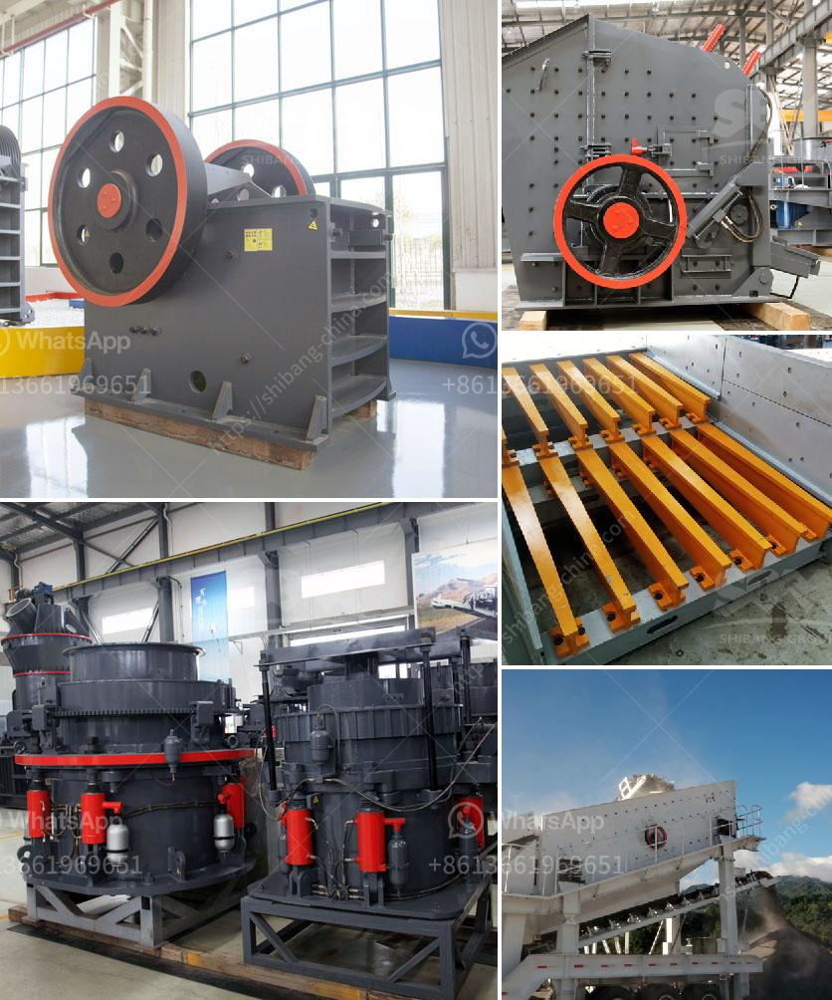

<h3>coal pulverizer crusher manufacturers</h3>
Coal pulverizer crushers play an important role in the mining industry as they help coal to be efficiently crushed into fine powder for combustion in power plants. Chemicals, metallurgy, building materials, mining, and other industries also utilize pulverizers. The market for coal pulverizer crushers is constantly evolving, with new manufacturers entering the industry regularly.

One of the key factors that have contributed to the growth of coal pulverizer crusher manufacturers is the rapid expansion of the mining industry. As global demand for coal continues to rise, companies are investing in advanced technologies to enhance productivity and efficiency in the extraction and processing of coal. This has led to a surge in demand for reliable and durable coal pulverizer crushers to handle the large volume of coal.

To meet this demand, manufacturers are constantly developing innovative crusher designs that can withstand the harsh conditions encountered in coal mines. Advanced materials and engineering techniques are being employed to improve the reliability and longevity of these machines. Additionally, manufacturers are focusing on enhancing the efficiency of coal pulverizer crushers to reduce energy consumption and lower operating costs for users.

With the growing demand for environmental sustainability, manufacturers are also developing crushers with improved dust and noise control features. This ensures that the operations are more eco-friendly, complying with stringent environmental regulations.

The market for coal pulverizer crushers is highly competitive, with numerous manufacturers offering a wide range of products. Some of the leading manufacturers include Williams Crusher, American Pulverizer Company, and TerraSource Global. These companies have established a strong reputation for delivering high-quality, reliable, and innovative crushers to the industry.

In conclusion, the market for coal pulverizer crusher manufacturers is driven by the growing demand for coal in various industries, particularly in power generation. Manufacturers are constantly striving to develop advanced crusher designs that are efficient, reliable, and environmentally friendly. As the mining industry continues to expand, the competition between manufacturers is expected to intensify, leading to further technological advancements and innovations in coal pulverizer crushers.
<h3>Contact us</h3><ul><li><strong>Whatsapp:&nbsp;<a href="https://wa.me/8613661969651">+8613661969651</a></strong></li><li><a href="https://swt.shibang-china.com/?git&amp;zhl&amp;coal pulverizer crusher manufacturers"><strong>Online Service(chat now)</strong></a></li></ul><h3>Related</h3><ul><li><a href='stone crusher powder which products in use in philippines.md'>stone crusher powder which products in use in philippines</a></li><li><a href='crushing pe jaw crusher.md'>crushing pe jaw crusher</a></li><li><a href='supplier of jaw crusher in south africa.md'>supplier of jaw crusher in south africa</a></li><li><a href='ball mill diagram manufacturers in bangalore.md'>ball mill diagram manufacturers in bangalore</a></li><li><a href='raymond mill manufactrer in udaipur.md'>raymond mill manufactrer in udaipur</a></li></ul>