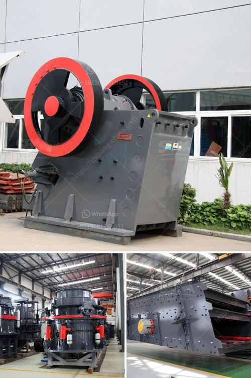

<h3>coal screen plant for hire in south africa</h3>
Coal screening plants are essential to the South African coal mining industry. They are efficient tools that enable the separation of waste material from coal, allowing it to be used for various purposes such as energy production and industrial processes. For companies in the coal mining sector, having access to a reliable and efficient coal screen plant for hire is crucial for their operations.

One of the main advantages of hiring a coal screen plant in South Africa is that it provides companies with the flexibility they need. Instead of investing in expensive equipment, they can simply hire a coal screen plant when it is needed for a specific project. This not only helps to reduce costs but also ensures that companies have access to the latest and most advanced screening technology.

Another benefit of hiring a coal screen plant is that it allows for increased productivity. These plants are designed to process large volumes of coal quickly and efficiently, enabling mining companies to maximize their output. By outsourcing screening operations to a specialized plant, companies can focus on their core business activities, such as extraction and transportation, without compromising on the quality or quantity of the coal they produce.

Furthermore, hiring a coal screen plant in South Africa can also help companies meet environmental regulations and sustainability goals. These plants often incorporate advanced technologies that minimize dust emissions and reduce the impact on the environment. By utilizing such plants, mining companies can ensure that their operations are in line with environmental standards, leading to better sustainability practices.

In conclusion, the coal mining industry in South Africa heavily relies on coal screen plants for waste separation and production optimization. The option to hire such plants provides companies with flexibility, increased productivity, and improved sustainability. By leveraging the expertise and technologies offered by these plants, South African coal mining companies can remain competitive in an ever-changing industry.
<h3>Contact us</h3><ul><li><strong>Whatsapp:&nbsp;<a href="https://wa.me/8613661969651">+8613661969651</a></strong></li><li><a href="https://swt.shibang-china.com/?git&amp;zhl&amp;coal screen plant for hire in south africa"><strong>Online Service(chat now)</strong></a></li></ul><h3>Related</h3><ul><li><a href='lime grinding machine manufacturer in kolhapur.md'>lime grinding machine manufacturer in kolhapur</a></li><li><a href='working principle structure of stone crusher.md'>working principle structure of stone crusher</a></li><li><a href='coal crusher machine in zhengzhou henan china.md'>coal crusher machine in zhengzhou henan china</a></li><li><a href='stone stone crusher machine malaysia.md'>stone stone crusher machine malaysia</a></li><li><a href='crusher price china.md'>crusher price china</a></li></ul>