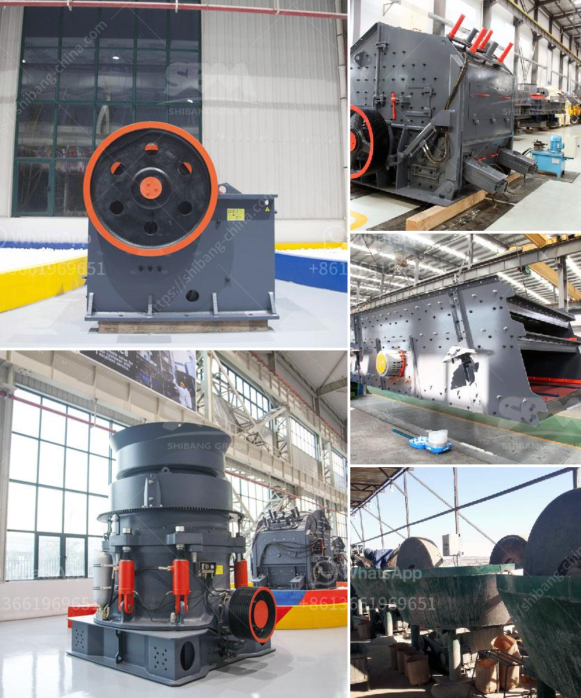

<h3>coal screening machine in india</h3>
India, being one of the largest producers of coal in the world, is no stranger to the challenges faced by the coal industry. One such challenge is the efficient screening of coal to remove impurities and foreign materials, which can adversely impact coal quality and its subsequent usage. To address this issue, coal screening machines have emerged as a boon for the coal industry in India.

Coal screening machines are designed to effectively separate different sizes of coal particles, ensuring optimal coal quality and efficient utilization. These machines utilize various techniques such as gravity, magnetism, and density to achieve accurate and reliable coal screening. There are several types of coal screening machines available in the Indian market, each catering to specific screening requirements.

One commonly used coal screening machine is the flip flow screen. It is a highly efficient screening equipment that utilizes the principles of resonance and vibration to screen coal particles. The flip flow screen consists of a series of panels with alternating screenbars and polyurethane fingers. As the coal passes through the panels, the screenbars vibrate vigorously, causing the coal particles to move in a zigzag pattern. This movement helps to break down agglomerates and ensure thorough screening.

Another popular coal screening machine is the circular vibrating screen. It employs a circular motion and high-frequency vibrations to screen coal particles. The circular vibrating screen consists of a screen box, screen mesh, vibrator, and damping springs. The coal is fed onto the screen surface, and the high-frequency vibrations help to separate the coal particles based on their size. The circular motion of the screen also prevents clogging, ensuring continuous operation.

In addition to flip flow screens and circular vibrating screens, there are other coal screening machines available in the Indian market, such as roller screens and banana screens. Roller screens are designed to screen large-sized coal particles, while banana screens are suitable for fine coal screening. These machines utilize different mechanisms, such as rotation and gravity, to achieve efficient coal screening.

The adoption of coal screening machines in India has numerous benefits for the coal industry. Firstly, these machines significantly improve the quality of screened coal. By removing impurities and foreign materials, coal screening machines ensure that only high-quality coal reaches the market, reducing the risk of equipment damage and enhancing coal combustion efficiency.

Moreover, coal screening machines enable coal producers to meet the specific requirements of various industries. Different industries have different coal specifications, and the ability to accurately screen coal particles allows producers to cater to these unique requirements. This enhances customer satisfaction and opens up lucrative opportunities for coal exporters.

Furthermore, coal screening machines contribute to a more sustainable coal industry. By efficiently separating coal particles, these machines reduce the need for further processing and handling, thereby minimizing energy consumption and environmental impact. The use of coal screening machines also helps in the efficient utilization of coal resources, reducing waste and promoting cleaner coal production.

In conclusion, coal screening machines have emerged as a boon for the coal industry in India. These machines facilitate efficient and accurate screening of coal particles, enhancing coal quality and utilization. With their ability to remove impurities and meet specific industry requirements, coal screening machines contribute to a sustainable and prosperous coal industry in India. As the demand for coal continues to grow, the role of coal screening machines in ensuring high-quality coal supply will become increasingly crucial.
<h3>Contact us</h3><ul><li><strong>Whatsapp:&nbsp;<a href="https://wa.me/8613661969651">+8613661969651</a></strong></li><li><a href="https://swt.shibang-china.com/?git&amp;zhl&amp;coal screening machine in india"><strong>Online Service(chat now)</strong></a></li></ul><h3>Related</h3><ul><li><a href='ball mills mfg in kenya.md'>ball mills mfg in kenya</a></li><li><a href='accessories for conveyor belts.md'>accessories for conveyor belts</a></li><li><a href='dubai dolomite crusher suppliers.md'>dubai dolomite crusher suppliers</a></li><li><a href='stone crusher hyderabad.md'>stone crusher hyderabad</a></li><li><a href='standard operating procedure for cement manufacturing.md'>standard operating procedure for cement manufacturing</a></li></ul>