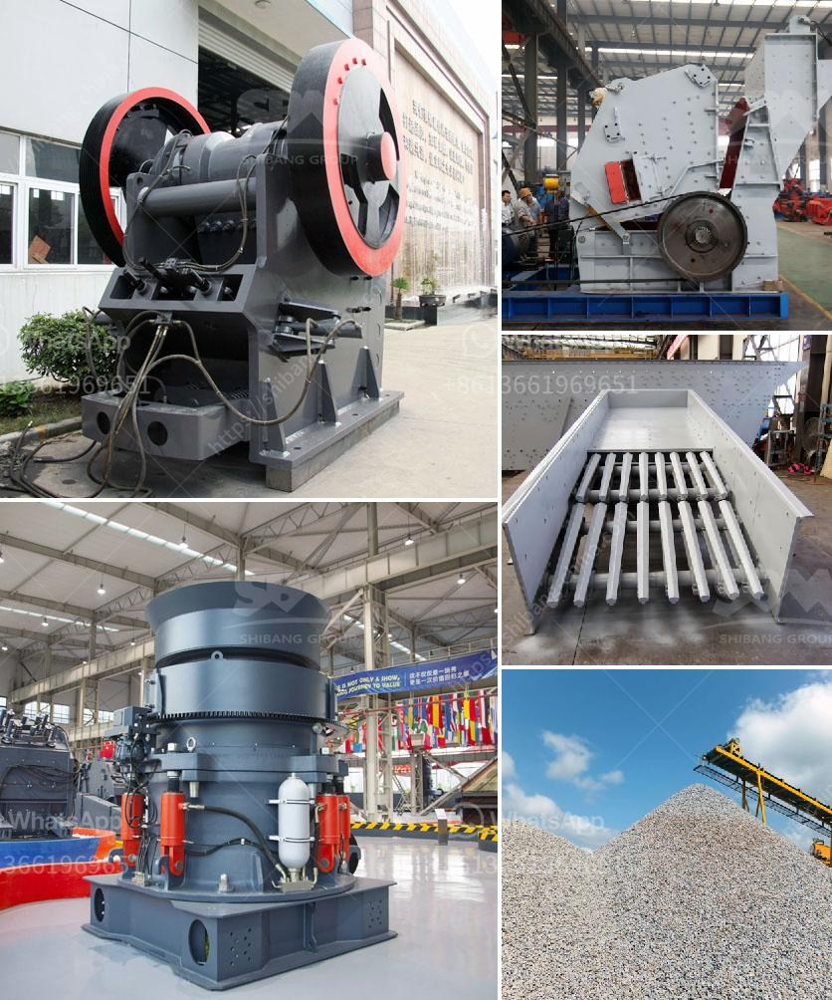

<h3>coal screening plant south africa</h3>
South Africa is one of the leading coal producers and consumers in the world. The coal industry ranks amongst the top contributors to the country's economic growth. However, the environmental impact of traditional coal mining and consumption has raised concerns globally. To address these issues, coal screening plants play a critical role in ensuring cleaner and more efficient coal production. In this article, we will explore the significance of coal screening plants in South Africa, emphasizing how they contribute to sustainable energy practices and a cleaner environment.

As the world transitions towards cleaner energy sources, the demand for clean coal is gaining momentum. Clean coal refers to coal that has undergone specific treatments and processes, eliminating hazardous pollutants such as sulfur dioxide, nitrogen oxide, and mercury. Coal screening plants help in the refinement and enhancement of coal quality, ensuring compliance with environmental regulations and reducing harmful emissions during the combustion process.

Modern coal screening plants in South Africa are equipped with advanced technology, allowing for efficient separation of coal particles based on their size and composition. These plants employ various screening techniques such as mechanical screening and wet or dry screening methods. Through precise screening, the coal industry can optimize the quality of coal by removing impurities and ensuring uniformity in size, thereby increasing the overall efficiency of coal-fired power plants and reducing operating costs.

Coal screening plants play a pivotal role in reducing the environmental impact of coal mining and utilization. By effectively separating coal particles and removing undesirable elements, these plants ensure that only clean and high-quality coal is sent to power plants. This process significantly reduces emissions of harmful pollutants, including greenhouse gases, and minimizes the environmental footprint of coal-based power generation. Furthermore, cleaner coal combustion results in improved air quality, benefiting both human health and the surrounding ecosystem.

The establishment of coal screening plants in South Africa not only creates job opportunities but also supports the country's economic growth. These plants require skilled workers for various operations, including monitoring, maintenance, and quality control. This helps in the local development of expertise in the coal industry and provides employment to a significant number of individuals, thereby contributing to the overall socioeconomic development of the region.

Coal screening plants in South Africa are integral to producing cleaner coal and reducing the environmental impacts associated with traditional coal mining practices. With the increasing demand for clean energy, these plants play a critical role in providing a reliable and sustainable source of energy while protecting the environment for future generations.
<h3>Contact us</h3><ul><li><strong>Whatsapp:&nbsp;<a href="https://wa.me/8613661969651">+8613661969651</a></strong></li><li><a href="https://swt.shibang-china.com/?git&amp;zhl&amp;coal screening plant south africa"><strong>Online Service(chat now)</strong></a></li></ul><h3>Related</h3><ul><li><a href='lime stone crusher rotor.md'>lime stone crusher rotor</a></li><li><a href='small rock gravel crushers.md'>small rock gravel crushers</a></li><li><a href='crusher made in taiwan.md'>crusher made in taiwan</a></li><li><a href='specification for stone crushing for roads.md'>specification for stone crushing for roads</a></li><li><a href='coal processing plants for sale.md'>coal processing plants for sale</a></li></ul>