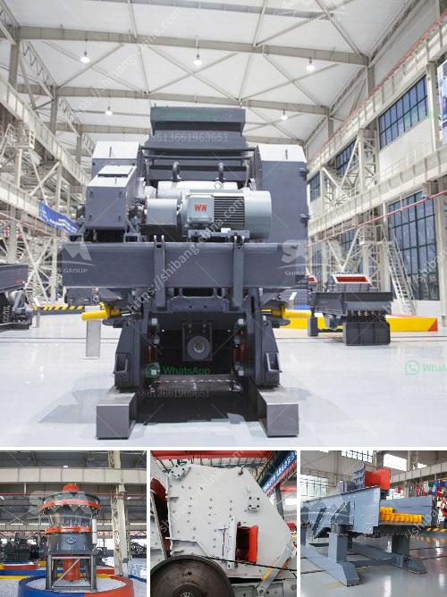

<h3>coal screening process</h3>
Coal screening is an essential part of the coal processing industry. Once mined, coal goes through a series of different processes to remove impurities and ensure its quality and usability for various industries. Screening is one such crucial process that separates coal particles of different sizes. 

The screening process begins with the raw coal being fed into a vibrating screen, where it is separated into different sizes. This screen consists of a series of woven wire panels, with different-sized openings. Larger pieces of coal will not pass through the smaller openings, and they move towards the discharge end of the screen, while smaller coal particles fall through the openings and move forward, creating multiple streams. 

To improve the efficiency of the screening process, various techniques are employed. One such technique is wet screening, where water is added to the coal during the screening process. This helps to remove fines and improves the overall quality of the coal. Additionally, magnetic separators can be used to remove any magnetic impurities that may be present in the coal. 

The purpose of coal screening is two-fold: to separate coal into different sizes for better handling and to remove impurities that could lower the overall quality of the coal. By separating coal into different sizes, it becomes easier to transport, store, and distribute. This is particularly important for industries that rely on coal, such as power plants. Furthermore, removing impurities ensures that the coal burns more efficiently, reducing emissions and maximizing its energy potential.

In conclusion, coal screening is a vital process in the coal industry. By separating coal into different sizes and removing impurities, it becomes more suitable for various applications. This process not only ensures that coal is of high quality, but also improves its handling, efficiency, and environmental impact. As the demand for coal continues, the importance of effective screening processes will only grow in significance.
<h3>Contact us</h3><ul><li><strong>Whatsapp:&nbsp;<a href="https://wa.me/8613661969651">+8613661969651</a></strong></li><li><a href="https://swt.shibang-china.com/?git&amp;zhl&amp;coal screening process"><strong>Online Service(chat now)</strong></a></li></ul><h3>Related</h3><ul><li><a href='cameroon quarry crusher.md'>cameroon quarry crusher</a></li><li><a href='concrete crusher plant.md'>concrete crusher plant</a></li><li><a href='project cost of 100 tpd opc cement plant.md'>project cost of 100 tpd opc cement plant</a></li><li><a href='components of a ball mill.md'>components of a ball mill</a></li><li><a href='crusher plant made in uk.md'>crusher plant made in uk</a></li></ul>