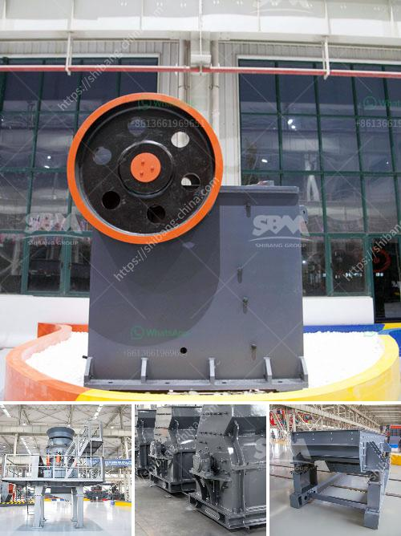

<h3>coal washing plant supplier south africa</h3>
Coal is a vital resource in South Africa, contributing to the country's economic growth and development. However, the coal mining industry faces several challenges, including the consistent supply of coal as well as the accurate and efficient washing of coal.

Coal washing plants are dedicated facilities specifically designed to wash coal of impurities such as sulfur, ash, and rock, ensuring that it meets the desired specifications for use in thermal power plants or metallurgical applications. South Africa is fortunate to have several coal washing plants established within its borders.

Coal washing plant refers to a facility for separating impurities from raw coal to improve its quality and maximize its economic value. The coal washing process begins with the extraction of coal from underground mines or open-pit mines. The washing plant consists of several stages, including crushing, screening, and separating, to remove the impurities.

One of the major coal washing plants supplier in South Africa is Franco Martinengo. Franco Martinengo, a well-known name in the coal washing industry, has over 30 years of experience in designing and manufacturing modular coal washing plants, making him one of the most experienced and reliable suppliers in the field. His company, Franco Martinengo & Associates (FMA), has successfully completed numerous coal washing plant projects in South Africa and internationally.

FMA's coal washing plants are highly efficient, cost-effective, and environmentally friendly. They are designed to minimize water usage and maximize the recovery of coal fines, thus reducing the environmental impact of coal mining. The modular design of FMA's coal washing plants allows for easy expansion or relocation, ensuring flexibility and adaptability to the changing needs of the coal mining industry.

Alongside FMA, several other suppliers also play a crucial role in providing coal washing plants in South Africa. These include McLanahan Corporation, a global leader in designing and manufacturing coal washing equipment. McLanahan's coal washing plants are known for their high quality and durability, ensuring reliable and efficient operation.

The importance of coal washing plants in South Africa cannot be overstated. Apart from improving the quality of coal and reducing its environmental impact, coal washing plants also contribute to the economy by creating job opportunities and attracting investments in the coal mining industry.

In conclusion, coal washing plants are a vital infrastructure in South Africa, promoting the beneficiation of coal and ensuring its availability for various industries. Suppliers like Franco Martinengo & Associates and McLanahan Corporation play a significant role in providing efficient and environmentally friendly coal washing plants. As the demand for clean coal continues to rise, the presence and operation of coal washing plants will remain crucial for the sustainable development of South Africa's coal mining industry.
<h3>Contact us</h3><ul><li><strong>Whatsapp:&nbsp;<a href="https://wa.me/8613661969651">+8613661969651</a></strong></li><li><a href="https://swt.shibang-china.com/?git&amp;zhl&amp;coal washing plant supplier south africa"><strong>Online Service(chat now)</strong></a></li></ul><h3>Related</h3><ul><li><a href='crushing production line in equipment.md'>crushing production line in equipment</a></li><li><a href='mining process of dolomite ryamond mill in kenya.md'>mining process of dolomite ryamond mill in kenya</a></li><li><a href='earth moving equipment duty free in zimbabwe.md'>earth moving equipment duty free in zimbabwe</a></li><li><a href='gold refining and essay report equipment.md'>gold refining and essay report equipment</a></li><li><a href='stone crusher pe 250x400.md'>stone crusher pe 250x400</a></li></ul>