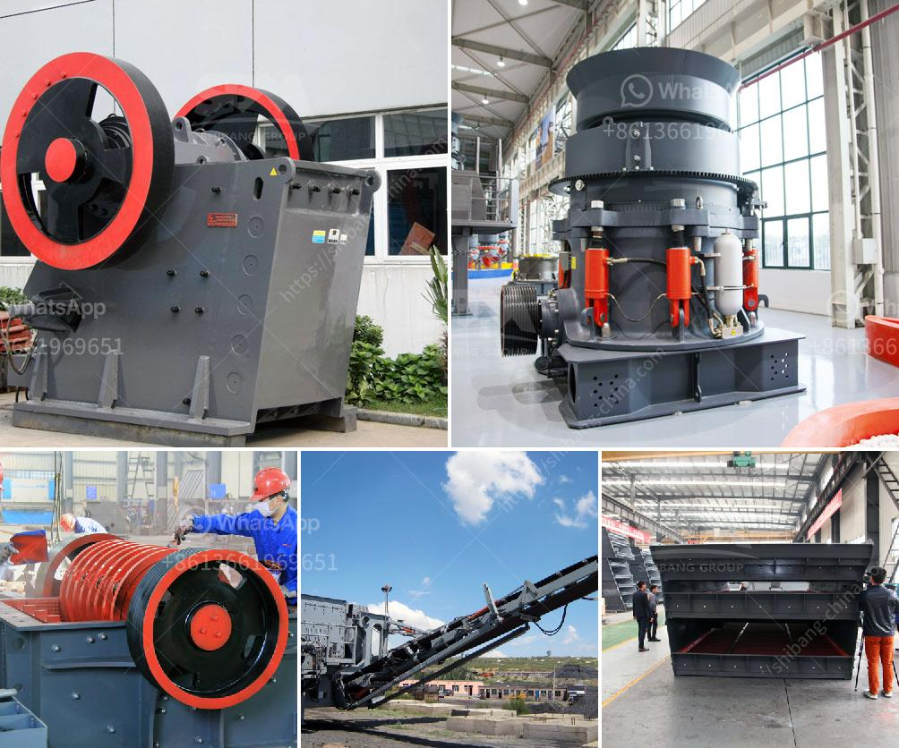

<h3>cocoa processing plant in nigeria</h3>
Cocoa is one of Nigeria's most vital cash crops, and the country is known for its rich cocoa production. With a suitable climate and fertile soil, Nigeria is the fourth-largest cocoa producer globally. However, for many years, the cocoa production sector has faced various challenges, including inadequate infrastructure, limited access to credit facilities, and a lack of value addition. To combat these setbacks, the establishment of cocoa processing plants in Nigeria has gained significant attention as a potential solution.

Cocoa processing plants play a crucial role in the cocoa value chain. In the past, Nigerian farmers predominantly sold cocoa beans to overseas buyers, missing out on the added value that comes from processing the beans into various cocoa products. The establishment of processing plants within the country allows farmers to bypass intermediaries and directly sell processed cocoa products, thus maximizing profits.

One such cocoa processing plant in Nigeria is CocoaFX Ltd., located in the southwestern region of the country. The plant, equipped with state-of-the-art machinery, has a processing capacity of 50,000 metric tons per annum. This facility has transformed the cocoa production landscape in Nigeria, bringing numerous benefits to both farmers and the Nigerian economy.

Firstly, the establishment of cocoa processing plants has created employment opportunities. The operation of these plants requires skilled labor, ranging from machine operators to quality control personnel. As a result, many jobs have been generated, reducing unemployment rates and improving the overall standard of living for individuals in the surrounding communities.

Secondly, cocoa processing plants have increased the value of Nigeria's cocoa exports. By transforming the cocoa beans into higher-value products such as cocoa powder, cocoa butter, and chocolate, the country can command higher prices in international markets. This has helped Nigeria become a significant player in the global cocoa industry, boosting its export revenues and improving its overall trade balance.

Furthermore, cocoa processing plants have facilitated technology transfer and knowledge sharing. Foreign investors often bring in advanced machinery, technologies, and expertise to establish these plants, creating opportunities for skills and knowledge exchange with local workers. This helps in building human capital and nurturing local capabilities, which can be applied to other sectors of the economy.

In addition, the establishment of cocoa processing plants promotes local industrial development. When farmers have access to processing facilities within the country, it encourages the growth of related industries, such as packaging, logistics, and retail. This spillover effect leads to the creation of an entire cocoa value chain, boosting economic growth in the country and fostering self-sustainability.

However, the success of cocoa processing plants relies on several factors. The government's support in terms of policy frameworks, infrastructure development, and access to credit is critical. Additionally, continuous investments in research and development are necessary to improve production techniques, increase yields, and enhance product quality.

In conclusion, the establishment of cocoa processing plants in Nigeria has proven to be a game-changer for the cocoa industry. Not only does it create employment opportunities and boost the economy, but it also adds value to Nigeria's cocoa exports, facilitates technology transfer, and fosters local industrial development. With the right support, cocoa processing plants have the potential to transform Nigeria into a global cocoa processing hub, enhancing the country's standing in the international market and paving the way for sustained economic growth.
<h3>Contact us</h3><ul><li><strong>Whatsapp:&nbsp;<a href="https://wa.me/8613661969651">+8613661969651</a></strong></li><li><a href="https://swt.shibang-china.com/?git&amp;zhl&amp;cocoa processing plant in nigeria"><strong>Online Service(chat now)</strong></a></li></ul><h3>Related</h3><ul><li><a href='power of a hammer mill.md'>power of a hammer mill</a></li><li><a href='gypsum powder ball mill machinery.md'>gypsum powder ball mill machinery</a></li><li><a href='machine de fabrication de sable de platre.md'>machine de fabrication de sable de platre</a></li><li><a href='how to dismantle a cone crusher.md'>how to dismantle a cone crusher</a></li><li><a href='how much is limestone per ton.md'>how much is limestone per ton</a></li></ul>