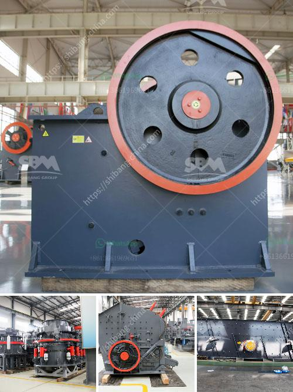

<h3>coconut shell powder making machine grinding mill for sale</h3>
Coconut shell powder is a popular raw material in various industries for its versatility and sustainability. It is widely used in the production of food, cosmetics, animal feed, and other industrial applications. To cater to the growing demand, coconut shell powder making machines are now available in the market.

A coconut shell powder making machine is a specialized machine that grinds coconut shells into fine powder. It can be used in a variety of industries such as food, cosmetics, animal feed, and more. With the help of this machine, you can extract coconut milk and make coconut shell powder right in your own home.

The grinding mill for sale is designed to grind coconut shells into powder form. This machine is suitable for producing different particle sizes of coconut shell powder. It can grind the coconut shells into a fine powder of 80-100 mesh.

The coconut shell powder machine is easy to operate and can produce coconut shell powder with high efficiency. The machine is made of high-quality materials to ensure maximum durability and long-term use. It is equipped with a powerful motor and sharpened blades for efficient grinding.

To use the coconut shell powder making machine, simply add coconut shells into the grinding chamber and press the start button. The machine will automatically grind the shells into a fine powder. You can adjust the fineness of the powder by changing the sieves in the machine.

With the coconut shell powder making machine, you can now turn waste coconut shells into a valuable and profitable product. Not only does it help reduce waste, but it also provides an additional source of income for coconut farmers.

In conclusion, the coconut shell powder making machine is a valuable investment for businesses or individuals looking to produce coconut shell powder. It is an efficient and reliable machine that can grind coconut shells into fine powder. With its high-quality construction and user-friendly interface, it is a convenient and cost-effective solution for coconut shell processing.
<h3>Contact us</h3><ul><li><strong>Whatsapp:&nbsp;<a href="https://wa.me/8613661969651">+8613661969651</a></strong></li><li><a href="https://swt.shibang-china.com/?git&amp;zhl&amp;coconut shell powder making machine grinding mill for sale"><strong>Online Service(chat now)</strong></a></li></ul><h3>Related</h3><ul><li><a href='crusher unit manufacturer india.md'>crusher unit manufacturer india</a></li><li><a href='industrial vibrating feeder.md'>industrial vibrating feeder</a></li><li><a href='silica sand crusher rajasthan.md'>silica sand crusher rajasthan</a></li><li><a href='rock crusher machine manufacturer.md'>rock crusher machine manufacturer</a></li><li><a href='harga stone crusher mini bekas.md'>harga stone crusher mini bekas</a></li></ul>