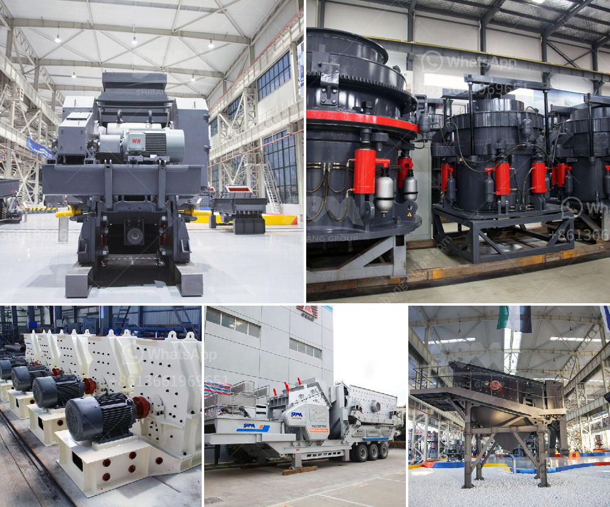

<h3>coltan milling equipment in south africa</h3>
Coltan, or columbite-tantalite, is an essential mineral used in the production of electronic devices, particularly in capacitors. With the growing demand for electronics globally, the need for coltan has also increased, making it a highly sought-after mineral. South Africa, a country rich in mineral resources, has become a significant player in the coltan milling industry.

Coltan milling equipment plays a crucial role in extracting and processing this valuable mineral. The milling process involves crushing the ore into smaller particles and then refining it to extract tantalum and niobium. These refined elements are essential in the production of electronic components.

South Africa has emerged as a leading coltan milling equipment manufacturer due to its advanced technological infrastructure and abundance of mineral resources. The country boasts several manufacturing plants that produce high-quality milling equipment specifically designed for coltan processing.

These milling equipment manufacturers in South Africa have also focused on improving efficiency and sustainability. They have introduced advanced technologies that minimize energy consumption and reduce the environmental impact of the milling process. This commitment to sustainability ensures that coltan mining and refining can be carried out responsibly, without causing significant harm to the environment.

Furthermore, these South African manufacturers have also prioritized the safety and well-being of the miners working in coltan mines. They have designed equipment that enhances worker safety by incorporating innovative features and technologies. This includes automated systems that reduce the risk of accidents and ensure a safer working environment.

The coltan milling equipment produced in South Africa has gained recognition and demand not only domestically but also internationally. The high-quality standards, technological advancements, and focus on sustainability have made South African manufacturers preferred suppliers for coltan mining companies around the world.

In conclusion, South Africa's coltan milling equipment industry has positioned itself as a crucial player in the global market. The country's advanced manufacturing capabilities, commitment to sustainability, and dedication to worker safety have made it a preferred destination for coltan mining companies seeking reliable milling equipment. As the demand for electronic devices continues to rise, so does the importance of coltan, and South Africa is well-placed to meet this demand, contributing to the growth of the global electronics industry.
<h3>Contact us</h3><ul><li><strong>Whatsapp:&nbsp;<a href="https://wa.me/8613661969651">+8613661969651</a></strong></li><li><a href="https://swt.shibang-china.com/?git&amp;zhl&amp;coltan milling equipment in south africa"><strong>Online Service(chat now)</strong></a></li></ul><h3>Related</h3><ul><li><a href='hammer mills for bricks and blocks.md'>hammer mills for bricks and blocks</a></li><li><a href='bentonite processing unit.md'>bentonite processing unit</a></li><li><a href='i want to buy china raymond grinding mill.md'>i want to buy china raymond grinding mill</a></li><li><a href='start up granite quarry crusher business.md'>start up granite quarry crusher business</a></li><li><a href='rock quarry equipment for sale.md'>rock quarry equipment for sale</a></li></ul>