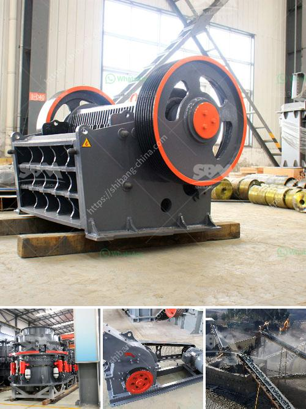

<h3>coltan processing plant cost</h3>
Coltan, short for columbite-tantalite, is a valuable mineral that is primarily used in the production of electronic devices. As demand for these high-tech gadgets continues to grow, so does the need for coltan processing plants. But what are the costs associated with setting up and operating such facilities?

Building a coltan processing plant is a complex and capital-intensive undertaking. The initial investment includes land acquisition, construction, and installation of machinery and equipment. These costs can vary depending on the plant's size, location, and technological requirements.

According to industry estimates, a small-scale coltan processing plant may cost around $10 million, while a large-scale facility can require investments of up to $100 million or more. The size of the plant typically reflects the projected processing capacity and desired output.

Operating costs of a coltan processing plant include ongoing expenses for labor, maintenance, energy consumption, raw material procurement, and waste management. These costs can be significant since processing coltan ore involves several stages such as crushing, grinding, gravity separation, and magnetic separation.

Furthermore, feasibility studies and environmental impact assessments are crucial steps before establishing a coltan processing plant. These studies help estimate the operational costs and potential environmental implications, ensuring compliance with regulations and sustainability practices.

Additional factors affecting the overall cost of a coltan processing plant include infrastructure development, transportation, and utilities. The availability of reliable power, water sources, and transportation networks can impact the plant's location and subsequent expenses.

Moreover, given the fluctuating nature of coltan prices and market demand, proper risk management strategies must be in place to safeguard investments in processing facilities. The economic viability of a coltan processing plant largely relies on market dynamics and maintaining competitive production costs.

It is important to note that establishing a coltan processing plant not only bears economic considerations but also has social and environmental implications. Responsible sourcing and sustainable mining practices should be integrated to ensure ethical processing and minimize environmental impacts.

In conclusion, the cost of setting up and operating a coltan processing plant is significant, varying based on various factors. The initial investment for construction and machinery, ongoing operational expenses, and associated infrastructure costs must all be considered. The establishment of such a plant requires careful planning, feasibility studies, and compliance with regulations. Moreover, sustainable and ethical practices should be incorporated to ensure long-term viability and minimize the environmental footprint.
<h3>Contact us</h3><ul><li><strong>Whatsapp:&nbsp;<a href="https://wa.me/8613661969651">+8613661969651</a></strong></li><li><a href="https://swt.shibang-china.com/?git&amp;zhl&amp;coltan processing plant cost"><strong>Online Service(chat now)</strong></a></li></ul><h3>Related</h3><ul><li><a href='machine powder gypsum mill.md'>machine powder gypsum mill</a></li><li><a href='functions of a mobile crushing plant.md'>functions of a mobile crushing plant</a></li><li><a href='small limestone plant.md'>small limestone plant</a></li><li><a href='ball mill diagram manufacturers in bangalore.md'>ball mill diagram manufacturers in bangalore</a></li><li><a href='ball mill for size reduct.md'>ball mill for size reduct</a></li></ul>