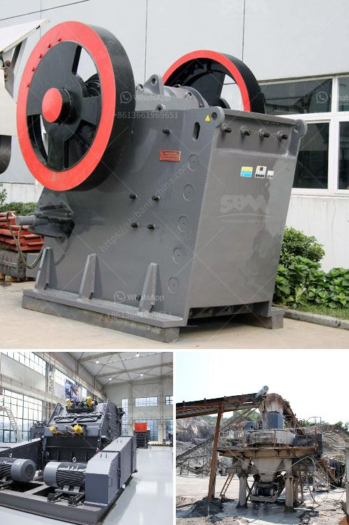

<h3>companies selling mining equipment in south africa</h3>
South Africa, a mineral-rich nation, has a long history of mining activities, providing a solid foundation for its present-day mining industry. With a wide array of mineral resources, South Africa's mining sector offers substantial opportunities for companies involved in the manufacturing and sale of mining equipment. In this article, we will delve into the South African market for mining equipment sales, highlighting key players and the growth prospects in this lucrative industry.

South Africa has an abundant supply of precious metals, such as gold, platinum, and diamonds, as well as other valuable minerals like coal, chrome, and manganese. The country's mining industry has greatly contributed to its economic development, providing employment opportunities and fostering foreign investment. The mining sector has traditionally been one of the key pillars of South Africa's economy, with vast mineral reserves being exploited through various mining methods.

Companies operating within the South African mining equipment sales space play a critical role in driving the country's mining industry forward. The mining equipment market in South Africa is highly competitive, with numerous local and international players vying for market share.

1. Bell Equipment: As one of the largest manufacturers and suppliers of heavy machinery in South Africa, Bell Equipment offers a comprehensive range of mining equipment, including articulated dump trucks, front-end loaders, and excavators. With a solid reputation for quality machinery, Bell Equipment has established itself as a leading player in the South African market.

2. Epiroc: Epiroc is a global leader in providing mining equipment and services. Through its South African subsidiary, the company offers innovative and sustainable solutions for the mining industry. Their product range includes drill rigs, loaders, and rock drilling tools, among others.

3. Sandvik: With a rich history spanning over 150 years, Sandvik is a reputable Swedish company that offers a diverse range of mining equipment. Their South African operations provide machinery such as underground drilling rigs, continuous miners, and loaders, backed by excellent after-sales support.

South Africa's mining sector is poised for growth, with various factors contributing to increased demand for mining equipment. These include the need to modernize and replace aging machinery, a continuous drive for higher production efficiency and output, and the ongoing development of new mining projects.

Additionally, South Africa's government has shown a renewed commitment to the mining industry, introducing policies to attract investments and streamline regulations. This favorable business environment creates opportunities for mining equipment manufacturers and suppliers to expand their operations and capitalise on the growing demand.

South Africa's mining equipment market presents an enticing landscape for companies looking to grow their business in the mining sector. With an abundance of minerals, ongoing infrastructure development, and government support, the demand for advanced mining equipment is expected to rise significantly in the coming years. Companies like Bell Equipment, Epiroc, and Sandvik are well-positioned to cater to these needs, offering cutting-edge mining machinery alongside comprehensive after-sales support.

As South Africa continues to promote sustainable mining practices and welcomes new investments, the mining equipment sales sector in the country is set to thrive. This will not only contribute to the country's economic growth but also create employment opportunities and drive innovation in this critical industry.
<h3>Contact us</h3><ul><li><strong>Whatsapp:&nbsp;<a href="https://wa.me/8613661969651">+8613661969651</a></strong></li><li><a href="https://swt.shibang-china.com/?git&amp;zhl&amp;companies selling mining equipment in south africa"><strong>Online Service(chat now)</strong></a></li></ul><h3>Related</h3><ul><li><a href='gypsum board machinery turkey manufacturers.md'>gypsum board machinery turkey manufacturers</a></li><li><a href='prices of industrial mills prices of crushing plant.md'>prices of industrial mills prices of crushing plant</a></li><li><a href='coltan processing plant cost.md'>coltan processing plant cost</a></li><li><a href='quotation for crushing and screening.md'>quotation for crushing and screening</a></li><li><a href='major suppliers of jaw crusher in south africa.md'>major suppliers of jaw crusher in south africa</a></li></ul>