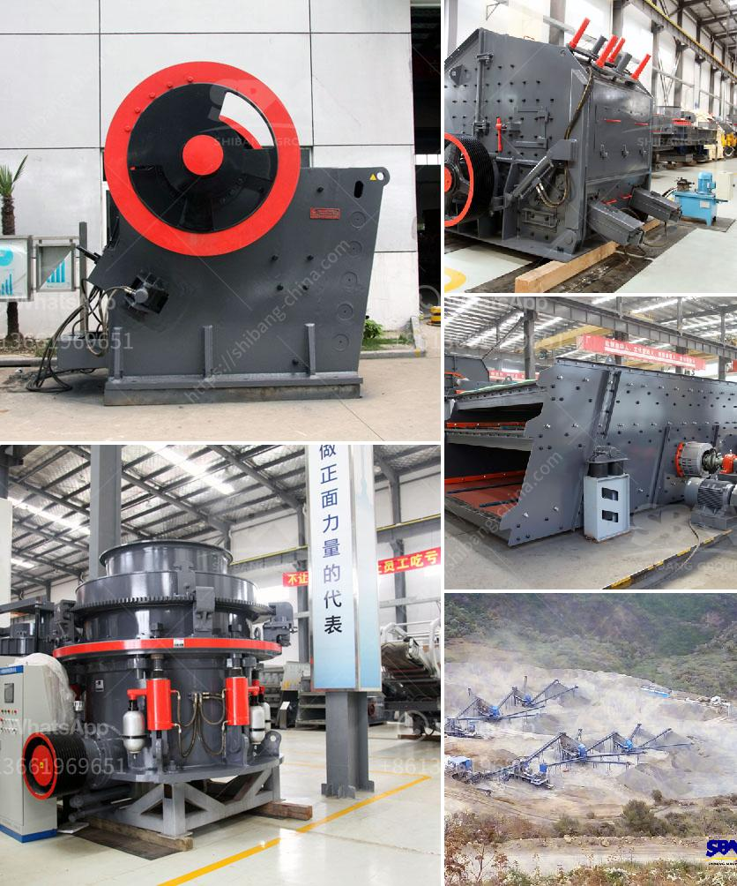

<h3>companies that sell conveyor belts</h3>
Conveyor belts are vital components for various industries, playing a crucial role in enhancing productivity and streamlining operations. These belts are used to transport goods, materials, and products within a facility, ensuring a smooth and efficient flow throughout the supply chain. Due to their importance, it is essential to source conveyor belts from reliable and renowned companies that offer high-quality products. In this article, we will explore some of the top companies that specialize in manufacturing and distributing conveyor belts.

Habasit AG is a globally recognized leading manufacturer of conveyor belts. With decades of experience, Habasit offers an extensive range of conveyor belts suitable for various industries, such as food processing, packaging, automotive, and logistics. They are known for their durable and high-performing belts that are designed to meet specific customer requirements. Habasit's conveyor belts are made using innovative technologies and materials to ensure longevity and efficiency.

Fenner Dunlop is another reputable company that supplies conveyor belts globally. They specialize in heavyweight, high-temperature, and flame-resistant conveyor belts, making them an ideal choice for heavy-duty applications in industries like mining, construction, and steel manufacturing. Fenner Dunlop is committed to providing innovative solutions, ensuring their belts withstand the most challenging conditions, while maintaining optimal performance and safety.

Bando Chemical Industries is a leading manufacturer of industrial rubber and synthetic products, including conveyor belts. With their exceptional engineering expertise, Bando provides a wide range of belt options suitable for diverse industries, such as agriculture, automotive, and pharmaceuticals. Their conveyor belts are known for their high tensile strength, excellent flexibility, and resistance to abrasion, making them ideal for heavy usage.

Forbo Movement Systems is a renowned global provider of conveyor belts for various industries, including manufacturing, food processing, and airports. With a focus on sustainability, Forbo offers belts made from eco-friendly materials, reducing their environmental impact. Their products are known for their durability, high grip, and excellent conveying performance, allowing businesses to optimize their operations with minimal downtime.

Ammeraal Beltech is a leading manufacturer of process and conveyor belts, known for their innovative solutions and high-quality products. They offer an extensive range of belts suitable for different applications, including food processing, airports, and automotive industries. Ammeraal Beltech focuses on providing productive and reliable belts that meet stringent safety and hygiene standards, ensuring seamless operations in critical environments.

Intralox is a global provider of conveyor belt solutions, specializing in modular plastic belts. These belts feature unique designs that allow for efficient conveyance of items and easy replacement of damaged sections, reducing maintenance time and costs. Intralox's belts are commonly used in industries like beverage, automotive, and general manufacturing, known for their reliability and versatility.

When looking for conveyor belts, it is essential to consider the specific needs of your industry, the required materials, and the level of durability and performance desired. Choosing a reputable company that provides high-quality and efficient conveyor belts will not only optimize your operations but also ensure longevity and cost-effectiveness in the long run. With the companies mentioned above, you can find a reliable partner that offers durable, efficient, and tailor-made conveyor belts for your business needs.
<h3>Contact us</h3><ul><li><strong>Whatsapp:&nbsp;<a href="https://wa.me/8613661969651">+8613661969651</a></strong></li><li><a href="https://swt.shibang-china.com/?git&amp;zhl&amp;companies that sell conveyor belts"><strong>Online Service(chat now)</strong></a></li></ul><h3>Related</h3><ul><li><a href='gypsum powder making.md'>gypsum powder making</a></li><li><a href='gypsum manufacturing plant from turkey.md'>gypsum manufacturing plant from turkey</a></li><li><a href='granite crushing per tonne.md'>granite crushing per tonne</a></li><li><a href='stone gravel crusher machine used for sale uae.md'>stone gravel crusher machine used for sale uae</a></li><li><a href='manufacturer of cement packing plant machine.md'>manufacturer of cement packing plant machine</a></li></ul>