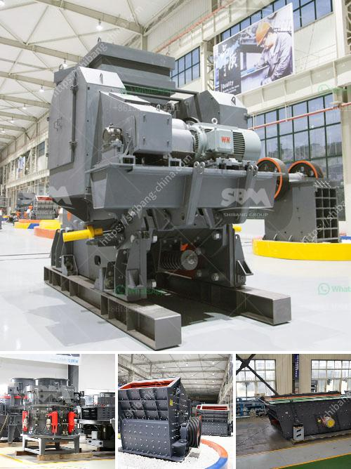

<h3>company that work in crushing stones</h3>
Stone crushing companies play a pivotal role in the construction industry as they provide essential building materials for infrastructure and housing projects. With millions of tons of crushed stone produced yearly, stone crushing companies are major contributors to the nation's economic growth.

Stone crushing involves the following processes: mining, processing, crushing, and screening. Each of these steps plays an important role in the production of high-quality aggregates.

1. Mining: Stone mines are excavated using heavy machinery, such as bulldozers and loaders, to extract large rock formations. These extracted stones undergo intense drilling and blasting to break them into manageable sizes.

2. Processing: After mining, the stones are transported to a processing facility where they are washed, sorted, and prepared for crushing. Removal of excess dirt and impurities ensures that the final product consists of pure and high-quality stones.

3. Crushing: Specialized crushers, known as stone crushers, efficiently and effectively break down large stones into smaller pieces. They may use mechanisms such as jaw crushers, impact crushers, or cone crushers to reduce the size of rocks.

4. Screening: Once crushed, the stones are passed through vibrating screens to separate them into various sizes. This process ensures that the resulting aggregates are correctly graded and suitable for different construction purposes.

1. Job Creation: Stone crushing companies provide employment opportunities, creating jobs for local communities. With a high demand for construction materials, these companies require skilled workers and administrative staff to meet project deadlines.

2. Economic Growth: By producing crucial building materials, stone crushing companies contribute to economic growth. Their products are necessary for the construction of roads, bridges, buildings, and other infrastructural projects. These projects stimulate economic activity and attract further investments.

3. Environmental Considerations: While stone crushing companies contribute to economic growth, they must also be environmentally responsible. Exploiting natural resources must be balanced with sustainable practices. Companies are increasingly adopting eco-friendly measures, such as using recycling techniques and monitoring emissions to minimize their ecological footprint.

To ensure the provision of high-quality aggregates, stone crushing companies prioritize quality control measures. They subject their products to rigorous testing and adhere to relevant industry standards. Proper quality control guarantees durable and efficient construction materials, ensuring customer satisfaction and minimizing the need for repairs.

Stone crushing companies have a significant impact on the construction industry, providing essential materials for various infrastructure projects. With their ability to transform rock formations into high-quality aggregates, they contribute to economic growth, job creation, and the development of vital infrastructure. By adopting sustainable practices and embracing quality control measures, these companies maintain a balance between economic growth and environmental responsibility.
<h3>Contact us</h3><ul><li><strong>Whatsapp:&nbsp;<a href="https://wa.me/8613661969651">+8613661969651</a></strong></li><li><a href="https://swt.shibang-china.com/?git&amp;zhl&amp;company that work in crushing stones"><strong>Online Service(chat now)</strong></a></li></ul><h3>Related</h3><ul><li><a href='mobile ball mill for small scale mining.md'>mobile ball mill for small scale mining</a></li><li><a href='stone powder milling small machine.md'>stone powder milling small machine</a></li><li><a href='types of roller mill.md'>types of roller mill</a></li><li><a href='handmade stone crusher.md'>handmade stone crusher</a></li><li><a href='gypsum mining crusher dubai.md'>gypsum mining crusher dubai</a></li></ul>