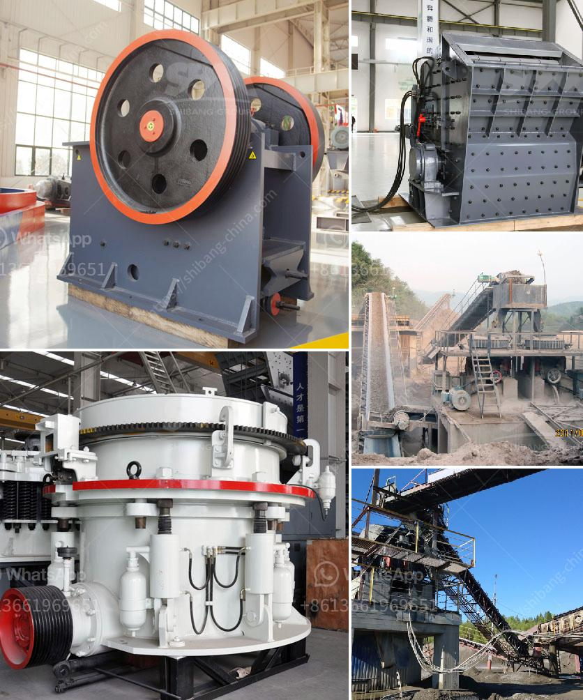

<h3>complete ore mining processing line</h3>
Ore mining is a crucial process for extracting valuable minerals and metals from the Earth's crust. To ensure efficiency and maximize yields, a complete ore mining processing line is essential. This article will explore the components and importance of such a line within the mining industry.

A complete ore mining processing line consists of several stages, each with its own specific equipment and functions. The process generally begins with drilling and blasting, where explosives are used to break up the ore-rich rocks. This allows for easier extraction and transportation to the next stage.

Once the ore is blasted, it is then loaded onto large trucks or conveyors and transported to a primary crusher. The crusher reduces the size of the ore particles, preparing it for further processing. From the primary crusher, the ore is then conveyed to secondary and tertiary crushers to achieve the desired size.

After the ore is adequately crushed, it enters the milling stage. This is where the ore is finely ground into a powder, allowing for easier separation of the valuable minerals and metals. Various types of equipment, such as ball mills and rod mills, are utilized in this process to achieve the desired particle size.

Once the ore is finely ground, it undergoes further processing through different methods, depending on the type of minerals or metals being extracted. These methods commonly include gravity separation, flotation, magnetic separation, or leaching. The specific method used depends on the desired end product and the characteristics of the ore being processed.

The final stage of the complete ore mining processing line involves drying, smelting, and refining the extracted minerals or metals. This is done to further purify the product, remove impurities, and create a marketable end product ready for sale or use in various industries.

In conclusion, a complete ore mining processing line plays a vital role in the mining industry. It ensures the efficient extraction of valuable minerals and metals from the Earth's crust while maximizing yield and minimizing waste. By employing various stages and equipment, the line enables the transformation of raw materials into marketable products, making it an integral part of the entire mining process.
<h3>Contact us</h3><ul><li><strong>Whatsapp:&nbsp;<a href="https://wa.me/8613661969651">+8613661969651</a></strong></li><li><a href="https://swt.shibang-china.com/?git&amp;zhl&amp;complete ore mining processing line"><strong>Online Service(chat now)</strong></a></li></ul><h3>Related</h3><ul><li><a href='impact crusher equipment.md'>impact crusher equipment</a></li><li><a href='stone crusher machine for sale.md'>stone crusher machine for sale</a></li><li><a href='4 rolar raymond mill productions.md'>4 rolar raymond mill productions</a></li><li><a href='bauxite crushing machine in maharashtra.md'>bauxite crushing machine in maharashtra</a></li><li><a href='construction equipment manufacturer in turkey.md'>construction equipment manufacturer in turkey</a></li></ul>