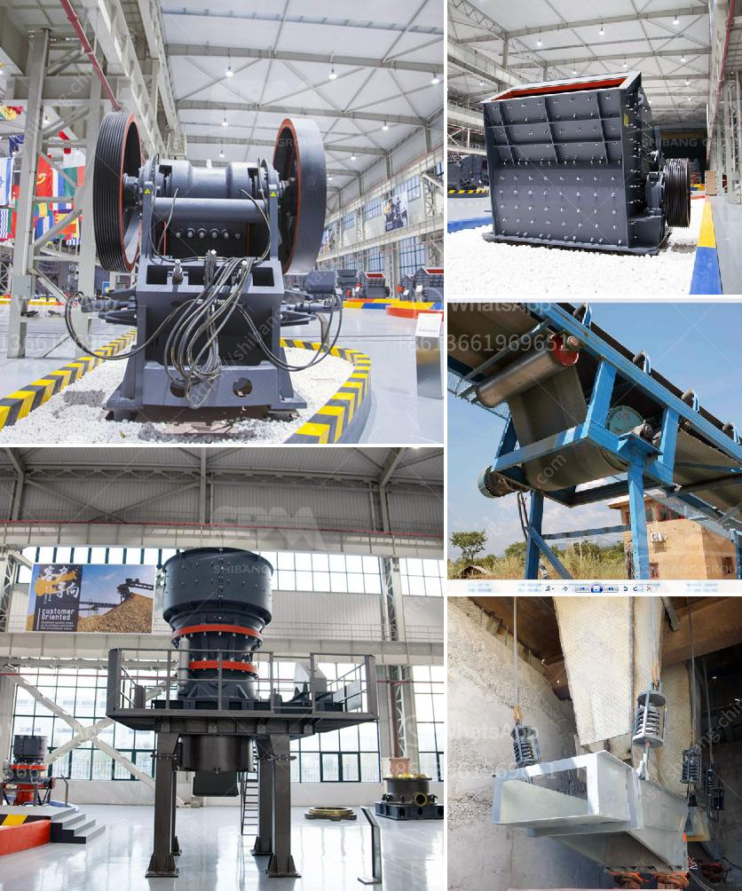

<h3>complete stone crusher set</h3>
A stone crushing plant is primarily involved in the manufacture of aggregates of various sizes (coarse aggregates, crusher run, rock sand and other fine aggregates) from basalt boulders. Coarse aggregates are usually used in ready mix concrete and asphaltic concrete. Crusher run is used for the bases and sub-bases for road making.

Fine aggregates are used for the production of concrete and plastering. The processes involved in stone crushing include pre-processing, crushing, washing, screening and recycling of wastewater.

Pre-processing consists of removal of stone boulders by mechanical means and screening of the boulders in a feed hopper to remove soil and small rocks. Crushing entails primary, secondary and tertiary crushing of the boulders into the aggregates. Washing and screening consists of further screening the aggregates through a vibrating screen using water jets.

The complete set of stone crusher production line is made of Vibrating Feeder,jaw crusher, impact crusher, cone crusher, belt Conveyor, Vibrating Screen, etc. We could design the line According to the size of the raw ore and different applications area of fineness requirement, To design self-contained complete of material solutions,so save part of Crushing and grinding equipment for you. The Stone Crusher production processing flow:

2.After primary crushing, the material will be transferred to secondary impact crusher for further crushing.

3.Then the crushed material will convey to vibrating screen by belt Conveyor. The vibrating screen is a key equipment to separate crushed material into different size.

4.The material with suitable size will be transferred to final product pile. That with unsuitable size will be transferred to the impact crusher for re-crushing. This forms closed and continuously automatic cycles. The plant can be equipped with dust removing facilities to protect environment according to customers' requests.

Firstly, the raw material is uniformly fed into the jaw crusher through the vibrating feeder for coarse crushing. And then the coarse material is transported to the impact crusher for secondary crushing through the belt conveyor.

After the secondary crushing, the materials will be sieved by a vibrating screen to separate the required particles, and then the qualified materials will be conveyed to the final product pile.

The unqualified particles will be returned to the impact crusher for re-crushing until reaching the required size. At the same time, the finished products will be transported to the product storage area.

The stone crushing plant has versatile application such as iron ore crushing plant, gold ore crusher plant, bauxite crushing plant, copper beneficial plant, nickel mining plant, manganese crushing plant, limestone crushing plant, feldspar crushing plant and so on.

This crushing plant is widely used as sand making line, rock crushing line, stone crushing plant, ore dressing line, aggregate production line, construction waste recycling plant and so on.

For the contractors and final users, SBM Machinery has designed complete stationary, portable, mobile crushing plants. The 300-500 tph stone crushing plant is suitable for crushing bulk materials at a fixed open-pit mine or quarry. This series stone crushing plant consists of large scale jaw crusher, heavy duty cone crusher, vibrating feeder, vibrating screen, belt conveyor and other auxiliary equipment. It is featured of high automation, high crushing ratio, high production efficiency from primary crushing, secondary crushing to tertiary crushing and from fine crushing to powder making.
<h3>Contact us</h3><ul><li><strong>Whatsapp:&nbsp;<a href="https://wa.me/8613661969651">+8613661969651</a></strong></li><li><a href="https://swt.shibang-china.com/?git&amp;zhl&amp;complete stone crusher set"><strong>Online Service(chat now)</strong></a></li></ul><h3>Related</h3><ul><li><a href='artificial stone production line floor.md'>artificial stone production line floor</a></li><li><a href='quartz making process.md'>quartz making process</a></li><li><a href='vertical grinder mill.md'>vertical grinder mill</a></li><li><a href='buy crusher of pact in peru.md'>buy crusher of pact in peru</a></li><li><a href='high gradient separator in zhengzhou.md'>high gradient separator in zhengzhou</a></li></ul>