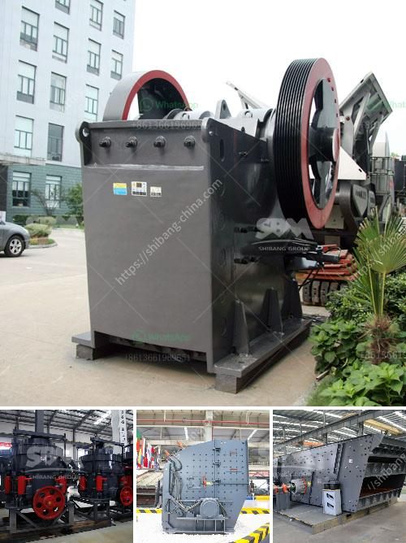

<h3>components of a ball mill</h3>
A ball mill is a type of grinder used to grind materials into extremely fine powder for use in mineral dressing processes, paints, pyrotechnics, ceramics and selective laser sintering. The main components of a ball mill include a cylindrical container with grinding balls at the bottom, which is rotated around its axis to create a rotational motion. The container is generally made of steel or rubber, and the grinding media are usually balls made of steel, ceramic, or rubber.

The basic structure of a ball mill consists of a feeding and discharging chamber, a grinding media chamber, and a drive system. The feeding and discharging chamber is where the materials are fed into the mill and discharged after being finely ground. This chamber usually has a grate or grid at the end to control the size of the materials exiting the mill.

The grinding media chamber is filled with balls, which are lifted up and dropped down as the mill rotates. The balls grind the material inside the mill, breaking it into smaller particles. The grinding media can be made of various materials, such as steel, ceramic, or rubber, and the size and shape of the balls affect the grinding efficiency.

The drive system is an essential part of a ball mill. It consists of a motor, gearbox, and coupling to transmit the rotating power to the mill. The mill rotates at different speeds, allowing for grinding of the materials in different ways. From the grinding material, the minimum achievable particle size is directly proportional to the rotational speed of the mill.

The choice of ball mill components will depend on the requirements of the particular application and the machine design. It is important to consider factors such as load capacity, corrosion resistance, and maintenance requirements when selecting the suitable components for a ball mill. In addition, it is crucial to ensure the proper installation and alignment of all components to achieve optimal mill performance.
<h3>Contact us</h3><ul><li><strong>Whatsapp:&nbsp;<a href="https://wa.me/8613661969651">+8613661969651</a></strong></li><li><a href="https://swt.shibang-china.com/?git&amp;zhl&amp;components of a ball mill"><strong>Online Service(chat now)</strong></a></li></ul><h3>Related</h3><ul><li><a href='series capacitor for crushing plant.md'>series capacitor for crushing plant</a></li><li><a href='cement production equipment in germany.md'>cement production equipment in germany</a></li><li><a href='how to make lime powder.md'>how to make lime powder</a></li><li><a href='hammer mill impactor marble machina.md'>hammer mill impactor marble machina</a></li><li><a href='small portable swing jaw crushers.md'>small portable swing jaw crushers</a></li></ul>