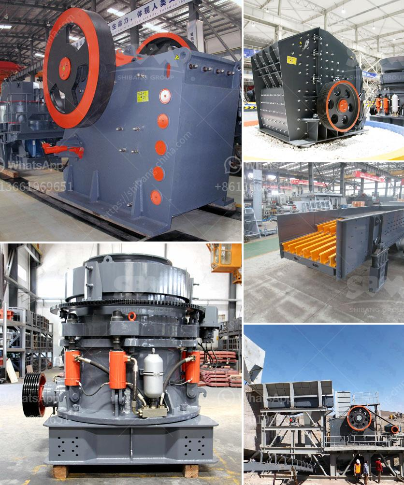

<h3>components of a roller mill</h3>
A roller mill is a piece of heavy-duty machinery used to crush or grind objects like wheat or rocks. It consists of a cylindrical drum that revolves around a horizontal axis, with hardened steel rollers crushing the material between them. Roller mills have various applications in different industries, including agriculture, mining, and construction. In this article, we will explore the components of a roller mill and their functions.

1. Drums: The drum is the main component of a roller mill, providing the space where the material is crushed or ground. It is usually made of heavy-duty steel and can have a variable diameter based on the specific application. Larger drums are beneficial in handling substantial quantities of material, whereas smaller drums are suitable for precise grinding operations.

2. Rollers: The rollers are crucial components that crush or grind the material within the drum. They are typically made of hardened steel to withstand the high pressure exerted during the process. Roller mills can have either one or multiple pairs of rollers, depending on the desired outcome. The distance between the rollers, referred to as the gap size, can also be adjusted to control the fineness of the final product.

3. Bearings: Efficient and reliable bearings are vital for the smooth operation of a roller mill. They support the weight of the drum and enable it to rotate. The main types of bearings used in roller mills are ball bearings and roller bearings. Ball bearings have a lower load capacity and are generally used in smaller roller mills, while roller bearings can handle heavier loads and are suitable for larger mills.

4. Drive System: The drive system ensures the rotation of the drum and rollers. It typically consists of an electric motor, a gearbox, and various mechanical components like pulleys, belts, or chains. The size and power of the motor depend on the size and capacity of the roller mill. The drive system should be robust enough to transmit the power efficiently and continuously to the rollers.

5. Hopper: The hopper is a container located above the rollers, where the material to be processed is fed into the roller mill. It can have different designs and capacities, allowing for the controlled discharge of the material into the drum. A well-designed hopper ensures a consistent feed rate, preventing overfeeding or clogging while maximizing the productivity of the roller mill.

6. Control System: Modern roller mills often feature advanced control systems that automate the operation and optimize the performance. These control systems can include sensors, actuators, and programmable logic controllers (PLCs) to monitor and adjust parameters such as the gap size, feed rate, and roller speed. Additionally, some systems can provide real-time data and analysis to improve the process efficiency and output quality.

In conclusion, a roller mill consists of several key components that work together to crush or grind material efficiently. These components include the drum, rollers, bearings, drive system, hopper, and control system. Each component plays a crucial role in ensuring the smooth operation and optimal performance of the roller mill. As technology continues to advance, roller mills are becoming more advanced and efficient, allowing for higher productivity and better quality products in various industries.
<h3>Contact us</h3><ul><li><strong>Whatsapp:&nbsp;<a href="https://wa.me/8613661969651">+8613661969651</a></strong></li><li><a href="https://swt.shibang-china.com/?git&amp;zhl&amp;components of a roller mill"><strong>Online Service(chat now)</strong></a></li></ul><h3>Related</h3><ul><li><a href='stone crusher manufacturers in dhansura.md'>stone crusher manufacturers in dhansura</a></li><li><a href='crushed gravel supplier in negros oriental.md'>crushed gravel supplier in negros oriental</a></li><li><a href='pakistan quarry crusher manufacturer.md'>pakistan quarry crusher manufacturer</a></li><li><a href='artificial stone production plant in turkey.md'>artificial stone production plant in turkey</a></li><li><a href='gold separator table for africa.md'>gold separator table for africa</a></li></ul>