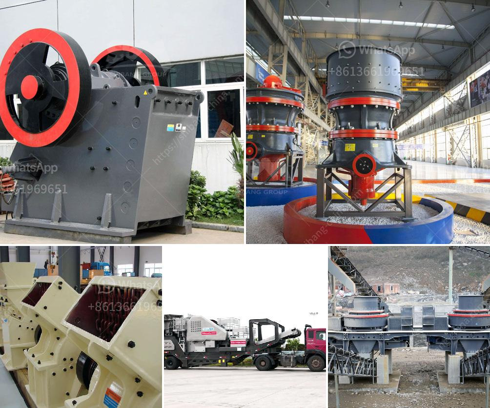

<h3>components of an impact mill</h3>
An impact mill is a versatile and powerful tool used for crushing and grinding material. It utilizes rapid and intense impacts to reduce particle size and achieve a finer product. Understanding the components of an impact mill is crucial for efficient operation and optimal performance. In this article, we will discuss the key components that make up an impact mill and their functions.

The rotor is the primary component responsible for generating the high-speed impacts necessary for crushing and grinding. It consists of a shaft with several hammers attached to it. As the rotor rotates, the hammers strike the material, causing it to break into smaller particles. The design and arrangement of the hammers can vary, allowing for customization to suit different applications and materials.

Impact plates are located along the inner walls of the mill chamber. They serve as targets for the material being crushed and provide a surface for the hammers to strike against. Impact plates are typically made of hardened steel or other wear-resistant materials to withstand the constant impacts. They can be easily replaced when worn out, extending the lifespan of the impact mill.

The grinding chamber is the space within the impact mill where the material undergoes size reduction. It houses the rotor and impact plates, ensuring a controlled environment for efficient crushing. The size and shape of the grinding chamber can vary based on the mill's design and intended application. The larger the chamber, the higher the throughput and capacity.

The discharge mechanism is responsible for releasing the crushed material from the impact mill. The size of the discharge opening can be adjusted to control the final particle size. Some impact mills may have a built-in classifier to separate the finer particles and return them to the grinding chamber for further processing. The discharge mechanism ensures a continuous flow of processed material for subsequent operations.

The drive system is the power source that rotates the rotor and drives the entire operation of the impact mill. It can be electric, hydraulic, or mechanical, depending on the mill's design and requirements. The drive system must provide adequate power and torque to achieve the desired crushing and grinding action.

Safety is paramount in any industrial equipment, including impact mills. Common safety features include protective guards to prevent contact with moving parts, emergency stops for quick shutdown in case of emergencies, and interlocks to ensure proper operation and prevent accidents. Operators should be familiar with these safety features and follow all safety protocols to maintain a safe working environment.

In conclusion, an impact mill consists of several essential components that work together to achieve efficient crushing and grinding. Understanding the purpose and function of each component is crucial for optimal performance and prolonged equipment life. Whether used in the mining, pharmaceutical, or recycling industry, impact mills play a vital role in size reduction and material processing.
<h3>Contact us</h3><ul><li><strong>Whatsapp:&nbsp;<a href="https://wa.me/8613661969651">+8613661969651</a></strong></li><li><a href="https://swt.shibang-china.com/?git&amp;zhl&amp;components of an impact mill"><strong>Online Service(chat now)</strong></a></li></ul><h3>Related</h3><ul><li><a href='small scale gold mining machine and their price.md'>small scale gold mining machine and their price</a></li><li><a href='tanzania processing plant cost.md'>tanzania processing plant cost</a></li><li><a href='barite processing plants in texas.md'>barite processing plants in texas</a></li><li><a href='manufacturing of marble and granite crusher machines.md'>manufacturing of marble and granite crusher machines</a></li><li><a href='feasibility on quarry business.md'>feasibility on quarry business</a></li></ul>