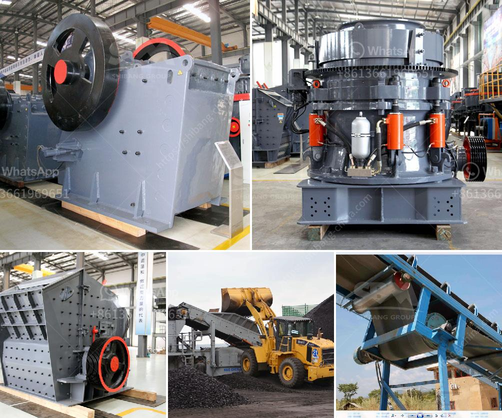

<h3>concrete batching plant for sale in pakistan</h3>
Concrete batching plants are essential for large-scale construction projects, providing a reliable and efficient way to mix concrete on site. In Pakistan, the construction industry is booming, with numerous infrastructure projects underway. As a result, the demand for concrete batching plants has increased significantly. Fortunately, there are several concrete batching plants for sale in Pakistan that cater to different project requirements.

One of the key advantages of investing in a concrete batching plant in Pakistan is that it offers greater control over the quality of concrete being produced. With a concrete batching plant, contractors can ensure that the mix design is consistent throughout the project, resulting in stronger and more durable structures. Additionally, using a batching plant can significantly reduce the time and labor required for concrete mixing, thereby increasing overall productivity.

The concrete batching plants available in Pakistan come in various capacities, ranging from 25 to 240 cubic meters per hour. This ensures that there is a suitable plant for every project, irrespective of its scale. These plants are equipped with advanced features and technologies, including computer batching controls, which enhance accuracy and precision in the mixing process.

Apart from productivity and quality, another crucial factor to consider when purchasing a concrete batching plant in Pakistan is its mobility. Some projects require the plant to be moved from one location to another. In such cases, a mobile batching plant is an ideal option as it can be easily transported and set up at the desired site. On the other hand, stationary plants are more suitable for long-term projects where the plant remains in one location throughout the construction process.

In conclusion, a concrete batching plant in Pakistan is an essential investment for any construction company. It offers greater control over the quality of concrete, improves productivity, and ensures efficient mixing, resulting in durable structures. With the variety of batching plants available in Pakistan, contractors can find the perfect plant that meets their specific project requirements, be it in terms of capacity or mobility.
<h3>Contact us</h3><ul><li><strong>Whatsapp:&nbsp;<a href="https://wa.me/8613661969651">+8613661969651</a></strong></li><li><a href="https://swt.shibang-china.com/?git&amp;zhl&amp;concrete batching plant for sale in pakistan"><strong>Online Service(chat now)</strong></a></li></ul><h3>Related</h3><ul><li><a href='suppliers of crusher equipment in south africa.md'>suppliers of crusher equipment in south africa</a></li><li><a href='aggregate sand and gravel process in philippines.md'>aggregate sand and gravel process in philippines</a></li><li><a href='price of granite jaw crusher.md'>price of granite jaw crusher</a></li><li><a href='mini concrete crushers.md'>mini concrete crushers</a></li><li><a href='quarry stone dressing machine.md'>quarry stone dressing machine</a></li></ul>