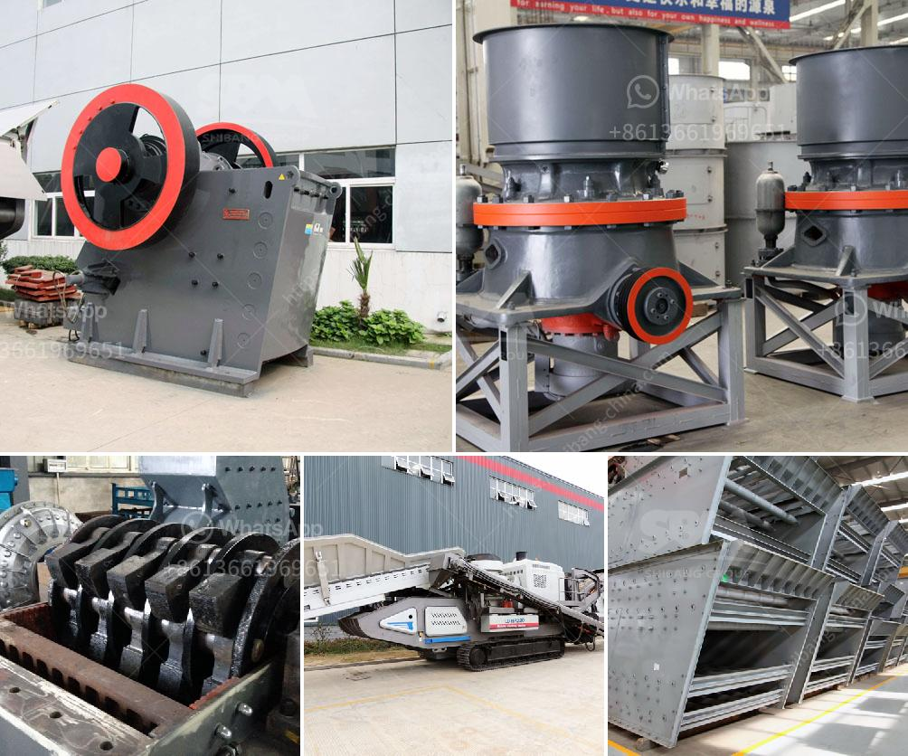

<h3>concrete crusher for sale</h3>
When it comes to finding the right concrete crusher for sale, it has never been easier with the wide range of options available today. Whether you're looking for a small and simple crusher for a DIY project or a larger machine for professional use, there's bound to be something that suits your needs and budget.

A concrete crusher is a machine that makes use of crushing large blocks of concrete or stones into gravel. With the help of heavy-duty attachments and powerful motors, the crusher is able to break down even the toughest materials. This not only saves time but also reduces the need for manual labor, making it a popular choice in construction sites and demolition projects.

One of the key advantages of owning a concrete crusher is its versatility. Apart from crushing concrete, it can also handle other materials such as bricks, tiles, asphalt, and rocks. This gives you the freedom to tackle a wide range of projects without having to invest in multiple machines.

Additionally, a concrete crusher can significantly reduce waste and environmental impact. Instead of disposing of large chunks of concrete, you can conveniently recycle them on-site, saving transportation costs and minimizing the need for landfill space. This eco-friendly approach not only benefits the environment but also showcases your commitment to sustainable practices.

When looking for a concrete crusher for sale, it's essential to consider factors such as the crusher's size, power source, and mobility. If you require a crusher that can easily be transported between job sites, a mobile or portable crusher may be the ideal choice. On the other hand, if you need a more powerful and permanent solution, a stationary crusher might be a better fit.

Regardless of which type you choose, investing in a concrete crusher is a smart decision. It offers increased efficiency, cost savings, and environmental benefits. So, if you're in the construction or demolition industry, don't miss out on the opportunity to enhance your operations with a concrete crusher. Browse the market, compare options, and find the perfect crusher for your needs.
<h3>Contact us</h3><ul><li><strong>Whatsapp:&nbsp;<a href="https://wa.me/8613661969651">+8613661969651</a></strong></li><li><a href="https://swt.shibang-china.com/?git&amp;zhl&amp;concrete crusher for sale"><strong>Online Service(chat now)</strong></a></li></ul><h3>Related</h3><ul><li><a href='fairly used quarry crusher in nigeria price.md'>fairly used quarry crusher in nigeria price</a></li><li><a href='crusher business for sale in oman.md'>crusher business for sale in oman</a></li><li><a href='mica minerals powder grinding unit in kenya.md'>mica minerals powder grinding unit in kenya</a></li><li><a href='copper crusher exporter in south africa.md'>copper crusher exporter in south africa</a></li><li><a href='gold mining equipment companies in china.md'>gold mining equipment companies in china</a></li></ul>