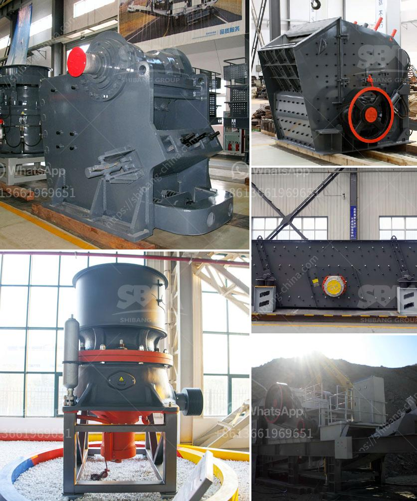

<h3>concrete crusher machine</h3>
Concrete continues to be the backbone of modern construction, playing an integral role in the creation of buildings, roadways, bridges, dams, and other infrastructure projects. It is a durable material known for its strength and longevity. However, the process of demolishing concrete structures can be time-consuming and costly. This is where concrete crusher machines come into play, transforming massive chunks of concrete into useful materials.

A concrete crusher machine is a versatile tool used for breaking up reinforced concrete structures and disposing of debris in smaller, more manageable pieces. The machine grinds concrete into gravel-sized chunks that are suitable for further processing, such as recycling for new construction purposes. The added benefit of using a concrete crusher machine is that it significantly reduces the cost of waste disposal and transportation to landfill sites.

One of the most prevalent uses for a concrete crusher machine is in the recycling of concrete waste. Crushing concrete into smaller pieces allows for the separation of reinforcing steel, which can be recycled separately and reused in construction projects. Additionally, the crushed concrete can be used as a base material for new roads, sidewalks, or even as aggregate for new concrete mixtures.

Another crucial application of concrete crusher machines is in the demolition industry. Demolishing a building or structure often requires the removal of concrete and other materials. Concrete crusher machines enable efficient demolition while maximizing the recovery of valuable materials. As the machine grinds the concrete into smaller pieces, any embedded metal is separated, making the recycling process more efficient.

The use of a concrete crusher machine is becoming more common in the construction industry today, as concrete waste grows exponentially. Contractors and demolition companies look for a portable and cost-effective solution to lower costs and reduce environmental impact. With the advent of concrete crusher machines, these concerns are now a thing of the past. These machines significantly reduce the time, effort, and expenses associated with demolishing concrete structures.

Moreover, the use of concrete crusher machines minimizes the generation of dust during the crushing process. Most crusher machines generate considerable amounts of dust during operation, leading to potential health hazards and air pollution. By investing in a state-of-the-art concrete crusher machine, dust emissions can be reduced, ensuring a safer working environment for construction workers and nearby residents.

In conclusion, concrete crusher machines are increasingly being utilized in sustainable construction practices. They provide a cost-effective and environmentally friendly solution for recycling concrete waste and efficiently demolishing structures. The use of these machines greatly reduces waste disposal costs, lowers transportation expenses, and minimizes the environmental impact associated with concrete demolition. With the ability to transform concrete into reusable materials, concrete crusher machines facilitate sustainable construction practices and contribute to a greener future.
<h3>Contact us</h3><ul><li><strong>Whatsapp:&nbsp;<a href="https://wa.me/8613661969651">+8613661969651</a></strong></li><li><a href="https://swt.shibang-china.com/?git&amp;zhl&amp;concrete crusher machine"><strong>Online Service(chat now)</strong></a></li></ul><h3>Related</h3><ul><li><a href='crushing plant adalah.md'>crushing plant adalah</a></li><li><a href='mining equipment cad blocks.md'>mining equipment cad blocks</a></li><li><a href='mobile crushing unit.md'>mobile crushing unit</a></li><li><a href='quartz making process.md'>quartz making process</a></li><li><a href='crushing pe jaw crusher.md'>crushing pe jaw crusher</a></li></ul>