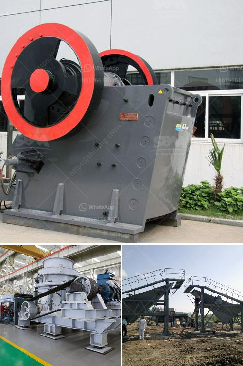

<h3>concrete crusher plant</h3>
A concrete crusher plant is a powerful tool when it comes to breaking down large chunks of concrete and other materials into smaller pieces. They are essential equipment in construction, demolition, and other industries where large quantities of waste material need to be disposed of quickly and efficiently.

These plants consist of a primary crusher, secondary crusher, screening and conveyor belts, and a control panel. The primary crusher, typically a jaw crusher, is used to reduce the size of the large materials, while the secondary crusher, usually a cone crusher or impact crusher, further breaks down the material into finer particles.

One of the main advantages of a concrete crusher plant is its mobility. It can be easily transported to different construction sites, saving time and money on transportation costs. This flexibility allows contractors to bring the crusher directly to the job site, eliminating the need to transport the material to a central location for processing.

Another important feature of a concrete crusher plant is its ability to produce different sizes of finished products. By adjusting the settings of the crushers, contractors can control the size and shape of the crushed materials. This versatility allows them to meet specific project requirements, whether it's to produce base materials for road construction or fine aggregates for concrete production.

In addition to size control, concrete crusher plants also play a crucial role in environmental sustainability. Instead of disposing of large amounts of concrete and other materials as waste, these plants recycle them, reducing the need for new raw materials and conserving natural resources. This not only helps protect the environment but also reduces costs associated with waste disposal.

Operating a concrete crusher plant requires skilled operators who are knowledgeable about the equipment and its safety protocols. These operators must be trained in proper operation techniques and maintenance procedures to ensure the plant operates efficiently and safely. Regular maintenance, such as regular inspection and lubrication of the crushers, is essential to prevent breakdowns and downtime.

Safety is paramount when operating a concrete crusher plant. Adequate safety measures, such as proper guarding and emergency stop systems, should be in place to protect the operators from potential hazards. Additionally, all personnel should wear appropriate personal protective equipment, such as hard hats, safety goggles, and steel-toe boots, when working with or around the plant.

In conclusion, a concrete crusher plant is a valuable asset for any construction or demolition project. With its ability to break down large chunks of concrete and other materials efficiently and produce various sizes of finished products, it offers significant benefits in terms of cost savings, environmental sustainability, and project flexibility. However, it is crucial to prioritize safety and proper maintenance to ensure the plant operates smoothly and protects personnel from potential hazards.
<h3>Contact us</h3><ul><li><strong>Whatsapp:&nbsp;<a href="https://wa.me/8613661969651">+8613661969651</a></strong></li><li><a href="https://swt.shibang-china.com/?git&amp;zhl&amp;concrete crusher plant"><strong>Online Service(chat now)</strong></a></li></ul><h3>Related</h3><ul><li><a href='how much is a stone crusher.md'>how much is a stone crusher</a></li><li><a href='stone crusher mobile plant di indonesia.md'>stone crusher mobile plant di indonesia</a></li><li><a href='concrete crushers for rent nigeria.md'>concrete crushers for rent nigeria</a></li><li><a href='small rock gravel crushers.md'>small rock gravel crushers</a></li><li><a href='clinker powder machine.md'>clinker powder machine</a></li></ul>